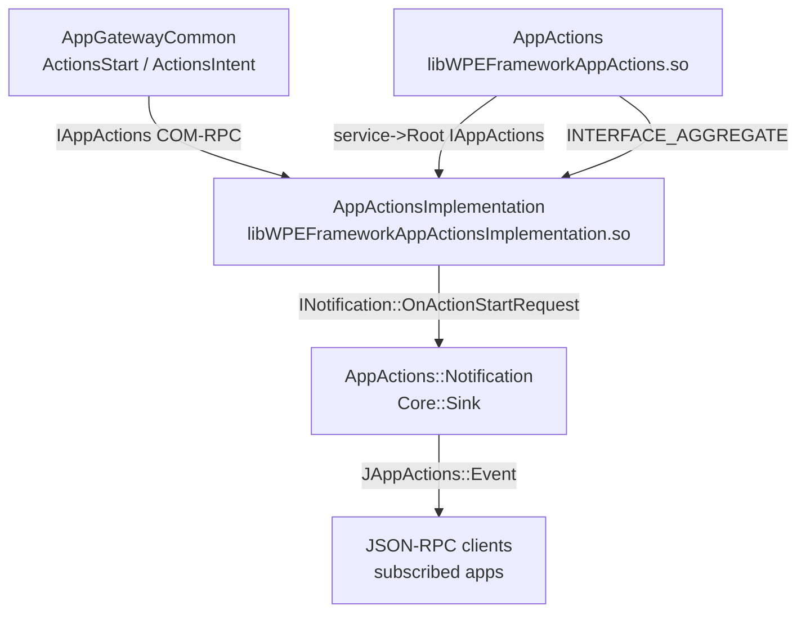
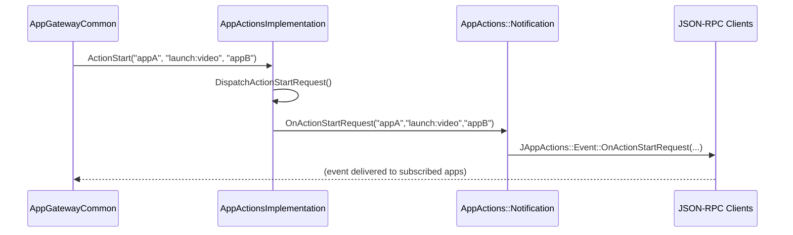

# AppActions Plugin

> **Source files:** `AppActions/`
> **Callsign:** `org.rdk.AppActions`
> **Shared libraries:** `libWPEFrameworkAppActions.so` (plugin shell), `libWPEFrameworkAppActionsImplementation.so` (implementation)
> **Version:** `1.0.0`

---

## 1. High-Level Purpose & Architecture

### Role in ENT / RDK Infrastructure

`AppActions` is a Thunder plugin that provides **app-to-app action and intent dispatch** on RDK devices. It exposes a Firebolt-compatible JSON-RPC interface (`JAppActions`) that allows one application to request that another application handle a specific intent (e.g., open a URL, launch a media item).

It is a relatively thin plugin compared to `AppGateway` or `AppGatewayCommon`: it exposes a single action method (`ActionStart`) and a single notification event (`OnActionStartRequest`).

### Responsibilities

| Responsibility | Component |
|---|---|
| Accept an `ActionStart` request (initiator, intent, handlerAppId) | `AppActionsImplementation::ActionStart()` |
| Notify registered listeners of new action-start requests | `AppActionsImplementation::DispatchActionStartRequest()` |
| Propagate `OnActionStartRequest` event to JSON-RPC clients | `AppActions::Notification::OnActionStartRequest()` → `JAppActions::Event::OnActionStartRequest()` |
| Manage listener registrations | `AppActionsImplementation::Register()` / `Unregister()` |

### What AppActions Does NOT Do

- Does **not** route WebSocket connections — those are handled by `AppGateway`.
- Does **not** authenticate callers — authentication is performed upstream in `AppGateway`.
- Does **not** implement business logic for the intents — the handler app fulfils the intent.

### Interacting Subsystems

```
AppGatewayCommon::ActionsStart()
  │  (COM-RPC → IAppActions)
  ▼
AppActionsImplementation::ActionStart()
  │
  ▼ DispatchActionStartRequest()
  │
  ▼ IAppActions::INotification::OnActionStartRequest()
  │
  ▼ AppActions::Notification (Core::Sink)
  │
  ▼ JAppActions::Event::OnActionStartRequest()  [JSON-RPC event to subscribed clients]
```

---

## 2. Architectural Overview

### Two-Library Split

Unlike the other plugins in this repository which compile to a single `.so`, `AppActions` compiles to **two separate shared libraries**:

| Library | Sources | Role |
|---|---|---|
| `libWPEFrameworkAppActions.so` | `AppActions.cpp`, `AppActions.h`, `Module.cpp` | Thunder plugin shell; JSON-RPC server; aggregates `IAppActions` |
| `libWPEFrameworkAppActionsImplementation.so` | `AppActionsImplementation.cpp`, `AppActionsImplementation.h`, `Module.cpp` | Out-of-process implementation; business logic |

This follows the standard WPEFramework out-of-process plugin pattern: the shell runs in the main Thunder process and proxies calls to the implementation which runs in a separate process.

### Component Diagram



---

## 3. Code Organization

```
AppActions/
├── AppActions.h / .cpp                # Plugin shell (IPlugin + JSONRPC)
├── AppActionsImplementation.h / .cpp  # Out-of-process implementation
├── Module.h / .cpp                    # WPEFramework module declaration
├── AppActions.conf.in                 # Thunder config template
├── AppActions.config                  # CMake config script
├── CMakeLists.txt                     # Builds TWO libraries
└── docs/
    └── (local docs)
```

### File Breakdown

| File | Purpose | Key Types |
|---|---|---|
| `AppActions.h/.cpp` | Plugin shell; aggregates `IAppActions` via `INTERFACE_AGGREGATE`; sinks `IAppActions::INotification` and `RPC::IRemoteConnection::INotification` | `AppActions`, `AppActions::Notification` |
| `AppActionsImplementation.h/.cpp` | Implementation plugin: `IPlugin`, `IAppActions`, `IConfiguration`; manages notification list; dispatches `OnActionStartRequest` | `AppActionsImplementation`, `ActionStart()`, `DispatchActionStartRequest()` |
| `Module.h/.cpp` | WPEFramework module boilerplate | `MODULE_NAME=Plugin_AppActions` |

---

## 4. Class & Interface Documentation

### 4.1 `AppActions` — Plugin Shell

**File:** `AppActions/AppActions.h`, `AppActions/AppActions.cpp`

**Inherits:** `PluginHost::IPlugin`, `PluginHost::JSONRPC`

**Interface map:**
```cpp
// AppActions/AppActions.h (excerpt)
BEGIN_INTERFACE_MAP(AppActions)
INTERFACE_ENTRY(PluginHost::IPlugin)
INTERFACE_ENTRY(PluginHost::IDispatcher)
INTERFACE_AGGREGATE(Exchange::IAppActions, mAppActions)
END_INTERFACE_MAP
```

**Key private members:**

| Member | Type | Purpose |
|---|---|---|
| `mService` | `PluginHost::IShell*` | Thunder service shell |
| `mConnectionId` | `uint32_t` | RPC connection ID for the out-of-process implementation |
| `mAppActions` | `Exchange::IAppActions*` | Rooted out-of-process implementation |
| `mAppActionsNotification` | `Core::Sink<Notification>` | Receives `IAppActions::INotification` callbacks |
| `mAppActionsConfigure` | `Exchange::IConfiguration*` | Interface for configuring the implementation |

#### `AppActions::Notification` inner class

Implements both `Exchange::IAppActions::INotification` and `RPC::IRemoteConnection::INotification`.

```cpp
// AppActions/AppActions.h (excerpt)
void OnActionStartRequest(const string& initiator, const string& intent,
                          const string& handlerAppId) {
    Exchange::JAppActions::Event::OnActionStartRequest(
        _parent, initiator, intent, handlerAppId);
}
```

When `AppActionsImplementation` calls back via `IAppActions::INotification::OnActionStartRequest()`, this sink fires `JAppActions::Event::OnActionStartRequest()` which broadcasts the JSON-RPC event to all subscribed clients.

---

### 4.2 `AppActionsImplementation` — Out-of-Process Implementation

**File:** `AppActions/AppActionsImplementation.h`, `AppActions/AppActionsImplementation.cpp`

**Implements:** `PluginHost::IPlugin`, `Exchange::IAppActions`, `Exchange::IConfiguration`

**Interface map:**
```cpp
// AppActions/AppActionsImplementation.h (excerpt)
BEGIN_INTERFACE_MAP(AppActionsImplementation)
INTERFACE_ENTRY(Exchange::IConfiguration)
INTERFACE_ENTRY(PluginHost::IPlugin)
INTERFACE_ENTRY(Exchange::IAppActions)
END_INTERFACE_MAP
```

**Key Members:**

| Member | Type | Purpose |
|---|---|---|
| `mService` | `PluginHost::IShell*` | Thunder service shell |
| `mAppActionsNotifications` | `std::list<INotification*>` | Registered notification listeners |
| `mAdminLock` | `Core::CriticalSection` | Guards `mAppActionsNotifications` |

**Key Methods:**

| Method | Description |
|---|---|
| `Configure(IShell*)` | `IConfiguration` entry; stores service shell |
| `ActionStart(initiator, intent, handlerAppId)` | Receives the action start request; calls `DispatchActionStartRequest()` |
| `DispatchActionStartRequest(initiator, intent, handlerAppId)` | Iterates `mAppActionsNotifications` and calls `OnActionStartRequest()` on each |
| `Register(INotification*)` | Add a notification listener (thread-safe) |
| `Unregister(INotification*)` | Remove a notification listener (thread-safe) |

**Dispatch implementation pattern:**

```cpp
// AppActionsImplementation.cpp — DispatchActionStartRequest
void AppActionsImplementation::DispatchActionStartRequest(
        const string& initiator, const string& intent, const string& handlerAppId) {
    mAdminLock.Lock();
    for (auto* notification : mAppActionsNotifications) {
        notification->OnActionStartRequest(initiator, intent, handlerAppId);
    }
    mAdminLock.Unlock();
}
```

---

### 4.3 `IAppActions` Interface (Exchange)

The interface is defined in `interfaces/IAppActions.h` (not in this repository). Key surface:

| Method | Direction | Description |
|---|---|---|
| `ActionStart(initiator, intent, handlerAppId)` | Caller → Implementation | Trigger an action start |
| `Register(INotification*)` | Caller → Implementation | Register for `OnActionStartRequest` events |
| `Unregister(INotification*)` | Caller → Implementation | Unregister |
| `INotification::OnActionStartRequest(initiator, intent, handlerAppId)` | Implementation → Caller | Fired when an action start occurs |

---

## 5. Configuration & Build Integration

### CMake Build (`AppActions/CMakeLists.txt`)

This is the only plugin in the repository that produces **two libraries from one `CMakeLists.txt`**:

```cmake
# Shell library
add_library(${MODULE_NAME} SHARED
    AppActions.cpp  AppActions.h  Module.cpp)

# Implementation library
add_library(${PLUGIN_IMPLEMENTATION} SHARED
    AppActionsImplementation.cpp  AppActionsImplementation.h  Module.cpp)
```

**Key CMake options:**

| Option | Default | Effect |
|---|---|---|
| `PLUGIN_APPACTIONS` | — | Must be `ON` |
| `PLUGIN_APPACTIONS_AUTOSTART` | `"false"` | Thunder autostart |
| `PLUGIN_APPACTIONS_STARTUPORDER` | `""` | Plugin startup sequence |

**Linked libraries (both targets):** `${NAMESPACE}Plugins`, `${NAMESPACE}Definitions`, `uuid`

**Install targets:**
- Shell: `${CMAKE_INSTALL_PREFIX}/lib/${STORAGE_DIRECTORY}/plugins`
- Implementation: `lib/${STORAGE_DIRECTORY}/plugins`

### Plugin Configuration

```cmake
# AppActions/AppActions.config
set(autostart "false")
set(callsign "org.rdk.AppActions")
```

---

## 6. Internal Workflows & Execution Flow

### 6.1 Plugin Initialization

```
Thunder calls AppActions::Initialize(service)
  ├── Store mService
  ├── service->Root<IAppActions>(mConnectionId, timeout, "AppActionsImplementation")
  │     └── AppActionsImplementation::Initialize(service)
  │     └── AppActionsImplementation::Configure(service)
  ├── mAppActions->Register(&mAppActionsNotification)   // subscribe for callbacks
  └── Exchange::JAppActions::Register(*this, mAppActions) // expose JSON-RPC methods
```

### 6.2 Action Start Flow

```
AppGatewayCommon::ActionsStart(ctx, payload, result)
  └── IAppActions::ActionStart(initiator, intent, handlerAppId)  [COM-RPC]
        └── AppActionsImplementation::ActionStart(...)
              └── DispatchActionStartRequest(initiator, intent, handlerAppId)
                    └── for each INotification* in mAppActionsNotifications:
                          └── notification->OnActionStartRequest(initiator, intent, handlerAppId)
                                └── AppActions::Notification::OnActionStartRequest()
                                      └── JAppActions::Event::OnActionStartRequest()
                                            └── JSON-RPC event broadcast to subscribed clients
```

### 6.3 Notification Registration

```
Client subscribes to "onActionStartRequest" JSON-RPC event
  └── Thunder JSON-RPC subscription
        └── AppActions JSONRPC server records subscription
              └── On ActionStart: JAppActions::Event::OnActionStartRequest() broadcasts event
```

### 6.4 Shutdown

```
Thunder calls AppActions::Deinitialize(service)
  ├── Exchange::JAppActions::Unregister(*this)
  ├── mAppActions->Unregister(&mAppActionsNotification)
  ├── mAppActions->Release()
  └── mService->Release()
```

### 6.5 Remote Connection Drop Handling

```
RPC::IRemoteConnection::INotification::Deactivated(connection)
  └── AppActions::Deactivated(connection)
        └── if connection->Id() == mConnectionId:
              └── Initiate plugin deactivation / cleanup
```

### 6.6 Error Handling

- `ActionStart()` returns `Core::hresult`; errors are logged via `LOGINFO()` / `LOGERR()`.
- `Register()` / `Unregister()` are guarded by `mAdminLock` to prevent race conditions.
- Remote process death is handled via `Deactivated()` callback.

---

## 7. Diagrams & Visual Aids

### 7.1 Class Diagram

```mermaid
classDiagram
    class AppActions {
        +Initialize(service) string
        +Deinitialize(service) void
        -mAppActions : IAppActions*
        -mAppActionsNotification : Sink~Notification~
        -mAppActionsConfigure : IConfiguration*
    }
    class AppActionsNotification {
        +OnActionStartRequest(initiator, intent, handlerAppId) void
        +Activated(connection) void
        +Deactivated(connection) void
    }
    class AppActionsImplementation {
        +ActionStart(initiator, intent, handlerAppId) hresult
        +Register(notification) hresult
        +Unregister(notification) hresult
        +DispatchActionStartRequest(initiator, intent, handlerAppId) void
        -mAppActionsNotifications : list~INotification ptr~
        -mAdminLock : CriticalSection
    }

    AppActions --> AppActionsImplementation : roots out-of-process
    AppActions --> AppActionsNotification : owns (Core::Sink)
    AppActionsImplementation --> AppActionsNotification : notifies via INotification
```

### 7.2 Action Start Sequence



### 7.3 Plugin Lifecycle

```mermaid
stateDiagram-v2
    [*] --> Unloaded
    Unloaded --> Initializing : Thunder loads AppActions
    Initializing --> RootingImpl : service->Root IAppActions
    RootingImpl --> RegisteringNotif : mAppActions->Register()
    RegisteringNotif --> Ready : JAppActions::Register()
    Ready --> Dispatching : ActionStart() received
    Dispatching --> Ready : dispatch complete
    Ready --> Deinitializing : Thunder deactivates
    Deinitializing --> Unloaded : all releases done
    RootingImpl --> Error : Root() fails
    Error --> Unloaded : cleanup
```

---

## 8. Testing & Quality

### Existing Tests (`Tests/L1Tests/AppActions/`)

| Test File | Coverage Area |
|---|---|
| `AppActions_test.cpp` | `ActionStart()` dispatch, notification registration/unregistration |

### Relevant Mocks

| Mock | Purpose |
|---|---|
| `Tests/mocks/AppActionsMock.h` | `Exchange::IAppActions`, `IAppActions::INotification` |
| `Tests/mocks/ServiceMock.h` | `PluginHost::IShell` |
| `Tests/mocks/DispatcherMock.h` | `PluginHost::IDispatcher` |

### Missing Coverage & Suggestions

- No test for the remote-process-death path (`Deactivated()` callback).
- No test for concurrent `Register()` / `Unregister()` calls (thread safety of `mAdminLock`).
- No test for the JSON-RPC event broadcast (`JAppActions::Event::OnActionStartRequest()`).
- **Suggestion:** Add a test that registers multiple `INotification` listeners and verifies all are called when `ActionStart()` fires.
- **Suggestion:** Add a test that calls `Unregister()` during dispatch (listener removal while iterating) to verify lock safety.

---

## 9. Beginner-to-Expert Learning Path

### Must-Know First

1. Understand the WPEFramework out-of-process plugin pattern — two libraries, one shell that proxies via COM-RPC to the implementation.
2. Read `AppActions.h` — note the `INTERFACE_AGGREGATE` entry and the `Core::Sink<Notification>` member.
3. Read `AppActionsImplementation.h` — note the three interfaces it implements and the notification list.

### Intermediate

4. Trace a full `ActionStart()` call from `AppGatewayCommon::ActionsStart()` → `IAppActions::ActionStart()` → `AppActionsImplementation::DispatchActionStartRequest()` → `JAppActions::Event::OnActionStartRequest()`.
5. Understand why there are **two libraries**: the shell runs in-process with Thunder; the implementation runs in a separate sandboxed process. COM-RPC transparently bridges them.
6. Study `AppActions::Notification` — it is the critical bridge between the out-of-process COM-RPC callback and the in-process JSON-RPC event broadcast.

### Advanced

7. **Adding a new action type** — extend `IAppActions` with a new method in the Exchange interface definition; implement it in `AppActionsImplementation`; add the corresponding JSON-RPC handler and event in `JAppActions`.
8. **Understanding `Core::Sink<T>`** — a WPEFramework pattern for safely implementing notification interfaces as members of another class; study how `mAppActionsNotification` is passed to `mAppActions->Register()` and how it receives callbacks.

---

*Back to [README.md](../README.md) | Related: [AppGateway.md](AppGateway.md) | [AppGatewayCommon.md](AppGatewayCommon.md)*
