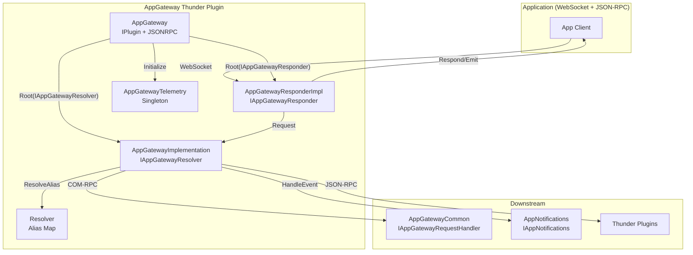
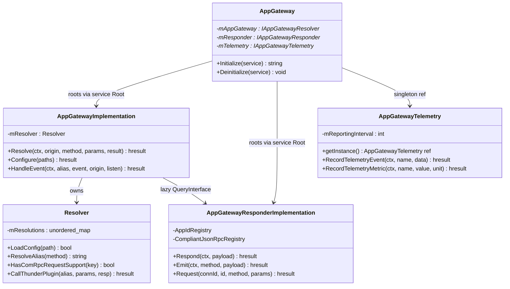
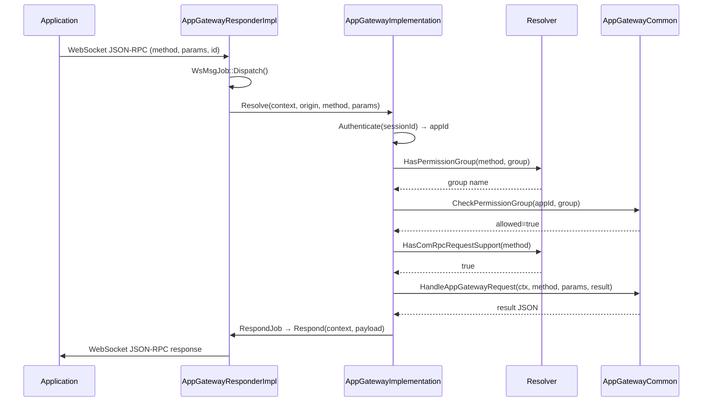
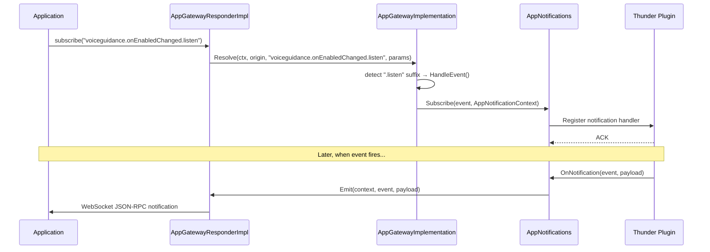
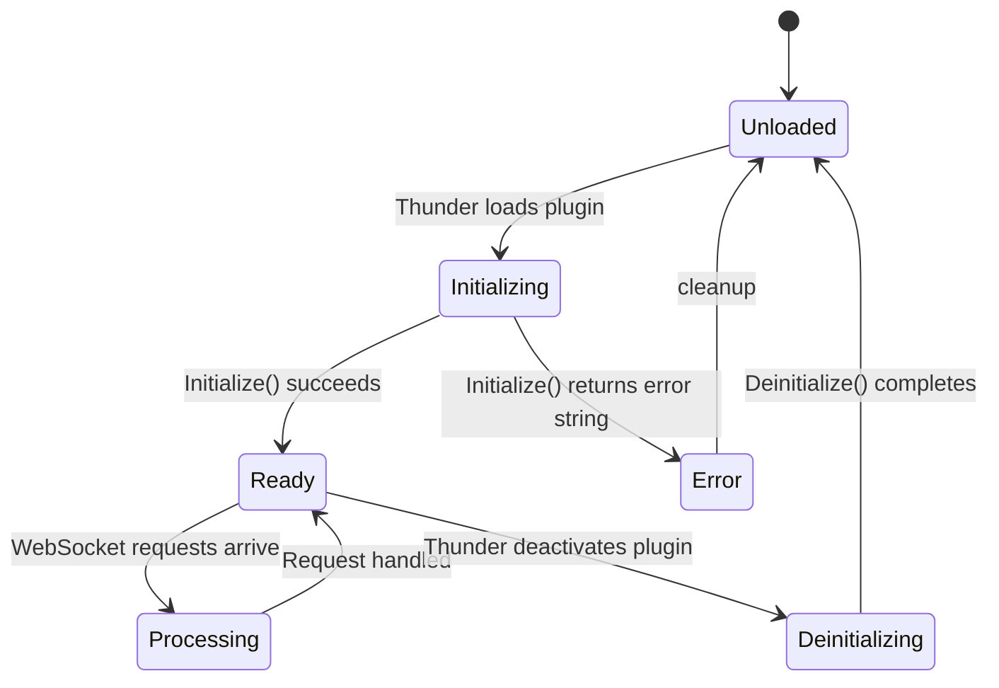

# AppGateway Plugin

> **Source files:** `AppGateway/`  
> **Callsign:** `org.rdk.AppGateway`  
> **Shared library:** `libWPEFrameworkAppGateway.so`  
> **Version:** `1.0.0`

---

## 1. High-Level Purpose & Architecture

### Role in ENT / RDK Infrastructure

`AppGateway` is the **central Firebolt-compatible API gateway** for all applications running on an RDK device. It is a Thunder (WPEFramework) plugin that acts as the single authenticated entry-point between WebSocket-connected applications and the underlying RDK Thunder plugin ecosystem.

It **deprecates the legacy Ripple Gateway** from the RDK Apps Managers Framework. Ripple Gateway support is being phased out and will be removed after the migration period.

### Responsibilities

| Responsibility | Component |
|---|---|
| Plugin registration & lifecycle with Thunder | `AppGateway` |
| WebSocket connection management | `AppGatewayResponderImplementation` |
| Request routing / resolution | `AppGatewayImplementation` + `Resolver` |
| Firebolt-to-Thunder method mapping | `Resolver` + `resolution.base.json` |
| Session authentication & permission checks | `AppGatewayCommon` (via COM-RPC) |
| Telemetry aggregation (T2) | `AppGatewayTelemetry` |
| Event emission back to apps | `AppGatewayResponderImplementation` |

### What AppGateway Does NOT Do

- Does **not** implement business-logic handlers — those live in **AppGatewayCommon**.
- Does **not** manage event subscriptions to Thunder plugins — that is **AppNotifications**.
- Does **not** control application lifecycle — delegated to **LifecycleDelegate** inside AppGatewayCommon.

### Interacting Subsystems

```
┌──────────────┐    WebSocket/JSON-RPC    ┌──────────────────────────┐
│ Applications │ ──────────────────────► │ AppGateway (this plugin) │
└──────────────┘                          └───────────┬──────────────┘
                                                      │ COM-RPC
                          ┌───────────────────────────┼─────────────────────────┐
                          ▼                            ▼                         ▼
                ┌──────────────────┐   ┌───────────────────────┐  ┌─────────────────────┐
                │ AppGatewayCommon │   │   AppNotifications    │  │  Thunder Plugins    │
                │ (business logic) │   │   (event routing)     │  │  (System, Display,) │
                └──────────────────┘   └───────────────────────┘  └─────────────────────┘
```

---

## 2. Architectural Overview

### Major Components

| Class | Interfaces Implemented | Role |
|---|---|---|
| `AppGateway` | `IPlugin`, `JSONRPC` | Thunder plugin entry point; aggregates all sub-interfaces |
| `AppGatewayImplementation` | `IAppGatewayResolver`, `IConfiguration` | Request resolution engine |
| `AppGatewayResponderImplementation` | `IAppGatewayResponder`, `IConfiguration` | WebSocket I/O layer |
| `Resolver` | *(internal)* | Firebolt→Thunder method alias map |
| `AppGatewayTelemetry` | `IAppGatewayTelemetry` | T2 telemetry aggregator (singleton) |

### High-Level Diagram



---

## 3. Code Organization

```
AppGateway/
├── AppGateway.h / .cpp                        # Plugin entry point (IPlugin + JSONRPC)
├── AppGatewayImplementation.h / .cpp          # Core request resolution engine
├── AppGatewayResponderImplementation.h / .cpp # WebSocket I/O
├── AppGatewayTelemetry.h / .cpp               # T2 telemetry aggregator (singleton)
├── Resolver.h / .cpp                          # Firebolt-to-Thunder alias map
├── Module.h / Module.cpp                      # WPEFramework module declaration
├── AppGateway.conf.in                         # Thunder config template
├── AppGateway.config                          # CMake config script
├── CMakeLists.txt                             # Build definition
└── resolutions/
    └── resolution.base.json                   # Base method resolution table
```

### File Breakdown

| File | Purpose | Key Types / Functions |
|---|---|---|
| `AppGateway.h/.cpp` | Plugin shell; registers with Thunder; aggregates interface map | `AppGateway::Initialize`, `Deinitialize`, `SERVICE_REGISTRATION` |
| `AppGatewayImplementation.h/.cpp` | Processes each incoming API call; auth, routing, context enrichment | `Resolve()`, `Configure()`, `HandleEvent()`, `RespondJob` |
| `AppGatewayResponderImplementation.h/.cpp` | Manages WebSocket connections; sends responses and events | `Respond()`, `Emit()`, `Request()`, `WsMsgJob`, `RespondJob` |
| `AppGatewayTelemetry.h/.cpp` | Singleton telemetry aggregator; reports to T2 | `RecordTelemetryEvent()`, `RecordTelemetryMetric()`, `getInstance()` |
| `Resolver.h/.cpp` | Loads `resolution.base.json`; maps Firebolt method names to Thunder aliases | `LoadConfig()`, `ResolveAlias()`, `HasComRpcRequestSupport()`, `CallThunderPlugin()` |
| `Module.h/.cpp` | WPEFramework boilerplate; defines `MODULE_NAME=Plugin_AppGateway` | — |
| `resolution.base.json` | Data file: all Firebolt→Thunder method mappings | JSON object keyed by Firebolt method name |

---

## 4. Class & Interface Documentation

### 4.1 `AppGateway` — Plugin Entry Point

**File:** `AppGateway/AppGateway.h`, `AppGateway/AppGateway.cpp`

**Inherits:** `PluginHost::IPlugin`, `PluginHost::JSONRPC`

**Responsibilities:** Register with Thunder; root all out-of-process implementation objects; expose aggregated interface map.

```cpp
// AppGateway/AppGateway.h (excerpt)
class AppGateway : public PluginHost::IPlugin, public PluginHost::JSONRPC {
public:
    virtual const string Initialize(PluginHost::IShell *service) override;
    virtual void Deinitialize(PluginHost::IShell *service) override;

    BEGIN_INTERFACE_MAP(AppGateway)
    INTERFACE_ENTRY(PluginHost::IPlugin)
    INTERFACE_ENTRY(PluginHost::IDispatcher)
    INTERFACE_AGGREGATE(Exchange::IAppGatewayResolver,  mAppGateway)
    INTERFACE_AGGREGATE(Exchange::IAppGatewayResponder, mResponder)
    INTERFACE_AGGREGATE(Exchange::IAppGatewayTelemetry, mTelemetry)
    END_INTERFACE_MAP
private:
    PluginHost::IShell*              mService;
    Exchange::IAppGatewayResolver*   mAppGateway;   // AppGatewayImplementation
    Exchange::IAppGatewayResponder*  mResponder;    // AppGatewayResponderImplementation
    Exchange::IAppGatewayTelemetry*  mTelemetry;    // AppGatewayTelemetry singleton
    uint32_t mConnectionId;
};
```

**Lifecycle:**
1. `Initialize()` — starts telemetry singleton; roots `AppGatewayImplementation` and `AppGatewayResponderImplementation` as out-of-process objects via `service->Root<T>()`; calls `IConfiguration::Configure(service)` on each.
2. `Deinitialize()` — unregisters JSON-RPC methods; releases all interface pointers and the service shell.

**Key pattern — measuring bootstrap time:**
```cpp
// AppGateway/AppGateway.cpp  lines ~70-80
auto bootstrapStart = std::chrono::steady_clock::now();
AppGatewayTelemetry::getInstance().Initialize(service);
mAppGateway = service->Root<Exchange::IAppGatewayResolver>(mConnectionId, 2000, _T("AppGatewayImplementation"));
```

---

### 4.2 `AppGatewayImplementation` — Request Resolution Engine

**File:** `AppGateway/AppGatewayImplementation.h`, `AppGateway/AppGatewayImplementation.cpp`

**Implements:** `Exchange::IAppGatewayResolver`, `Exchange::IConfiguration`

**Responsibilities:** Receive every incoming JSON-RPC call; authenticate; resolve alias via `Resolver`; dispatch to COM-RPC (AppGatewayCommon) or direct JSON-RPC (Thunder plugin); return result.

**Key Members:**

| Member | Type | Purpose |
|---|---|---|
| `mResolver` | `Resolver` | Holds loaded resolution config |
| `mService` | `PluginHost::IShell*` | Access to Thunder service bus |
| `mAppGatewayResponder` | `Exchange::IAppGatewayResponder*` | Lazy-acquired; used to return responses |

**Key Methods:**

| Method | Description |
|---|---|
| `Configure(IStringIterator* paths)` | Loads resolution config files into `Resolver` |
| `Configure(IShell* service)` | `IConfiguration` entry; reads plugin config |
| `Resolve(Context&, origin, method, params, result&)` | Main dispatch path for every request |
| `HandleEvent(Context&, alias, event, origin, listen)` | Routes subscribe/unsubscribe to AppNotifications |

**`RespondJob` — async response dispatch:**
```cpp
// AppGateway/AppGatewayImplementation.h (excerpt)
virtual void Dispatch() override {
    if (ContextUtils::IsOriginGateway(mDestination)) {
        mParent.ReturnMessageInSocket(mContext, std::move(mPayload));
    } else {
        mParent.SendToLaunchDelegate(mContext, std::move(mPayload));
    }
}
```

The `RespondJob` is a `Core::IDispatch`-derived inner class; it safely routes a completed response either back through the WebSocket (gateway origin) or to the launch delegate (app origin).

---

### 4.3 `AppGatewayResponderImplementation` — WebSocket I/O Layer

**File:** `AppGateway/AppGatewayResponderImplementation.h`, `AppGateway/AppGatewayResponderImplementation.cpp`

**Implements:** `Exchange::IAppGatewayResponder`, `Exchange::IConfiguration`

**Responsibilities:** Manage WebSocket connections via `WebSocketConnectionManager`; serialize and send responses/events; track per-connection context (appId, JSON-RPC compliance mode).

**Public Interface:**

| Method | Description |
|---|---|
| `Respond(context, payload)` | Send JSON-RPC response to connection identified by `context.connectionId` |
| `Emit(context, method, payload)` | Push a named event to a specific connection |
| `Request(connectionId, id, method, params)` | Forward an incoming app request into the resolution engine |
| `GetGatewayConnectionContext(connId, key, value&)` | Read per-connection metadata (e.g., `appId`) |
| `RecordGatewayConnectionContext(connId, key, value)` | Write per-connection metadata |
| `Register(INotification*)` | Subscribe to connection-status change events |
| `Unregister(INotification*)` | Unsubscribe from connection-status change events |
| `OnConnectionStatusChanged(appId, connId, connected)` | Internal callback on WebSocket connect/disconnect |

**Internal Job Classes:**

| Job | Trigger | Action |
|---|---|---|
| `WsMsgJob` | Incoming WebSocket message | Calls `DispatchWsMsg()` to parse & route |
| `RespondJob` | Response ready | Calls `ReturnMessageInSocket()` |

**Internal Registries:**
- `AppIdRegistry` — maps `connectionId → appId` (mutex-protected).
- `CompliantJsonRpcRegistry` — tracks which connections use JSON-RPC 2.0 format, detected from `RPCV2=true` in auth token.

---

### 4.4 `Resolver` — Method Alias Map

**File:** `AppGateway/Resolver.h`, `AppGateway/Resolver.cpp`

**Responsibilities:** Load and cache `resolution.base.json` (and any overlay files); answer queries about how a given Firebolt method should be routed.

**`Resolution` struct:**
```cpp
// AppGateway/Resolver.h (excerpt)
struct Resolution {
    std::string alias;            // Target Thunder callsign/method
    std::string event;            // Event name (for subscriptions)
    std::string permissionGroup;  // Required permission group
    JsonValue   additionalContext;
    bool includeContext  = false; // Inject GatewayContext into params
    bool useComRpc       = false; // Route via COM-RPC vs JSON-RPC
    bool versionedEvent  = false; // Event uses version-specific name
};
```

**Query Methods:**

| Method | Returns | Description |
|---|---|---|
| `LoadConfig(path)` | `bool` | Parse a JSON resolution file; merge into `mResolutions` map |
| `ResolveAlias(method)` | `string` | Look up the Thunder alias for a Firebolt method |
| `HasComRpcRequestSupport(key)` | `bool` | Is this method routed via COM-RPC? |
| `HasEvent(key)` | `bool` | Does this method carry an event field? |
| `HasIncludeContext(key, ctx&)` | `bool` | Should `GatewayContext` be injected into params? |
| `HasPermissionGroup(key, grp&)` | `bool` | Required permission group for this method |
| `IsVersionedEvent(key)` | `bool` | Is the event name version-qualified? |
| `CallThunderPlugin(alias, params, resp&)` | `Core::hresult` | Direct JSON-RPC call to a Thunder plugin |
| `ClearResolutions()` | `void` | Reset the resolution map |
| `IsConfigured()` | `bool` | Check if resolver has been loaded |

**Private helpers:** `ParseAlias()`, `ExtractStringField()`, `ExtractBooleanField()`, `ExtractAdditionalContext()`.

**Thread safety:** `mMutex` (`std::mutex`) guards all reads/writes to `mResolutions`.

---

### 4.5 `AppGatewayTelemetry` — T2 Aggregator

**File:** `AppGateway/AppGatewayTelemetry.h`, `AppGateway/AppGatewayTelemetry.cpp`

**Implements:** `Exchange::IAppGatewayTelemetry`

**Pattern:** Singleton — `AppGatewayTelemetry::getInstance()`

**What it tracks:**
- Bootstrap time (plugin init duration)
- WebSocket connection counts
- Total / successful / failed API calls
- Per-API error counts
- External service error counts (gRPC, Permissions, etc.)

**Key methods:**

| Method | Description |
|---|---|
| `RecordTelemetryEvent(context, eventName, eventData)` | Record a named T2 event (e.g., `agw_xyzApiError`) |
| `RecordTelemetryMetric(context, metricName, value, unit)` | Record an aggregated metric (sum/min/max/count) |
| `Initialize(service)` | Start the bootstrap timer and periodic flush |
| `getInstance()` | Return the singleton instance |
| `CreateSystemContext()` | Helper to build a `GatewayContext` for aggregated metrics |

**Reporting configuration:**
- Default interval: **3600 seconds (1 hour)** — `TELEMETRY_DEFAULT_REPORTING_INTERVAL_SEC`
- Default cache threshold: **1000 records** — `TELEMETRY_DEFAULT_CACHE_THRESHOLD`
- Output formats: `TelemetryFormat::JSON` (verbose) or `TelemetryFormat::COMPACT` (CSV)

**Build flag:** `BUILD_ENABLE_TELEMETRY_LOGGING` must be set to link `telemetry_msgsender`.

---

## 5. Configuration & Build Integration

### Plugin Configuration

```cmake
# AppGateway/AppGateway.config
set(autostart ${PLUGIN_APPGATEWAY_AUTOSTART})   # default: "false"
set(preconditions Platform)
set(callsign "org.rdk.AppGateway")
```

### CMake Build (`AppGateway/CMakeLists.txt`)

The plugin compiles to a single shared library from:

```
AppGateway.cpp
AppGatewayImplementation.cpp
AppGatewayResponderImplementation.cpp
AppGatewayTelemetry.cpp
Resolver.cpp
Module.cpp
```

**Key CMake options:**

| Option / Variable | Default | Effect |
|---|---|---|
| `PLUGIN_APPGATEWAY` | — | Must be `ON` to include this subdirectory |
| `PLUGIN_APPGATEWAY_AUTOSTART` | `"false"` | Thunder autostart flag |
| `PLUGIN_APPGATEWAY_STARTUPORDER` | `""` | Plugin startup sequence |
| `BUILD_ENABLE_TELEMETRY_LOGGING` | OFF | Enables T2 logging; links `telemetry_msgsender` |
| `ENABLE_APP_GATEWAY_AUTOMATION` | OFF | Enables automation test hooks |
| `BUILD_CONFIG_PATH` | — | Compile-time path to build-specific config |
| `VENDOR_CONFIG_PATH` | — | Compile-time path to vendor config |
| `USE_THUNDER_R4` | OFF | Compile against Thunder R4 APIs |
| `DISABLE_SECURITY_TOKEN` | OFF | Bypass auth token checking |

**Install:** `lib/${STORAGE_DIRECTORY}/plugins`
**Resolution file install:** `/etc/app-gateway/resolution.base.json`

### `resolution.base.json` — Method Resolution Table

**Location:** `AppGateway/resolutions/resolution.base.json`

Each entry maps a Firebolt API method to a Thunder routing target:

```json
{
  "resolutions": {
    "device.name": {
      "alias": "org.rdk.AppGatewayCommon",
      "useComRpc": true
    },
    "device.setName": {
      "alias": "org.rdk.AppGatewayCommon",
      "useComRpc": true,
      "permissionGroup": "org.rdk.permission.group.enhanced"
    },
    "voiceguidance.setEnabled": {
      "alias": "org.rdk.AppGatewayCommon",
      "useComRpc": true,
      "permissionGroup": "org.rdk.permission.group.enhanced"
    }
  }
}
```

**Fields:**

| Field | Type | Description |
|---|---|---|
| `alias` | string | Target Thunder callsign (or `callsign.method` for JSON-RPC routing) |
| `useComRpc` | bool | If `true`, dispatched via COM-RPC to `IAppGatewayRequestHandler` |
| `permissionGroup` | string | If set, `CheckPermissionGroup()` is called before dispatch |
| `event` | string | Event name for subscription methods |
| `includeContext` | bool | If `true`, injects `GatewayContext` into request params |
| `additionalContext` | object | Static JSON object merged into context |
| `versionedEvent` | bool | If `true`, appends version suffix to event name |

---

## 6. Internal Workflows & Execution Flow

### 6.1 Plugin Initialization

```
Thunder framework calls AppGateway::Initialize(service)
  ├── AppGatewayTelemetry::getInstance().Initialize(service)    // bootstrap timer starts
  ├── service->Root<IAppGatewayResolver>("AppGatewayImplementation")
  │     └── AppGatewayImplementation::Configure(service)        // loads resolution configs
  ├── service->Root<IAppGatewayResponder>("AppGatewayResponderImplementation")
  │     └── AppGatewayResponderImplementation::Configure(service)// sets up WS manager
  └── Exchange::JAppGatewayResolver::Register(*this, mAppGateway)// expose JSON-RPC methods
```

### 6.2 Request Flow (App → Thunder)

```
WebSocket message arrives
  └── AppGatewayResponderImplementation::WsMsgJob::Dispatch()
        └── DispatchWsMsg(method, params, requestId, connectionId)
              └── AppGatewayImplementation::Resolve(context, origin, method, params, result)
                    ├── Authenticate session → get appId
                    ├── Resolver::HasPermissionGroup() → CheckPermissionGroup(appId, group)
                    ├── Resolver::HasIncludeContext() → enrich params with context
                    ├── Resolver::HasComRpcRequestSupport() ?
                    │     YES → AppGatewayCommon::HandleAppGatewayRequest(ctx, method, params, result)
                    │     NO  → Resolver::CallThunderPlugin(alias, params, result)
                    └── AppGatewayImplementation::RespondJob → Respond(context, payload)
```

### 6.3 Event Subscription Flow

```
App sends "voiceguidance.onEnabledChanged.listen"
  └── AppGatewayImplementation detects ".listen" suffix
        └── HandleEvent(context, alias, event, origin, listen=true)
              └── AppNotifications::Subscribe(event, AppNotificationContext)
                    └── ThunderSubscriptionManager::Subscribe(module, event)
                          └── Thunder plugin registers notification handler
```

### 6.4 Event Emission Flow (Thunder → App)

```
Thunder plugin fires event
  └── AppNotifications::ThunderSubscriptionManager::HandleNotification()
        └── SubscriberMap::EventUpdate(key, payload, appId)
              └── for each subscriber context:
                    └── AppGatewayResponderImplementation::Emit(context, method, payload)
                          └── WebSocket message sent to app
```

### 6.5 Shutdown

```
Thunder calls AppGateway::Deinitialize(service)
  ├── Unregister JSON-RPC methods
  ├── mAppGateway->Release()
  ├── mResponder->Release()
  ├── mTelemetry->Release()
  └── mService->Release()
```

### 6.6 Error Handling

| Error Code | Meaning | Typical Source |
|---|---|---|
| `Core::ERROR_NONE` | Success | — |
| `Core::ERROR_GENERAL` | Generic failure | Plugin call failed |
| `Core::ERROR_INVALID_PARAMETER` | Bad input | Auth token missing / malformed |
| `Core::ERROR_UNAVAILABLE` | Service not ready | AppGatewayCommon not activated |
| `Core::ERROR_ILLEGAL_STATE` | Wrong state | Called before `Initialize` |

Errors are propagated as `Core::hresult` return values, logged via `LOGERR()`, and converted to JSON-RPC error responses before being sent back to the application over WebSocket.

---

## 7. Diagrams & Visual Aids

### 7.1 Class Relationships



### 7.2 Request Sequence Diagram



### 7.3 Event Subscription Sequence



### 7.4 Plugin Lifecycle



---

## 8. Testing & Quality

### Existing Test Infrastructure

| Location | Type | Notes |
|---|---|---|
| `Tests/L1Tests/` | Unit tests | GTest-based; covers AppGatewayCommon, AppActions |
| `Tests/mocks/` | Mock headers | `AppGatewayMock.h`, `ServiceMock.h`, etc. |
| `AppGateway/tests/CurlCmds.md` | Manual/smoke | curl command examples for live testing |

### Relevant Mocks

| Mock File | Mocked Interface |
|---|---|
| `Tests/mocks/AppGatewayMock.h` | `Exchange::IAppGateway*` interfaces |
| `Tests/mocks/ServiceMock.h` | `PluginHost::IShell` |
| `Tests/mocks/DispatcherMock.h` | `PluginHost::IDispatcher` |
| `Tests/mocks/TelemetryMock.h` | `Exchange::IAppGatewayTelemetry` |
| `Tests/mocks/MockEmitter.h` | `IAppNotificationHandler::IEmitter` |

### Missing Coverage & Suggestions

- No automated tests for the `Resolver` JSON parsing logic with malformed inputs.
- No integration tests for the full WebSocket request/response round-trip within AppGateway itself.
- `AppGatewayTelemetry` flush/threshold logic has no unit tests.
- **Suggestion:** Add L1 tests for `Resolver::LoadConfig()` with valid, empty, and corrupted JSON inputs.
- **Suggestion:** Add L1 tests for `AppGatewayImplementation::Resolve()` with mocked `Resolver` and `IAppGatewayRequestHandler`.

---

## 9. Beginner-to-Expert Learning Path

### Must-Know First

1. **Thunder (WPEFramework) basics** — understand `IPlugin`, `JSONRPC`, `IShell`, `Core::hresult`, COM-RPC vs JSON-RPC.
2. **What is a Firebolt API?** — it is an app-facing JSON-RPC API; AppGateway translates it to internal RDK APIs.
3. **Read `Module.h`** — establishes the module name used throughout WPEFramework macros.
4. **Read `AppGateway.h` and `AppGateway.cpp`** — the plugin entry point is small and linear; trace `Initialize()` step by step.
5. **Read `resolution.base.json`** — this is the map from every Firebolt method to its Thunder target; understanding this unlocks the rest.

### Intermediate

6. **Read `Resolver.h/.cpp`** — understand how the JSON config is parsed and queried.
7. **Trace a single request** through `AppGatewayResponderImplementation::Request()` → `AppGatewayImplementation::Resolve()` → `Resolver::ResolveAlias()` → `AppGatewayCommon::HandleAppGatewayRequest()` → `Respond()`.
8. **Understand `GatewayContext`** — follow how `connectionId`, `requestId`, `appId`, and `sessionId` are created and passed across the chain.
9. **Read `AppGatewayTelemetry.h`** — understand the singleton pattern and how T2 telemetry events are recorded.

### Advanced

10. **Async job dispatch** — study `WsMsgJob`, `RespondJob` in both `AppGatewayResponderImplementation` and `AppGatewayImplementation`; understand why `Core::IDispatch` is used instead of direct calls.
11. **JSON-RPC 2.0 compliance detection** — find `CompliantJsonRpcRegistry` and trace how `RPCV2=true` changes response formatting.
12. **Adding a new Firebolt method** — add entry in `resolution.base.json`; if custom logic is needed, add a handler in `AppGatewayCommon` and register it in its handler map; no AppGateway code change required.
13. **Adding a new event** — add event entry in resolution config; add subscription logic in `AppNotifications`; event routing is automatic.

---

*Back to [README.md](../README.md) | Related: [AppGatewayCommon.md](AppGatewayCommon.md) | [AppNotifications.md](AppNotifications.md)*
