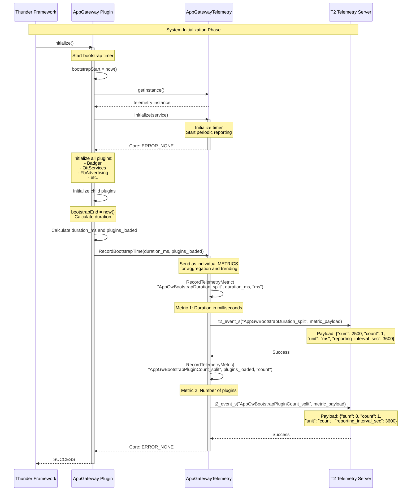

# Scenario 1: Bootstrap Time Tracking

## Overview

This sequence diagram illustrates how App Gateway measures and reports the total time taken to initialize all plugins during system bootstrap.

## Sequence Diagram



## Key Components

| Component | Responsibility |
|-----------|---------------|
| **Thunder Framework** | Initiates plugin loading sequence |
| **AppGateway Plugin** | Measures bootstrap time across all child plugins |
| **AppGatewayTelemetry** | Aggregates and reports bootstrap metrics to T2 |
| **T2 Telemetry Server** | Receives and stores telemetry data |

## Data Flow

1. **Bootstrap Start**: AppGateway records timestamp when `Initialize()` is called
2. **Plugin Initialization**: All child plugins (Badger, OttServices, etc.) are loaded
3. **Bootstrap End**: After all plugins load, calculate total duration
4. **Telemetry Recording**: Report bootstrap time and plugin count to telemetry
5. **T2 Reporting**: Telemetry formats and sends data to T2 server

## T2 Markers

**Metric 1 Name:** `AppGwBootstrapDuration_split`

**Metric Payload Format:**
```json
{
  "sum": 2500,
  "count": 1,
  "unit": "ms",
  "reporting_interval_sec": 3600
}
```

**Metric 2 Name:** `AppGwBootstrapPluginCount_split`

**Metric Payload Format:**
```json
{
  "sum": 8,
  "count": 1,
  "unit": "count",
  "reporting_interval_sec": 3600
}
```

**Compact Format:**
```
AppGwBootstrapDuration_split: 2500,1,ms,3600
AppGwBootstrapPluginCount_split: 8,1,count,3600
```

## Configuration

- **Reporting**: Immediate upon bootstrap completion
- **Frequency**: Once per system start
- **Format**: Individual numeric metrics for aggregation
- **Data Type**: METRIC (not EVENT)

## Notes

- Bootstrap time is critical for measuring system startup performance
- Helps identify slow plugin initialization
- Reported as individual METRICS for statistical aggregation
- Each metric (duration and plugin count) sent separately with its own T2 marker
- Metrics can be aggregated, trended, and alerted on over time
- Independent of periodic telemetry reporting interval
