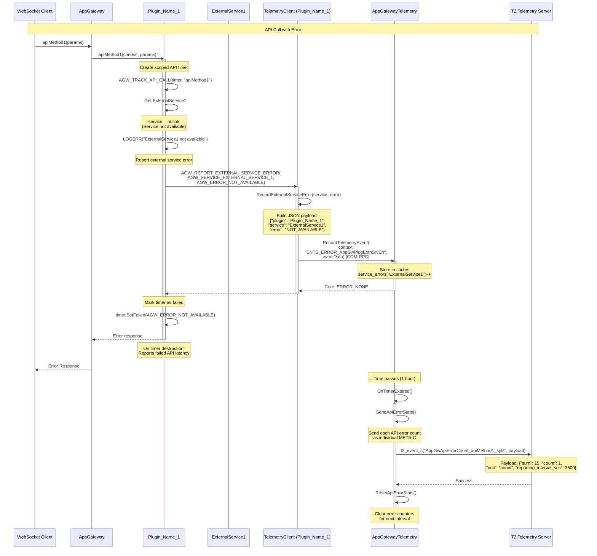

# Scenario 3: API Error Reporting (Plugin Example)

## Overview

This sequence diagram illustrates how a plugin reports API errors to App Gateway via COM-RPC using the generic marker system. The example shows `apiMethod1` failing due to external service unavailability.

## Sequence Diagram


```mermaid
sequenceDiagram
    participant Client as WebSocket Client
    participant AppGw as AppGateway
    participant Plugin as Plugin_Name_1
    participant ExtService as ExternalService1
    participant TelemetryClient as TelemetryClient (Plugin_Name_1)
    participant Telemetry as AppGatewayTelemetry
    participant T2 as T2 Telemetry Server
    
    Note over Client,T2: API Call with Error
    
    Client->>AppGw: apiMethod1(params)
    AppGw->>Plugin: apiMethod1(context, params)
    activate Plugin
    
    Note over Plugin: Create scoped API timer
    Plugin->>Plugin: AGW_TRACK_API_CALL(timer, "apiMethod1")
    
    Plugin->>Plugin: Get ExternalService1
    Note over Plugin: service = nullptr<br/>(Service not available)
    
    Plugin->>Plugin: LOGERR("ExternalService1 not available")
    
    Note over Plugin: Report external service error
    Plugin->>TelemetryClient: AGW_REPORT_EXTERNAL_SERVICE_ERROR(<br/>AGW_SERVICE_EXTERNAL_SERVICE_1,<br/>AGW_ERROR_NOT_AVAILABLE)
    activate TelemetryClient
    
    TelemetryClient->>TelemetryClient: RecordExternalServiceError(service, error)
    
    Note over TelemetryClient: Build JSON payload:<br/>{"plugin": "Plugin_Name_1",<br/> "service": "ExternalService1",<br/> "error": "NOT_AVAILABLE"}
    
    TelemetryClient->>Telemetry: RecordTelemetryEvent(<br/>context,<br/>"ENTS_ERROR_AppGwPlugExtnSrvErr",<br/>eventData) [COM-RPC]
    activate Telemetry
    
    Note over Telemetry: Store in cache:<br/>service_errors["ExternalService1"]++
    
    Telemetry-->>TelemetryClient: Core::ERROR_NONE
    deactivate Telemetry
    
    TelemetryClient-->>Plugin: 
    deactivate TelemetryClient
    
    Note over Plugin: Mark timer as failed
    Plugin->>Plugin: timer.SetFailed(AGW_ERROR_NOT_AVAILABLE)
    
    Plugin-->>AppGw: Error response
    deactivate Plugin
    
    Note over Plugin: On timer destruction:<br/>Reports failed API latency
    
    AppGw-->>Client: Error Response
    
    Note over Telemetry: ... Time passes (1 hour) ...
    
    Telemetry->>Telemetry: OnTimerExpired()
    activate Telemetry
    
    Telemetry->>Telemetry: SendApiErrorStats()
    
    Note over Telemetry: Send each API error count<br/>as individual METRIC
    
    Telemetry->>T2: t2_event_s("AppGwApiErrorCount_apiMethod1_split", payload)
    Note over T2: Payload: {"sum": 15, "count": 1,<br/>"unit": "count", "reporting_interval_sec": 3600}
    T2-->>Telemetry: Success
    
    Telemetry->>Telemetry: ResetApiErrorStats()
    Note over Telemetry: Clear error counters<br/>for next interval
    
    deactivate Telemetry
```

## Key Components

| Component | Responsibility |
|-----------|---------------|
| **WebSocket Client** | Initiates API call to AppGateway |
| **AppGateway** | Routes request to plugin |
| **Plugin_Name_1** | Processes API call, encounters error |
| **ExternalService1** | External service (unavailable in this scenario) |
| **TelemetryClient** | Helper class in plugin for telemetry reporting |
| **AppGatewayTelemetry** | Aggregates errors and reports to T2 |
| **T2 Telemetry Server** | Receives aggregated error statistics |

## Error Flow

1. **API Call**: Client requests method via AppGateway
2. **Service Check**: Plugin attempts to get external service
3. **Error Detection**: External service is unavailable
4. **Error Logging**: Plugin logs error with context
5. **Telemetry Reporting**: Report external service error via `AGW_REPORT_EXTERNAL_SERVICE_ERROR`
6. **COM-RPC Call**: TelemetryClient calls AppGatewayTelemetry via COM-RPC
7. **Error Aggregation**: AppGatewayTelemetry increments error counter
8. **Timer Tracking**: Scoped timer marks API call as failed
9. **Client Response**: Return default value to client
10. **Periodic Reporting**: Aggregated errors sent to T2 every hour

## Generic Marker System

### Event Marker (Immediate - Individual Occurrences)
**Marker:** `ENTS_ERROR_AppGwPlugExtnSrvErr`
**Payload:**
```json
{
  "plugin": "Plugin_Name_1",
  "service": "ExternalService1",
  "error": "NOT_AVAILABLE"
}
```

### Aggregated Error Count Metrics (Periodic - Per API)
**Metric Name Pattern:** `AppGwApiErrorCount_<ApiName>_split`

**Example Metric:** `AppGwApiErrorCount_apiMethod1_split`
**Payload:**
```json
{
  "sum": 15,
  "count": 1,
  "unit": "count",
  "reporting_interval_sec": 3600
}
```

**Compact Format:**
```
AppGwApiErrorCount_apiMethod1_split: 15,1,count,3600
```

## Predefined Constants Used

```cpp
// From AppGatewayTelemetryMarkers.h
#define AGW_PLUGIN_YOUR_PLUGIN               "YourPlugin"
#define AGW_SERVICE_EXTERNAL_SERVICE_1       "ExternalService1"
#define AGW_ERROR_NOT_AVAILABLE              "NOT_AVAILABLE"
#define AGW_MARKER_PLUGIN_EXT_SERVICE_ERROR  "ENTS_ERROR_AppGwPlugExtnSrvErr"
```

## Benefits of Generic Markers

- **Single Marker per Category**: `ENTS_ERROR_AppGwPlugExtnSrvErr` used by all plugins for immediate error reporting
- **Individual Metrics per API**: Each failing API gets its own metric for trending: `AppGwApiErrorCount_<ApiName>`
- **Plugin Name in Payload**: Events include plugin context for filtering
- **No Marker Duplication**: No need for plugin-specific error markers
- **Consistent Reporting**: Same pattern across all plugins
- **Scalable**: Adding new APIs automatically creates new metrics
- **Statistical Aggregation**: Metrics support sum, count, min, max, avg

## Notes

- Event reporting (immediate) captures WHAT happened with full context
- Metric reporting (periodic) captures HOW MANY times it happened
- Error counts tracked per API name (e.g., "apiMethod1", "apiMethod2")
- Each API that experiences errors gets a unique metric in T2
- Metrics reset after each reporting interval (default: 1 hour)
- Scoped timer automatically tracks failed API latency
- COM-RPC enables cross-plugin telemetry communication
