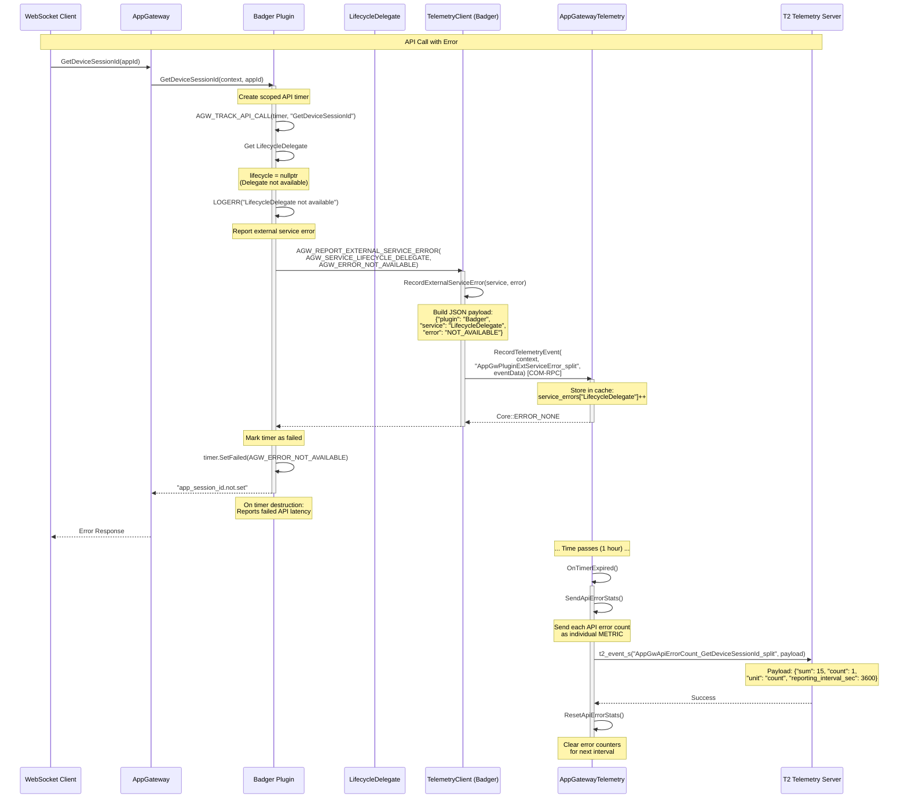

# Scenario 3: API Error Reporting (Badger Plugin Example)

## Overview

This sequence diagram illustrates how the Badger plugin reports API errors to App Gateway via COM-RPC using the generic marker system. The example shows `GetDeviceSessionId` API failing due to LifecycleDelegate unavailability.

## Sequence Diagram



## Key Components

| Component | Responsibility |
|-----------|---------------|
| **WebSocket Client** | Initiates API call to AppGateway |
| **AppGateway** | Routes request to Badger plugin |
| **Badger Plugin** | Attempts to get device session ID, encounters error |
| **LifecycleDelegate** | External service (unavailable in this scenario) |
| **TelemetryClient** | Helper class in Badger for telemetry reporting |
| **AppGatewayTelemetry** | Aggregates errors and reports to T2 |
| **T2 Telemetry Server** | Receives aggregated error statistics |

## Error Flow

1. **API Call**: Client requests device session ID via AppGateway
2. **Service Check**: Badger attempts to get LifecycleDelegate
3. **Error Detection**: LifecycleDelegate is unavailable
4. **Error Logging**: Badger logs error with context
5. **Telemetry Reporting**: Report external service error via `AGW_REPORT_EXTERNAL_SERVICE_ERROR`
6. **COM-RPC Call**: TelemetryClient calls AppGatewayTelemetry via COM-RPC
7. **Error Aggregation**: AppGatewayTelemetry increments error counter
8. **Timer Tracking**: Scoped timer marks API call as failed
9. **Client Response**: Return default value to client
10. **Periodic Reporting**: Aggregated errors sent to T2 every hour

## Generic Marker System

### Event Marker (Immediate - Individual Occurrences)
**Marker:** `AppGwPluginExtServiceError_split`
**Payload:**
```json
{
  "plugin": "Badger",
  "service": "LifecycleDelegate",
  "error": "NOT_AVAILABLE"
}
```

### Aggregated Error Count Metrics (Periodic - Per API)
**Metric Name Pattern:** `AppGwApiErrorCount_<ApiName>_split`

**Example Metric:** `AppGwApiErrorCount_GetDeviceSessionId_split`
**Payload:**
```json
{
  "sum": 15,
  "count": 1,
  "unit": "count",
  "reporting_interval_sec": 3600
}
```

**Compact Format:**
```
AppGwApiErrorCount_GetDeviceSessionId_split: 15,1,count,3600
```

## Predefined Constants Used

```cpp
// From AppGatewayTelemetryMarkers.h
#define AGW_PLUGIN_BADGER                "Badger"
#define AGW_SERVICE_LIFECYCLE_DELEGATE   "LifecycleDelegate"
#define AGW_ERROR_NOT_AVAILABLE          "NOT_AVAILABLE"
#define AGW_MARKER_PLUGIN_EXT_SERVICE_ERROR  "AppGwPluginExtServiceError_split"
```

## Benefits of Generic Markers

- **Single Marker per Category**: `AppGwPluginExtServiceError_split` used by all plugins for immediate error reporting
- **Individual Metrics per API**: Each failing API gets its own metric for trending: `agw_API_Error_Count_<ApiName>`
- **Plugin Name in Payload**: Events include plugin context for filtering
- **No Marker Duplication**: No need for `AGW_MARKER_BADGER_API_ERROR`
- **Consistent Reporting**: Same pattern across all plugins
- **Scalable**: Adding new APIs automatically creates new metrics
- **Statistical Aggregation**: Metrics support sum, count, min, max, avg

## Notes

- Event reporting (immediate) captures WHAT happened with full context
- Metric reporting (periodic) captures HOW MANY times it happened
- Error counts tracked per API name (e.g., "GetDeviceSessionId", "AuthorizeDataField")
- Each API that experiences errors gets a unique metric in T2
- Metrics reset after each reporting interval (default: 1 hour)
- Scoped timer automatically tracks failed API latency
- COM-RPC enables cross-plugin telemetry communication
