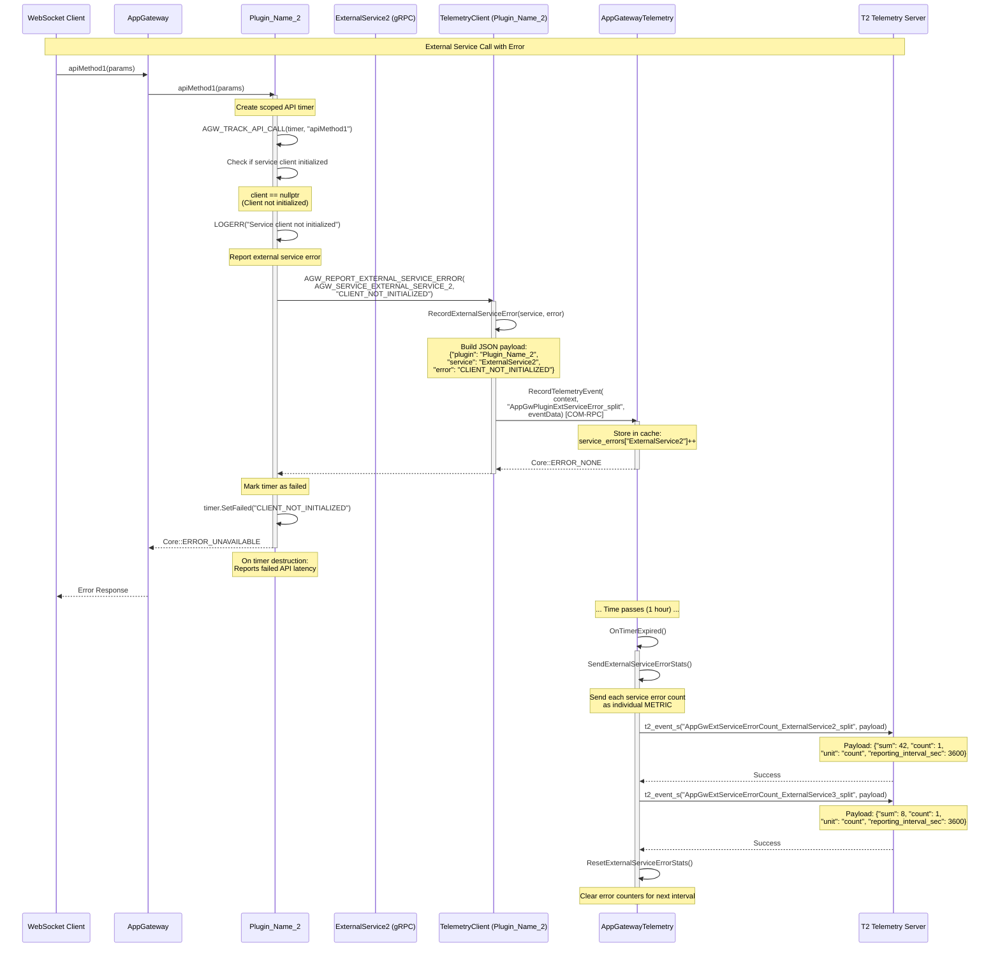

# Scenario 4: External Service Error Reporting (Plugin Example)

## Overview

This sequence diagram illustrates how a plugin reports external service errors to App Gateway via COM-RPC. The example shows `apiMethod1` failing when an external gRPC service client is not initialized.

## Sequence Diagram



## Key Components

| Component | Responsibility |
|-----------|---------------|
| **WebSocket Client** | Initiates API call via AppGateway |
| **AppGateway** | Routes request to plugin |
| **Plugin_Name_2** | Processes API call via external service |
| **ExternalService2** | External gRPC service |
| **TelemetryClient** | Helper class in plugin for telemetry reporting |
| **AppGatewayTelemetry** | Aggregates errors from all plugins and reports to T2 |
| **T2 Telemetry Server** | Receives aggregated error statistics |

## Error Flow

1. **API Call**: Client requests method via AppGateway
2. **Service Check**: Plugin checks if external service client is initialized
3. **Error Detection**: gRPC client is not initialized
4. **Error Logging**: Plugin logs error with context
5. **Telemetry Reporting**: Report external service error via `AGW_REPORT_EXTERNAL_SERVICE_ERROR`
6. **COM-RPC Call**: TelemetryClient calls AppGatewayTelemetry via COM-RPC
7. **Error Aggregation**: AppGatewayTelemetry increments error counter for the external service
8. **Timer Tracking**: Scoped timer marks API call as failed
9. **Client Response**: Return error code to client
10. **Periodic Reporting**: Aggregated errors from all plugins sent to T2 every hour

## Generic Marker System

### Event Marker (Immediate - per plugin)
**Marker:** `AppGwPluginExtServiceError_split`
**Payload (Plugin_Name_2):**
```json
{
  "plugin": "Plugin_Name_2",
  "service": "ExternalService2",
  "error": "CLIENT_NOT_INITIALIZED"
}
```

**Payload (Plugin_Name_1 - different plugin, same marker):**
```json
{
  "plugin": "Plugin_Name_1",
  "service": "ExternalService1",
  "error": "INTERFACE_UNAVAILABLE"
}
```

### Aggregated Error Count Metrics (Periodic - Per Service)
**Metric Name Pattern:** `AppGwExtServiceErrorCount_<ServiceName>_split`

**Example Metrics:**

`AppGwExtServiceErrorCount_ExternalService2_split`
```json
{
  "sum": 42,
  "count": 1,
  "unit": "count",
  "reporting_interval_sec": 3600
}
```

`AppGwExtServiceErrorCount_ExternalService3_split`
```json
{
  "sum": 8,
  "count": 1,
  "unit": "count",
  "reporting_interval_sec": 3600
}
```

**Compact Format:**
```
AppGwExtServiceErrorCount_ExternalService2_split: 42,1,count,3600
AppGwExtServiceErrorCount_ExternalService3_split: 8,1,count,3600
```

## Predefined Constants Used

```cpp
// From AppGatewayTelemetryMarkers.h
#define AGW_PLUGIN_YOUR_PLUGIN                "YourPlugin"
#define AGW_SERVICE_EXTERNAL_SERVICE_2        "ExternalService2"
#define AGW_SERVICE_EXTERNAL_SERVICE_3        "ExternalService3"
#define AGW_MARKER_PLUGIN_EXT_SERVICE_ERROR   "AppGwPluginExtServiceError_split"
```

## Multi-Plugin Aggregation

Each external service that experiences errors gets its own metric with error count aggregated across all plugins:

| Metric Name | Error Count (1 hour) | Contributing Plugins |
|-------------|---------------------|---------------------|
| `AppGwExtServiceErrorCount_ExternalService2_split` | 42 | Plugin_Name_2 |
| `AppGwExtServiceErrorCount_ExternalService3_split` | 8 | Plugin_Name_2 |
| `AppGwExtServiceErrorCount_ExternalService1_split` | 15 | Plugin_Name_1 |
| `AppGwExtServiceErrorCount_ExternalService4_split` | 3 | Plugin_Name_1 |

Each metric has its own T2 marker for independent trending and alerting.

## Configuration

- **Reporting Interval**: Default 3600 seconds (1 hour), configurable
- **Format**: Individual numeric metrics (one per service)
- **Data Type**: METRIC (for statistical aggregation)
- **Reset**: Error counters reset after each periodic report
- **Granularity**: Per-service error counts (aggregated from all plugins)

## Notes

- **Service-level tracking**: Errors tracked by service name with individual metrics
- **Cross-plugin visibility**: Metrics aggregate errors from all plugins reporting to same service
- **Immediate vs Aggregated**: Individual events (optional) for forensics, metrics (required) for monitoring
- **Generic markers**: Single event marker `AppGwPluginExtServiceError_split` used by all plugins
- **Unique metrics**: Each service gets unique metric name for trending: `AppGwExtServiceErrorCount_<ServiceName>_split`
- **Payload differentiation**: Event payload includes plugin name for filtering
- **gRPC services**: Common pattern for plugins to report gRPC client errors
- **Alerting**: Can set thresholds on individual service metrics (e.g., ExternalService2 errors > 50)
