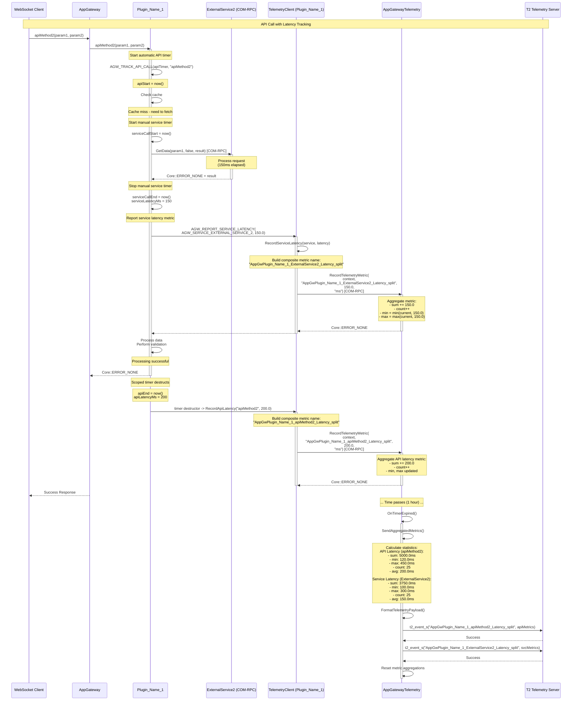

# Scenario 5: API and Service Latency Tracking (Metric Reporting)

## Overview

This sequence diagram illustrates how plugins track API call latency and external service call latency using both automatic (scoped timer) and manual timing methods. The example demonstrates `RecordTelemetryMetric` usage.

## Sequence Diagram



## Key Components

| Component | Responsibility |
|-----------|---------------|
| **WebSocket Client** | Initiates API call |
| **AppGateway** | Routes request to plugin |
| **Plugin_Name_1** | Performs operation, tracks API latency automatically |
| **ExternalService2** | Provides data via COM-RPC |
| **TelemetryClient** | Reports both API and service latency metrics |
| **AppGatewayTelemetry** | Aggregates metrics (sum, min, max, count, avg) |
| **T2 Telemetry Server** | Receives aggregated latency statistics |

## Timing Methods

### 1. Automatic API Latency (Scoped Timer)

```cpp
Core::hresult YourPlugin::apiMethod2(...) {
    AGW_TRACK_API_CALL(apiTimer, "apiMethod2");
    
    // ... API implementation ...
    
    if (error) {
        apiTimer.SetFailed(errorCode);  // Mark as failed
        return ERROR;
    }
    
    return SUCCESS;
    // Timer destructor automatically reports latency
}
```

**Benefits:**
- RAII-style automatic timing
- Handles both success and failure cases
- No manual timing code needed
- Guaranteed reporting even with early returns

### 2. Manual Service Latency

```cpp
// Start timer before external service call
auto serviceCallStart = std::chrono::steady_clock::now();

// Call external service
auto result = externalService->GetData(...);

// Stop timer after service call
auto serviceCallEnd = std::chrono::steady_clock::now();
auto serviceLatencyMs = std::chrono::duration_cast<std::chrono::milliseconds>(
    serviceCallEnd - serviceCallStart).count();

// Report service latency
AGW_REPORT_SERVICE_LATENCY(AGW_SERVICE_OTT_SERVICES, static_cast<double>(serviceLatencyMs));
```

**Benefits:**
- Precise measurement of specific service calls
- Can measure individual steps within an API call
- Flexible timing granularity

## Composite Metric Naming for Latency

### API Latency Metrics
**Pattern:** `AppGw<PluginName>_<ApiName>_Latency_split`

**Examples:**
- `AppGwPlugin_Name_1_apiMethod2_Latency_split`
- `AppGwPlugin_Name_1_apiMethod1_Latency_split`
- `AppGwPlugin_Name_2_apiMethod1_Latency_split`

**Payload (JSON):**
```json
{
  "sum": 5000.0,
  "count": 25,
  "unit": "ms",
  "reporting_interval_sec": 3600
}
```

### Service Latency Metrics
**Pattern:** `AppGw<PluginName>_<ServiceName>_Latency_split`

**Examples:**
- `AppGwPlugin_Name_1_ExternalService2_Latency_split`
- `AppGwPlugin_Name_2_ExternalService1_Latency_split`
- `AppGwPlugin_Name_2_ExternalService3_Latency_split`

**Payload (JSON):**
```json
{
  "sum": 3750.0,
  "count": 25,
  "unit": "ms",
  "reporting_interval_sec": 3600
}
```

**Key Change:** Plugin and API/service names are now part of the metric name, not the payload. This enables per-API/service alerting and trending.

## Metric Aggregation

AppGatewayTelemetry aggregates metrics over the reporting interval:

| Statistic | Calculation | Purpose |
|-----------|-------------|---------|
| `sum` | Σ(all latency values) | Total time spent |
| `min` | min(all latency values) | Best case performance |
| `max` | max(all latency values) | Worst case performance |
| `count` | Number of samples | Call frequency |
| `avg` | sum / count | Average latency |
| `unit` | "ms" | Measurement unit |

## Multi-Plugin Metric Tracking

Each plugin/API combination gets its own unique metric name:

| Plugin | API/Service | Metric Type | Metric Name |
|--------|-------------|-------------|-------------|
| Plugin_Name_1 | apiMethod2 | API Latency | `AppGwPlugin_Name_1_apiMethod2_Latency_split` |
| Plugin_Name_1 | ExternalService2 | Service Latency | `AppGwPlugin_Name_1_ExternalService2_Latency_split` |
| Plugin_Name_2 | apiMethod1 | API Latency | `AppGwPlugin_Name_2_apiMethod1_Latency_split` |
| Plugin_Name_2 | ExternalService1 | Service Latency | `AppGwPlugin_Name_2_ExternalService1_Latency_split` |
| Plugin_Name_2 | ExternalService3 | Service Latency | `AppGwPlugin_Name_2_ExternalService3_Latency_split` |

**Benefits:**
- Each API/service has independent metric for trending
- Enables per-API alerting (e.g., alert if metric > 500ms)
- Simplifies dashboard creation (one metric = one graph)

## Configuration

- **Reporting Interval**: Default 3600 seconds (1 hour), configurable
- **Format**: JSON (self-describing) or COMPACT (minimal)
- **Reset**: Metric aggregations reset after each report
- **Granularity**: Per API/service, per plugin

## Performance Insights

Latency metrics enable:
1. **SLA Monitoring**: Track if APIs meet latency SLAs
2. **Bottleneck Identification**: Identify slow services (high max, high avg)
3. **Trend Analysis**: Compare latency over time
4. **Capacity Planning**: Understand call frequency (count) and total time (sum)
5. **Performance Regression Detection**: Detect when latency increases

## Notes

- **Automatic timing**: Preferred for API latency (scoped timer)
- **Manual timing**: Used for granular service call measurement
- **C++11 compatible**: Uses `std::chrono::steady_clock` (monotonic, not affected by time changes)
- **Zero overhead when telemetry unavailable**: Macros check availability before timing
- **Thread-safe**: AppGatewayTelemetry uses locks for metric aggregation
- **Failed API latency**: Scoped timer can track failed API call latency separately
