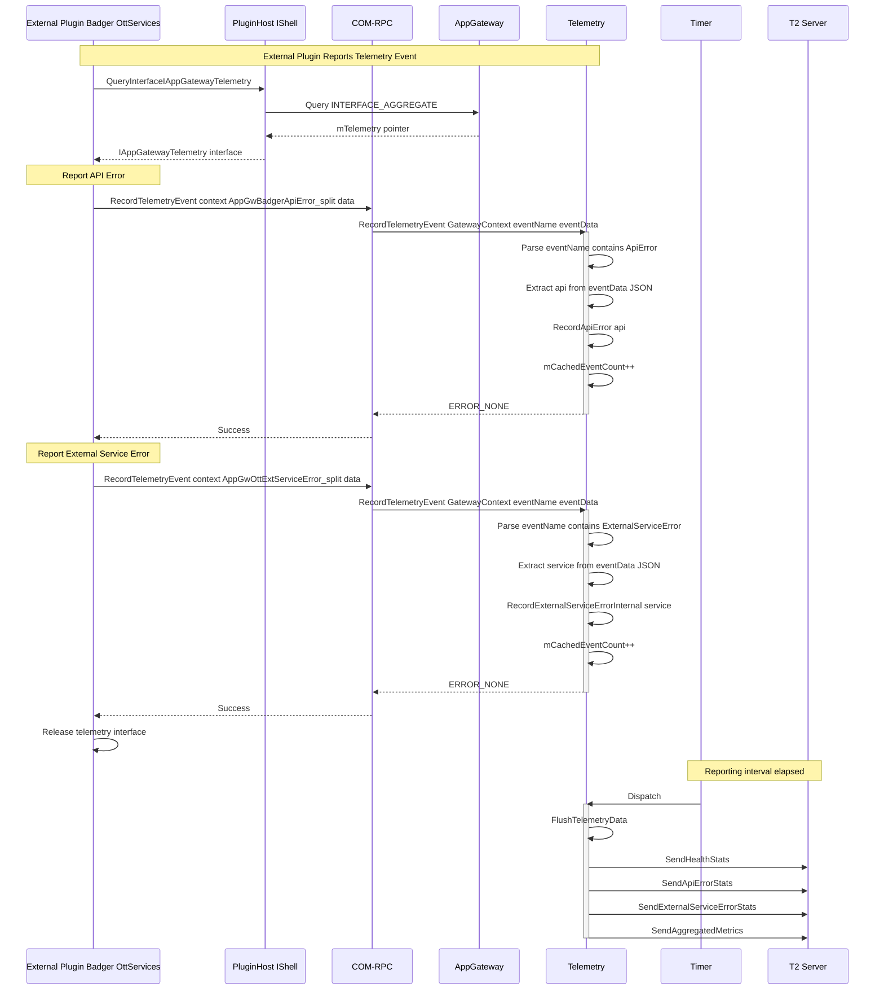

# Scenario 6: External Plugin COM-RPC Event Telemetry

## Overview

This sequence diagram illustrates how external plugins (Badger, OttServices, etc.) report telemetry events to AppGateway via COM-RPC. External plugins use the `IAppGatewayTelemetry` COM-RPC interface to report API errors and external service errors, which are aggregated by AppGatewayTelemetry and periodically sent to T2.

## Sequence Diagram



## Key Components

| Component | Responsibility |
|-----------|---------------|
| **External Plugin** | Reports telemetry events (API errors, service errors) via COM-RPC |
| **PluginHost (IShell)** | Provides interface to query AppGateway's aggregated interfaces |
| **COM-RPC** | Marshals telemetry interface calls between plugin processes |
| **AppGateway** | Exposes IAppGatewayTelemetry as INTERFACE_AGGREGATE |
| **AppGatewayTelemetry** | Aggregates events and periodically reports to T2 |
| **Timer** | Triggers periodic telemetry flush (default: 1 hour) |
| **T2 Telemetry Server** | Receives and stores aggregated telemetry data |

## Data Flow

### API Error Event

1. **Interface Acquisition**: External plugin queries IShell for `IAppGatewayTelemetry` interface using `APPGATEWAY_CALLSIGN`
2. **Interface Resolution**: IShell resolves the aggregated interface from AppGateway
3. **Error Recording**: Plugin calls `RecordTelemetryEvent()` with:
   - `eventName`: `AppGwBadgerApiError_split` (or plugin-specific marker)
   - `eventData`: JSON with `api` field (e.g., `{"api": "getApplications"}`)
4. **Event Parsing**: AppGatewayTelemetry parses event name to identify error type
5. **API Extraction**: Extracts API name from JSON payload
6. **Error Aggregation**: Increments error count for specific API in `mApiErrorCounts` map
7. **Interface Release**: Plugin releases interface when done

### External Service Error Event

1. **Interface Acquisition**: Same as API error flow
2. **Error Recording**: Plugin calls `RecordTelemetryEvent()` with:
   - `eventName`: `AppGwOttExtServiceError_split` (or plugin-specific marker)
   - `eventData`: JSON with `service` field (e.g., `{"service": "StreamingService"}`)
3. **Event Parsing**: AppGatewayTelemetry identifies external service error type
4. **Service Extraction**: Extracts service name from JSON payload
5. **Error Aggregation**: Increments error count for specific service in `mExternalServiceErrorCounts` map

### Periodic Reporting

1. **Timer Trigger**: Telemetry timer expires (default: 1 hour interval)
2. **Data Flush**: AppGatewayTelemetry calls `FlushTelemetryData()`
3. **Batch Sending**: All aggregated data sent to T2:
   - Health stats (WebSocket connections, API calls)
   - API error counts (per-API breakdown)
   - External service error counts (per-service breakdown)
   - Aggregated metrics (latencies, custom metrics)
4. **Counter Reset**: All internal counters reset to zero after successful send

## T2 Markers

### API Error Event

**Event Name:** `AppGwPluginApiError_split` (generic) or `AppGwBadgerApiError_split` (plugin-specific)

**Event Data Format:**
```json
{
  "api": "getApplications"
}
```

**T2 Aggregated Marker (Reported Periodically):**
`AppGwApiErrorCount_getApplications_split`

**Payload Format:**
```json
{
  "error_count": 42,
  "reporting_interval_sec": 3600
}
```

### External Service Error Event

**Event Name:** `AppGwPluginExtServiceError_split` (generic) or `AppGwOttExtServiceError_split` (plugin-specific)

**Event Data Format:**
```json
{
  "service": "StreamingService"
}
```

**T2 Aggregated Marker (Reported Periodically):**
`AppGwExtServiceErrorCount_StreamingService_split`

**Payload Format:**
```json
{
  "error_count": 15,
  "reporting_interval_sec": 3600
}
```

## Configuration

- **Interface Type**: COM-RPC (cross-process communication)
- **Aggregation Mode**: Count-based (increment per event)
- **Reporting Frequency**: Periodic (default: 1 hour)
- **Data Format**: JSON event data with structured fields
- **Thread Safety**: Protected by `mLock` CriticalSection in AppGatewayTelemetry

## Code Example

### External Plugin (Badger)

```cpp
// In Badger plugin implementation
void ReportApiError(const string& apiName)
{
    // Query AppGateway telemetry interface
    auto telemetry = _service->QueryInterfaceByCallsign<Exchange::IAppGatewayTelemetry>(APPGATEWAY_CALLSIGN);
    
    if (telemetry) {
        // Build event data JSON
        JsonObject eventData;
        eventData["api"] = apiName;
        
        string eventDataStr;
        eventData.ToString(eventDataStr);
        
        // Record telemetry event
        telemetry->RecordTelemetryEvent(
            Exchange::IAppGatewayTelemetry::GatewayContext::PLUGIN_BADGER,
            "AppGwBadgerApiError_split",
            eventDataStr
        );
        
        telemetry->Release();
    }
}
```

### External Plugin (OttServices)

```cpp
// In OttServices plugin implementation
void ReportServiceError(const string& serviceName)
{
    // Query AppGateway telemetry interface
    auto telemetry = _service->QueryInterfaceByCallsign<Exchange::IAppGatewayTelemetry>(APPGATEWAY_CALLSIGN);
    
    if (telemetry) {
        // Build event data JSON
        JsonObject eventData;
        eventData["service"] = serviceName;
        
        string eventDataStr;
        eventData.ToString(eventDataStr);
        
        // Record telemetry event
        telemetry->RecordTelemetryEvent(
            Exchange::IAppGatewayTelemetry::GatewayContext::PLUGIN_OTTSERVICES,
            "AppGwOttExtServiceError_split",
            eventDataStr
        );
        
        telemetry->Release();
    }
}
```

## Notes

- External plugins run in separate processes, requiring COM-RPC for communication
- Each plugin uses its own `GatewayContext` enum value for identification
- Event data is passed as JSON strings, parsed by AppGatewayTelemetry
- Aggregation happens at the telemetry service, not in the plugin
- Interface must be released after use to avoid resource leaks
- Events are counted and batched for efficient T2 reporting
- All event parsing is case-sensitive (check marker name format carefully)
- The `mCachedEventCount` tracks total events since last flush (for monitoring purposes)
