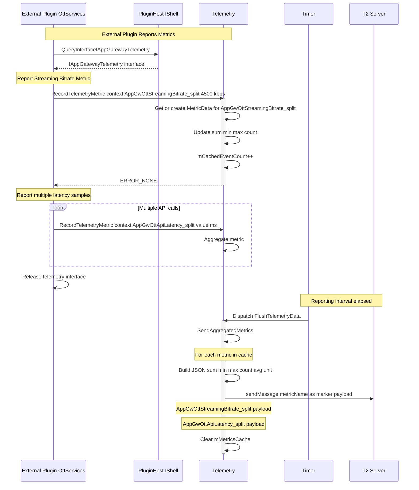

# Scenario 7: External Plugin COM-RPC Metric Recording

## Overview

This sequence diagram illustrates how external plugins (OttServices, Badger, etc.) report custom metrics to AppGateway via COM-RPC. External plugins use the `IAppGatewayTelemetry` COM-RPC interface to record numerical metrics such as latencies, bitrates, custom measurements, etc. These metrics are aggregated (min, max, avg, sum, count) by AppGatewayTelemetry and periodically sent to T2.

## Sequence Diagram



## Key Components

| Component | Responsibility |
|-----------|---------------|
| **External Plugin** | Records custom metric values via COM-RPC |
| **PluginHost (IShell)** | Provides interface to query AppGateway's aggregated interfaces |
| **AppGatewayTelemetry** | Aggregates metric samples (min, max, avg, sum, count) |
| **MetricData** | Internal data structure holding aggregated statistics |
| **Timer** | Triggers periodic telemetry flush (default: 1 hour) |
| **T2 Telemetry Server** | Receives and stores aggregated metric data |

## Data Flow

### Metric Recording Flow

1. **Interface Acquisition**: External plugin queries IShell for `IAppGatewayTelemetry` interface using `APPGATEWAY_CALLSIGN`
2. **Interface Resolution**: IShell resolves the aggregated interface from AppGateway
3. **Metric Recording**: Plugin calls `RecordTelemetryMetric()` with:
   - `context`: Plugin context enum (e.g., `PLUGIN_OTTSERVICES`)
   - `name`: Metric marker name (e.g., `AppGwOttStreamingBitrate_split`)
   - `value`: Numerical measurement (e.g., `4500`)
   - `unit`: Unit of measurement (e.g., `"kbps"`)
4. **Metric Lookup**: AppGatewayTelemetry looks up or creates `MetricData` entry in `mMetricsCache` map
5. **Statistical Update**: Updates aggregated statistics:
   - `sum += value`
   - `min = std::min(min, value)`
   - `max = std::max(max, value)`
   - `count++`
   - `unit` stored for reporting
6. **Cache Increment**: Increments `mCachedEventCount` for monitoring
7. **Multiple Samples**: Plugin can call `RecordTelemetryMetric()` multiple times for same metric (aggregated)

### Periodic Reporting Flow

1. **Timer Trigger**: Telemetry timer expires (default: 1 hour interval)
2. **Data Flush**: AppGatewayTelemetry calls `FlushTelemetryData()` → `SendAggregatedMetrics()`
3. **Metric Iteration**: For each metric in `mMetricsCache` map:
   - Calculate average: `avg = sum / count`
   - Build JSON payload with all statistics
   - Send to T2 with metric name as marker
4. **Cache Clear**: After successful send, clear `mMetricsCache` map
5. **Reset Counters**: Reset `mCachedEventCount` to zero

## T2 Markers

### Streaming Bitrate Metric

**Metric Name:** `AppGwOttStreamingBitrate_split`

**Recording Call:**
```cpp
telemetry->RecordTelemetryMetric(
    IAppGatewayTelemetry::PLUGIN_OTTSERVICES,
    "AppGwOttStreamingBitrate_split",
    4500.0,
    "kbps"
);
```

**T2 Aggregated Payload (Reported Periodically):**
```json
{
  "sum": 135000,
  "min": 2500,
  "max": 8000,
  "count": 30,
  "avg": 4500,
  "unit": "kbps",
  "reporting_interval_sec": 3600
}
```

**Compact Format:**
```
AppGwOttStreamingBitrate_split: 135000,2500,8000,30,4500,kbps,3600
```

### API Latency Metric

**Metric Name:** `AppGwOttApiLatency_split`

**Recording Call (Multiple Samples):**
```cpp
// Sample 1
telemetry->RecordTelemetryMetric(
    IAppGatewayTelemetry::PLUGIN_OTTSERVICES,
    "AppGwOttApiLatency_split",
    125.0,
    "ms"
);

// Sample 2
telemetry->RecordTelemetryMetric(
    IAppGatewayTelemetry::PLUGIN_OTTSERVICES,
    "AppGwOttApiLatency_split",
    98.0,
    "ms"
);

// ... many more samples ...
```

**T2 Aggregated Payload (Reported Periodically):**
```json
{
  "sum": 12500,
  "min": 45,
  "max": 350,
  "count": 100,
  "avg": 125,
  "unit": "ms",
  "reporting_interval_sec": 3600
}
```

## Configuration

- **Interface Type**: COM-RPC (cross-process communication)
- **Aggregation Mode**: Statistical (min, max, avg, sum, count)
- **Reporting Frequency**: Periodic (default: 1 hour)
- **Data Structure**: `std::map<string, MetricData>` in AppGatewayTelemetry
- **Thread Safety**: Protected by `mLock` CriticalSection
- **Supported Units**: ms, kbps, count, bytes, percent, etc. (any string)

## Code Example

### External Plugin - Single Metric Sample

```cpp
// In OttServices plugin implementation
void ReportStreamingBitrate(double bitrate)
{
    // Query AppGateway telemetry interface
    auto telemetry = _service->QueryInterfaceByCallsign<Exchange::IAppGatewayTelemetry>(APPGATEWAY_CALLSIGN);
    
    if (telemetry) {
        // Record metric value
        telemetry->RecordTelemetryMetric(
            Exchange::IAppGatewayTelemetry::GatewayContext::PLUGIN_OTTSERVICES,
            "AppGwOttStreamingBitrate_split",
            bitrate,
            "kbps"
        );
        
        telemetry->Release();
    }
}
```

### External Plugin - Multiple Metric Samples

```cpp
// In Badger plugin implementation
class ApiLatencyTracker {
private:
    Exchange::IAppGatewayTelemetry* mTelemetry;

public:
    ApiLatencyTracker(PluginHost::IShell* service) {
        mTelemetry = service->QueryInterfaceByCallsign<Exchange::IAppGatewayTelemetry>(APPGATEWAY_CALLSIGN);
    }
    
    ~ApiLatencyTracker() {
        if (mTelemetry) {
            mTelemetry->Release();
            mTelemetry = nullptr;
        }
    }
    
    void RecordApiLatency(double latencyMs) {
        if (mTelemetry) {
            // Record latency metric - will be aggregated with other samples
            mTelemetry->RecordTelemetryMetric(
                Exchange::IAppGatewayTelemetry::GatewayContext::PLUGIN_BADGER,
                "AppGwBadgerApiLatency_split",
                latencyMs,
                "ms"
            );
        }
    }
};

// Usage
void SomeApiCall() {
    auto start = std::chrono::steady_clock::now();
    
    // ... perform API call ...
    
    auto end = std::chrono::steady_clock::now();
    double latencyMs = std::chrono::duration<double, std::milli>(end - start).count();
    
    // Record latency sample
    latencyTracker->RecordApiLatency(latencyMs);
}
```

### External Plugin - Custom Metrics

```cpp
// In custom plugin implementation
void ReportCustomMetrics()
{
    auto telemetry = _service->QueryInterfaceByCallsign<Exchange::IAppGatewayTelemetry>(APPGATEWAY_CALLSIGN);
    
    if (telemetry) {
        // Report cache hit rate
        telemetry->RecordTelemetryMetric(
            Exchange::IAppGatewayTelemetry::GatewayContext::PLUGIN_CUSTOM,
            "AppGwCustomCacheHitRate_split",
            85.5,
            "percent"
        );
        
        // Report memory usage
        telemetry->RecordTelemetryMetric(
            Exchange::IAppGatewayTelemetry::GatewayContext::PLUGIN_CUSTOM,
            "AppGwCustomMemoryUsage_split",
            1024000,
            "bytes"
        );
        
        // Report queue depth
        telemetry->RecordTelemetryMetric(
            Exchange::IAppGatewayTelemetry::GatewayContext::PLUGIN_CUSTOM,
            "AppGwCustomQueueDepth_split",
            42,
            "count"
        );
        
        telemetry->Release();
    }
}
```

## MetricData Structure

```cpp
struct MetricData {
    double sum;        // Sum of all values
    double min;        // Minimum value seen
    double max;        // Maximum value seen
    uint32_t count;    // Number of samples
    string unit;       // Unit of measurement (ms, kbps, etc.)
    
    MetricData()
        : sum(0.0)
        , min(std::numeric_limits<double>::max())
        , max(std::numeric_limits<double>::lowest())
        , count(0)
        , unit("")
    {}
    
    void Update(double value, const string& unitStr) {
        sum += value;
        min = std::min(min, value);
        max = std::max(max, value);
        count++;
        unit = unitStr;
    }
    
    double Average() const {
        return (count > 0) ? (sum / count) : 0.0;
    }
};
```

## Notes

- External plugins can record metrics multiple times for aggregation
- Statistical aggregation provides min, max, avg, sum, count for analysis
- Metrics are batched and sent periodically to reduce T2 traffic
- Unit field is stored with first metric sample and used for all aggregation
- Interface should be acquired once and reused, then released when done
- Thread-safe: Multiple plugins can record metrics concurrently
- Cache is cleared after reporting to avoid memory growth
- Useful for latency tracking, performance monitoring, KPIs, health indicators
- Average is calculated at reporting time: `avg = sum / count`
- Always use `_split` suffix for T2 compatibility and marker identification
