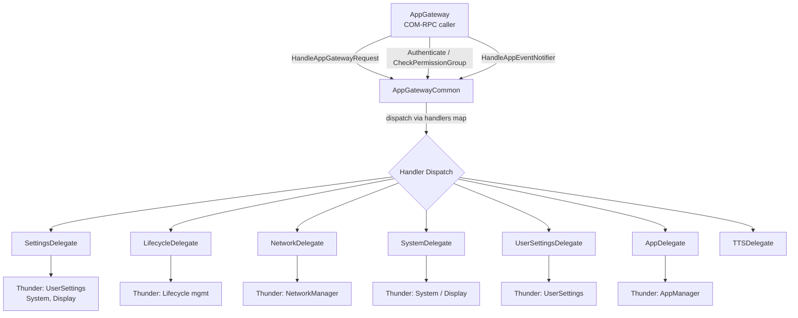
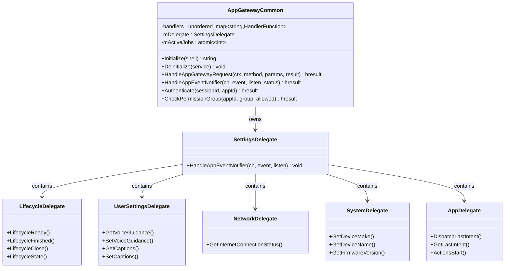
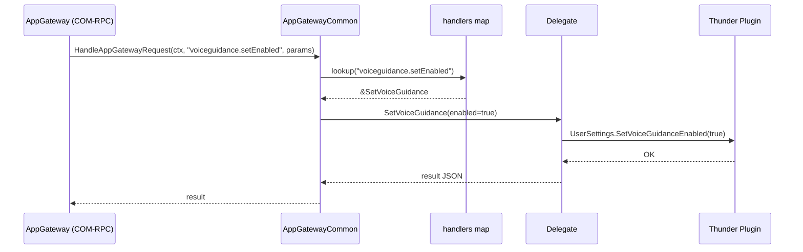
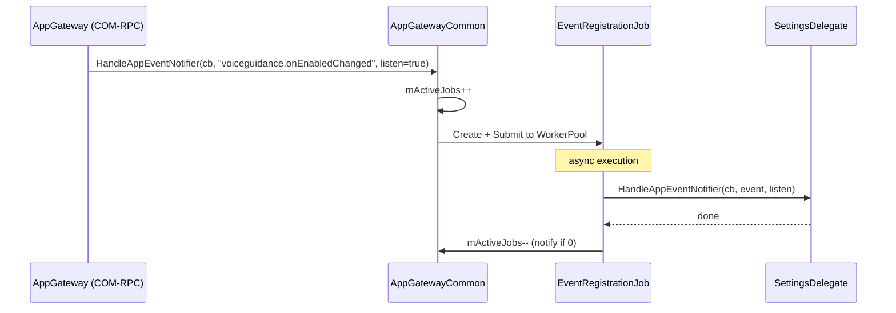
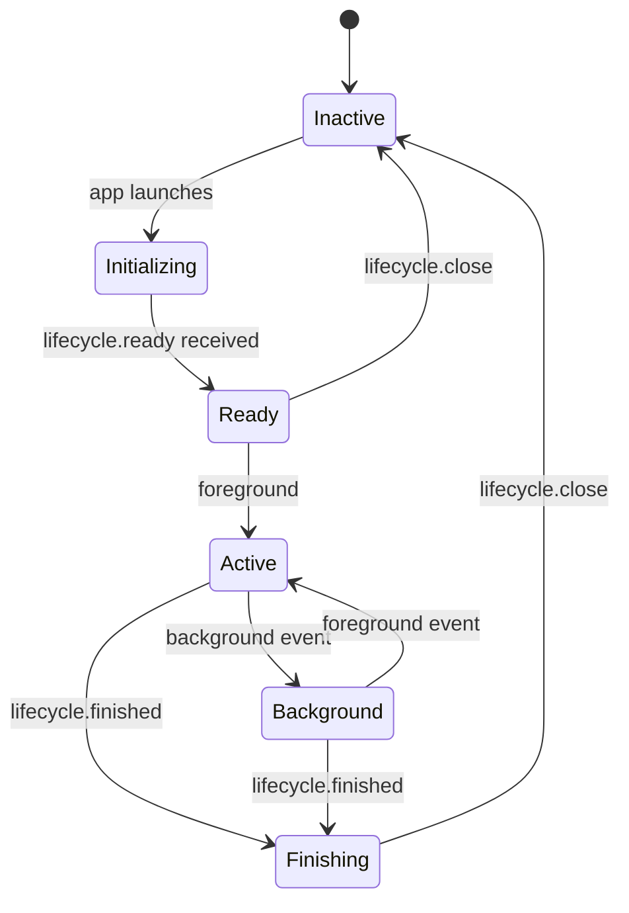

# AppGatewayCommon Plugin

> **Source files:** `AppGatewayCommon/`
> **Callsign:** `org.rdk.AppGatewayCommon`
> **Shared library:** `libWPEFrameworkAppGatewayCommon.so`
> **Version:** `1.0.0`

---

## 1. High-Level Purpose & Architecture

### Role in ENT / RDK Infrastructure

`AppGatewayCommon` is the **business-logic layer** of the AppGateway system. It is a separate Thunder plugin that runs in its own process and is invoked by `AppGateway` via COM-RPC. It handles everything that requires knowledge of the actual RDK platform: device information, user settings, network state, accessibility features, and application lifecycle.

It intentionally has **no WebSocket knowledge** — all transport concerns are handled by `AppGateway`.

### Responsibilities

| Responsibility | Implemented By |
|---|---|
| Authenticate app sessions & check permission groups | `AppGatewayCommon` (via `IAppGatewayAuthenticator`) |
| Handle Firebolt API requests dispatched over COM-RPC | `AppGatewayCommon` (via `IAppGatewayRequestHandler`) |
| Manage app event subscriptions | `AppGatewayCommon` (via `IAppNotificationHandler`) |
| Device info (make, name, SKU, chipset, class, uptime) | `AppGatewayCommon` helper methods |
| Localization (country code, timezone, locale, languages) | `SettingsDelegate` / `AppGatewayCommon` |
| Accessibility (voice guidance, audio description, captions) | `UserSettingsDelegate` |
| Network connectivity status | `NetworkDelegate` |
| Application lifecycle (ready, finished, close, state) | `LifecycleDelegate` |
| App-to-app intent dispatch | `AppDelegate` |
| Display info (EDID, resolution, HDR, HDCP, audio) | `SystemDelegate` |

### What AppGatewayCommon Does NOT Do

- Does **not** open or manage WebSocket connections — that is `AppGatewayResponderImplementation`.
- Does **not** load method resolution tables — that is `Resolver` inside `AppGateway`.
- Does **not** directly subscribe to Thunder plugin events — that is `AppNotifications`.

### Interacting Subsystems

```
AppGateway (COM-RPC caller)
  │
  ├── IAppGatewayRequestHandler::HandleAppGatewayRequest()
  ├── IAppGatewayAuthenticator::Authenticate()
  ├── IAppGatewayAuthenticator::CheckPermissionGroup()
  └── IAppNotificationHandler::HandleAppEventNotifier()
                     │
        ┌────────────┤
        ▼            ▼
  SettingsDelegate  LifecycleDelegate
  SystemDelegate    NetworkDelegate
  UserSettingsDelegate
  AppDelegate
  TTSDelegate
        │
        ▼
  Thunder Plugins (System, UserSettings, NetworkManager, Display, …)
```

---

## 2. Architectural Overview

### Major Components

| Class / File | Role |
|---|---|
| `AppGatewayCommon` (`AppGatewayCommon.h/.cpp`) | Plugin entry point; handler dispatch table; auth/permission |
| `SettingsDelegate` (`delegate/SettingsDelegate.h`) | Coordinates all Thunder-backed setting reads/writes |
| `LifecycleDelegate` (`delegate/LifecycleDelegate.h`) | App lifecycle state machine (Lifecycle 1.0 & 2.0) |
| `NetworkDelegate` (`delegate/NetworkDelegate.h`) | Network/internet connectivity queries |
| `SystemDelegate` (`delegate/SystemDelegate.h`) | Device system info and display queries |
| `UserSettingsDelegate` (`delegate/UserSettingsDelegate.h`) | Accessibility & user preference settings |
| `AppDelegate` (`delegate/AppDelegate.h`) | App-to-app intent and delegate communication |
| `TTSDelegate` (`delegate/TTSDelegate.h`) | Text-to-speech integration |

### High-Level Diagram



---

## 3. Code Organization

```
AppGatewayCommon/
├── AppGatewayCommon.h / .cpp   # Plugin entry point + handler table
├── Module.h / .cpp             # WPEFramework module declaration
├── AppGatewayCommon.conf.in    # Thunder config template
├── AppGatewayCommon.config     # CMake config script
├── CMakeLists.txt
└── delegate/
    ├── AppDelegate.h           # App intent / delegate communication
    ├── LifecycleDelegate.h     # Lifecycle 1.0 & 2.0 state management
    ├── NetworkDelegate.h       # Network connectivity queries
    ├── SettingsDelegate.h      # Aggregates all settings delegates
    ├── SystemDelegate.h        # Device system + display info
    ├── TTSDelegate.h           # Text-to-speech
    └── UserSettingsDelegate.h  # Accessibility & user preferences
```

### File Breakdown

| File | Purpose |
|---|---|
| `AppGatewayCommon.h/.cpp` | `IPlugin`, `IAppGatewayRequestHandler`, `IAppNotificationHandler`, `IAppGatewayAuthenticator` implementations; static handler dispatch table |
| `delegate/SettingsDelegate.h` | Orchestrates reads/writes to all Thunder-backed settings |
| `delegate/LifecycleDelegate.h` | Maps `lifecycle.ready`, `lifecycle.finished`, `lifecycle.close`, `lifecycle.state`, `lifecycle2.*` |
| `delegate/NetworkDelegate.h` | `GetInternetConnectionStatus()` via NetworkManager Thunder plugin |
| `delegate/SystemDelegate.h` | `GetDeviceMake()`, `GetDeviceName()`, `GetDeviceSku()`, display APIs |
| `delegate/UserSettingsDelegate.h` | `GetVoiceGuidance()`, `SetVoiceGuidance()`, `GetCaptions()`, `SetCaptions()`, etc. |
| `delegate/AppDelegate.h` | `DispatchLastIntent()`, `GetLastIntent()`, `ActionsStart()`, `ActionsIntent()` |
| `delegate/TTSDelegate.h` | Text-to-speech integration helpers |

---

## 4. Class & Interface Documentation

### 4.1 `AppGatewayCommon` — Plugin Entry Point

**File:** `AppGatewayCommon/AppGatewayCommon.h`, `AppGatewayCommon/AppGatewayCommon.cpp`

**Inherits / Implements:**
- `PluginHost::IPlugin`
- `Exchange::IAppGatewayRequestHandler`
- `Exchange::IAppNotificationHandler`
- `Exchange::IAppGatewayAuthenticator`

```cpp
// AppGatewayCommon/AppGatewayCommon.h (excerpt)
class AppGatewayCommon : public PluginHost::IPlugin,
                         Exchange::IAppGatewayRequestHandler,
                         Exchange::IAppNotificationHandler,
                         Exchange::IAppGatewayAuthenticator {
    using HandlerFunction =
        std::function<Core::hresult(AppGatewayCommon*,
                                    const Exchange::GatewayContext&,
                                    const std::string&,
                                    std::string&)>;
    static const std::unordered_map<std::string, HandlerFunction> handlers;
    ...
};
```

**Interface map:**
```cpp
BEGIN_INTERFACE_MAP(AppGatewayCommon)
INTERFACE_ENTRY(PluginHost::IPlugin)
INTERFACE_ENTRY(Exchange::IAppGatewayRequestHandler)
INTERFACE_ENTRY(Exchange::IAppNotificationHandler)
INTERFACE_ENTRY(Exchange::IAppGatewayAuthenticator)
END_INTERFACE_MAP
```

#### Handler Dispatch Table

`AppGatewayCommon` maintains a **static `unordered_map<string, HandlerFunction>`** that maps Firebolt method strings to private member-function pointers. When `HandleAppGatewayRequest()` is called, it looks up the method name in this table and invokes the corresponding handler.

**Device / System handlers:**

| Method Key | Handler |
|---|---|
| `device.make` | `GetDeviceMake()` |
| `device.name` | `GetDeviceName()` |
| `device.setName` | `SetDeviceName()` |
| `device.sku` | `GetDeviceSku()` |
| `device.chipset` | `GetDeviceChipsetId()` |
| `device.class` | `GetDeviceClass()` |
| `device.uptime` | `GetDeviceUptime()` |
| `device.timeInActiveState` | `GetDeviceTimeInActiveState()` |
| `device.statsMemoryUsage` | `GetStatsMemoryUsage()` |
| `display.edid` | `GetDisplayEdid()` |
| `display.size` | `GetDisplaySize()` |
| `display.maxResolution` | `GetDisplayMaxResolution()` |
| `display.screenResolution` | `GetScreenResolution()` |
| `display.videoResolution` | `GetVideoResolution()` |
| `display.hdcp` | `GetHdcp()` |
| `display.hdr` | `GetHdr()` |
| `display.audio` | `GetAudio()` |

**Localization / Settings handlers:**

| Method Key | Handler |
|---|---|
| `localization.countryCode` | `GetCountryCode()` |
| `localization.setCountryCode` | `SetCountryCode()` |
| `localization.timeZone` | `GetTimeZone()` |
| `localization.setTimeZone` | `SetTimeZone()` |
| `localization.locale` | `GetLocale()` |
| `localization.setLocale` | `SetLocale()` |
| `localization.language` | `GetPresentationLanguage()` |
| `localization.preferredAudioLanguages` | `GetPreferredAudioLanguages()` |
| `localization.setPreferredAudioLanguages` | `SetPreferredAudioLanguages()` |
| `localization.preferredCaptionsLanguages` | `GetPreferredCaptionsLanguages()` |
| `localization.setPreferredCaptionsLanguages` | `SetPreferredCaptionsLanguages()` |

**User Settings / Accessibility handlers:**

| Method Key | Handler |
|---|---|
| `voiceguidance.enabled` | `GetVoiceGuidance()` |
| `voiceguidance.setEnabled` | `SetVoiceGuidance()` |
| `voiceguidance.speed` | `GetSpeed()` |
| `voiceguidance.setSpeed` | `SetSpeed()` |
| `voiceguidance.hints` | `GetVoiceGuidanceHints()` |
| `voiceguidance.setHints` | `SetVoiceGuidanceHints()` |
| `voiceguidance.settings` | `GetVoiceGuidanceSettings()` |
| `audiodescriptions.enabled` | `GetAudioDescription()` |
| `audiodescriptions.setEnabled` | `SetAudioDescriptionsEnabled()` |
| `closedcaptions.enabled` | `GetCaptions()` |
| `closedcaptions.setEnabled` | `SetCaptions()` |
| `closedcaptions.settings` | `GetClosedCaptionsSettings()` |

**Lifecycle handlers:**

| Method Key | Handler |
|---|---|
| `lifecycle.ready` | `LifecycleReady()` |
| `lifecycle.finished` | `LifecycleFinished()` |
| `lifecycle.close` | `LifecycleClose()` |
| `lifecycle.state` | `LifecycleState()` |
| `lifecycle2.state` | `Lifecycle2State()` |
| `lifecycle2.close` | `Lifecycle2Close()` |

**App delegate / Actions handlers:**

| Method Key | Handler |
|---|---|
| `intents.dispatch` | `DispatchLastIntent()` |
| `intents.get` | `GetLastIntent()` |
| `actions.start` | `ActionsStart()` |
| `actions.intent` | `ActionsIntent()` |

---

### 4.2 Authentication Interface (`IAppGatewayAuthenticator`)

```cpp
// AppGatewayCommon/AppGatewayCommon.h (excerpt)
virtual Core::hresult Authenticate(const string &sessionId, string &appId) override;
virtual Core::hresult GetSessionId(const string &appId, string &sessionId) override;
virtual Core::hresult CheckPermissionGroup(const string &appId,
                                           const string &permissionGroup,
                                           bool &allowed) override;
```

- `Authenticate()` — validates a session token string and returns the associated `appId`.
- `GetSessionId()` — reverse lookup: given an `appId`, returns its session token.
- `CheckPermissionGroup()` — checks whether `appId` belongs to the named permission group (e.g., `org.rdk.permission.group.enhanced`).

---

### 4.3 Notification Handler (`IAppNotificationHandler`)

```cpp
// AppGatewayCommon/AppGatewayCommon.h (excerpt)
virtual Core::hresult HandleAppEventNotifier(
    Exchange::IAppNotificationHandler::IEmitter *cb,
    const string& event,
    bool listen,
    bool& status) override;
```

When an app subscribes to or unsubscribes from an event, `AppGatewayCommon` dispatches an `EventRegistrationJob`:

```cpp
// AppGatewayCommon/AppGatewayCommon.h (excerpt — EventRegistrationJob::Dispatch)
virtual void Dispatch() {
    mParent.mDelegate->HandleAppEventNotifier(mCallback, mEvent, mListen);
    if (1 == mParent.mActiveJobs.fetch_sub(1, std::memory_order_acq_rel)) {
        std::lock_guard<std::mutex> lk(mParent.mJobDrainMutex);
        mParent.mJobDrainCv.notify_all();
    }
}
```

The `mActiveJobs` counter + `mJobDrainCv` condition variable ensures `Deinitialize()` waits for all in-flight event registration jobs to finish before destroying the delegate.

---

### 4.4 Delegates (`delegate/`)

Each delegate encapsulates calls to a specific category of Thunder plugins. They are owned by `SettingsDelegate` (or directly by `AppGatewayCommon`) and accessed through the handler dispatch table.

| Delegate | Thunder Plugin(s) Used | Key Operations |
|---|---|---|
| `SystemDelegate` | `org.rdk.System`, `org.rdk.DisplaySettings` | Device make/name/SKU, firmware version, display EDID/size/resolution |
| `UserSettingsDelegate` | `org.rdk.UserSettings` | Voice guidance, captions, audio description, preferred languages |
| `NetworkDelegate` | `org.rdk.NetworkManager` | Internet connection status |
| `LifecycleDelegate` | Internal lifecycle state | App ready/finished/close/state for Lifecycle 1.0 and 2.0 |
| `AppDelegate` | App manager / intent system | Last intent dispatch, app focus state |
| `TTSDelegate` | TTS plugin | Text-to-speech settings |
| `SettingsDelegate` | Aggregates all above | Entry point used by `AppGatewayCommon` |

---

## 5. Configuration & Build Integration

### Plugin Configuration

```cmake
# AppGatewayCommon/AppGatewayCommon.config
set(autostart "false")
set(callsign "org.rdk.AppGatewayCommon")
```

### CMake Build (`AppGatewayCommon/CMakeLists.txt`)

```
Sources: AppGatewayCommon.cpp  Module.cpp
Output:  libWPEFrameworkAppGatewayCommon.so
```

**Key CMake options:**

| Option | Default | Effect |
|---|---|---|
| `PLUGIN_APPGATEWAYCOMMON` | — | Must be `ON` |
| `PLUGIN_APPGATEWAYCOMMON_AUTOSTART` | `"false"` | Thunder autostart |
| `ENABLE_FIREBOLT_TEXTTRACK` | OFF | Enables text-track Firebolt API support |
| `USE_THUNDER_R4` | OFF | Compile against Thunder R4 APIs |

**Key linked libraries:**
- `${NAMESPACE}Plugins`, `${NAMESPACE}Definitions`
- `uuid`
- `${NAMESPACE}NetworkManagerProxy` (optional, path: `${CMAKE_SYSROOT}/usr/lib/wpeframework/proxystubs`)

**Install target:** `lib/${STORAGE_DIRECTORY}/plugins`

---

## 6. Internal Workflows & Execution Flow

### 6.1 Plugin Initialization

```
Thunder calls AppGatewayCommon::Initialize(shell)
  ├── Store mShell pointer
  ├── Instantiate SettingsDelegate (and all sub-delegates)
  └── Register COM-RPC interfaces
```

### 6.2 Handling an API Request

```
AppGateway (COM-RPC) calls HandleAppGatewayRequest(ctx, method, params, result)
  ├── Look up method in static handlers map
  ├── If found: call handler(this, ctx, params, result)
  │     └── Handler calls appropriate delegate method
  │           └── Delegate calls Thunder plugin via JSON-RPC / COM-RPC
  │                 └── Returns result JSON string
  └── If not found: delegate to HandleAppDelegateRequest()
```

### 6.3 Authentication Flow

```
AppGateway calls Authenticate(sessionId, appId)
  └── AppGatewayCommon validates session token
        └── Returns appId string (or error)

AppGateway calls CheckPermissionGroup(appId, permissionGroup, allowed)
  └── AppGatewayCommon checks app capabilities
        └── Returns allowed=true/false
```

### 6.4 Event Registration Flow

```
AppGateway calls HandleAppEventNotifier(cb, event, listen, status)
  └── AppGatewayCommon::SafeSubmitEventRegistrationJob(cb, event, listen)
        └── mActiveJobs.fetch_add(1)
        └── Submit EventRegistrationJob to worker pool
              └── Job::Dispatch():
                    ├── mDelegate->HandleAppEventNotifier(cb, event, listen)
                    └── mActiveJobs.fetch_sub(1) → notify if last job
```

### 6.5 Graceful Shutdown

```
Thunder calls AppGatewayCommon::Deinitialize(service)
  ├── Wait for mActiveJobs == 0 (using mJobDrainCv condition variable)
  ├── Destroy SettingsDelegate (releases all Thunder interface pointers)
  └── Release mShell
```

### 6.6 Error Handling

All private methods return `Core::hresult`. Errors are:
- Logged via `LOGERR()`.
- Returned up the call stack to `HandleAppGatewayRequest()`, which serialises them into a JSON error response sent back to the app.

---

## 7. Diagrams & Visual Aids

### 7.1 Class Diagram



### 7.2 Request Dispatch Sequence



### 7.3 Event Registration Sequence



### 7.4 Lifecycle State Diagram



---

## 8. Testing & Quality

### Existing Tests (`Tests/L1Tests/AppGatewayCommon/`)

| Test File | Coverage Area |
|---|---|
| `AppGatewayCommon_core_test.cpp` | Core request dispatch, handler lookup |
| `AppGatewayCommon_system_test.cpp` | Device info APIs (make, name, SKU, chipset, uptime) |
| `AppGatewayCommon_usersettings_test.cpp` | Voice guidance, captions, audio description |
| `AppGatewayCommon_network_test.cpp` | Internet connection status |
| `AppGatewayCommon_lifecycle_test.cpp` | Lifecycle 1.0 and 2.0 flows |
| `AppGatewayCommon_events_test.cpp` | Event registration and `EventRegistrationJob` |
| `AppGatewayCommon_appdelegate_test.cpp` | Intent dispatch, actions |

### Relevant Mocks

| Mock | Purpose |
|---|---|
| `Tests/mocks/AppGatewayMock.h` | `IAppGatewayRequestHandler`, `IAppGatewayAuthenticator` |
| `Tests/mocks/MockEmitter.h` | `IAppNotificationHandler::IEmitter` |
| `Tests/mocks/UserSettingMock.h` | `org.rdk.UserSettings` Thunder plugin mock |
| `Tests/mocks/NetworkManagerMock.h` | `org.rdk.NetworkManager` Thunder plugin mock |
| `Tests/mocks/ServiceMock.h` | `PluginHost::IShell` |
| `Tests/mocks/LifecycleManagerMock.h` | Lifecycle management mock |

### Missing Coverage & Suggestions

- `CheckPermissionGroup()` permission-evaluation logic has no dedicated unit test.
- `TTSDelegate` integration is not unit-tested.
- Graceful drain (`mJobDrainCv` wait) in `Deinitialize()` has no concurrency stress test.
- **Suggestion:** Add a test that verifies `Deinitialize()` blocks until all in-flight `EventRegistrationJob`s complete.
- **Suggestion:** Add negative-path tests for `Authenticate()` with invalid / expired session tokens.

---

## 9. Beginner-to-Expert Learning Path

### Must-Know First

1. Understand COM-RPC in WPEFramework — `AppGatewayCommon` is called cross-process from `AppGateway`.
2. Read `AppGatewayCommon.h` — focus on the four implemented interfaces and the `handlers` map.
3. Look at `resolution.base.json` to understand which Firebolt methods map to `org.rdk.AppGatewayCommon`.
4. Read one delegate file (e.g., `UserSettingsDelegate.h`) to see how Thunder plugins are called.

### Intermediate

5. Trace a complete call: `HandleAppGatewayRequest("voiceguidance.setEnabled", ...)` → handler → `UserSettingsDelegate::SetVoiceGuidance()` → Thunder `UserSettings` plugin.
6. Study the `EventRegistrationJob` and its `mActiveJobs`/`mJobDrainCv` pattern — this is the clean-shutdown mechanism.
7. Read `LifecycleDelegate.h` and trace both Lifecycle 1.0 and 2.0 paths.

### Advanced

8. **Adding a new Firebolt method to AppGatewayCommon:**
   - Add a private handler method.
   - Register it in the static `handlers` map.
   - Add the corresponding entry in `resolution.base.json` (`alias: "org.rdk.AppGatewayCommon"`, `useComRpc: true`).
9. Study how `CheckPermissionGroup()` integrates with the permission group system and how `permissionGroup` strings in `resolution.base.json` connect to it.

---

*Back to [README.md](../README.md) | Related: [AppGateway.md](../AppGateway/AppGateway.md) | [AppNotifications.md](../AppNotifications/AppNotifications.md)*
