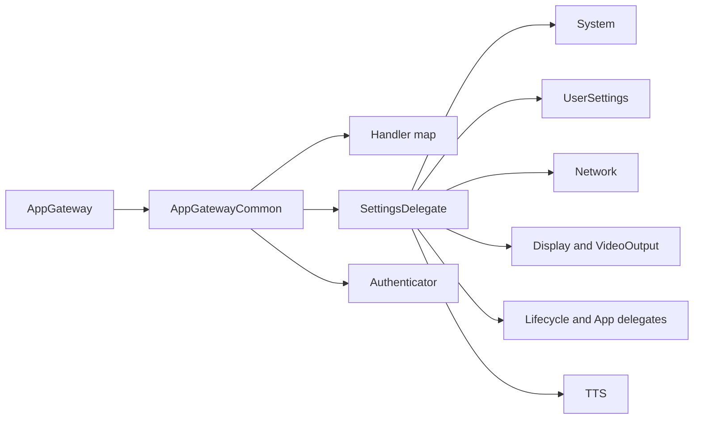
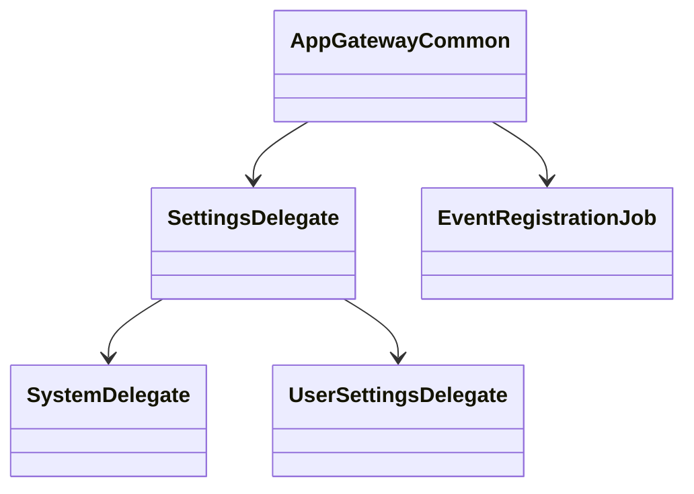
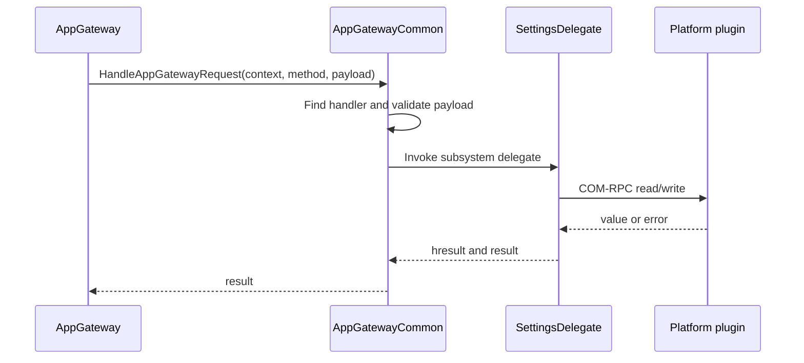
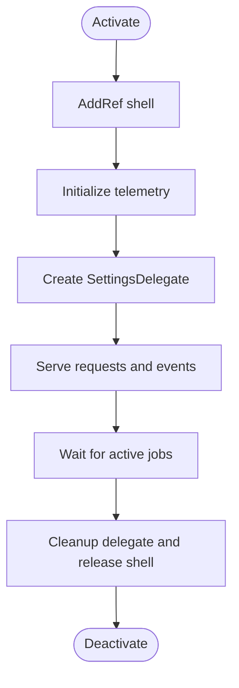

# AppGatewayCommon Subsystem

## 1. High-Level Purpose & Architecture

`AppGatewayCommon` is the device/service business-logic layer behind the Firebolt gateway. In ENT/RDK it translates gateway method names into operations on settings, system, display, network, lifecycle, speech, and application delegates.

Responsibilities:
- Implement `IAppGatewayRequestHandler`, `IAppNotificationHandler`, and `IAppGatewayAuthenticator`.
- Route method strings through a static handler table.
- Authenticate sessions, map app IDs, check permission groups, and handle event registration.
- Delegate platform operations to `SettingsDelegate` and its subsystem delegates.
- Manage worker-pool event registration safely during shutdown.

It does not provide the external WebSocket transport, resolution-file parsing, or the Thunder notification fan-out map; those belong to `AppGateway`, `AppGateway`'s resolver/responder, and `AppNotifications`.

## 2. Architectural Overview

`AppGatewayCommon` owns one `SettingsDelegate`, which exposes `SystemDelegate`, `UserSettingsDelegate`, `NetworkDelegate`, `VideoOutputDelegate`, `AvOutputDelegate`, `LifecycleDelegate`, `AppDelegate`, and `TTSDelegate`. The gateway invokes it over COM-RPC using `IAppGatewayRequestHandler` and `IAppGatewayAuthenticator`.

```text
AppGateway resolver
       |
       v COM-RPC
AppGatewayCommon -- handler map --> SettingsDelegate
       |                              |
       +--> authenticator             +--> platform Thunder plugins
       |
       +--> IAppNotificationHandler --> AppNotifications
```

## 3. Code Organization (Folder & File-Level)

- `AppGatewayCommon/AppGatewayCommon.h`: plugin class, interfaces, handler declarations, event job, lifecycle state.
- `AppGatewayCommon/AppGatewayCommon.cpp`: registration, lifecycle, static method map, request/authentication/event implementations.
- `AppGatewayCommon/delegate/SettingsDelegate.h`: aggregate delegate and shell wiring.
- `delegate/SystemDelegate.h`: device identity, localization, timezone, firmware and system operations.
- `delegate/UserSettingsDelegate.h`: accessibility, captions, language, audio and presentation settings.
- `delegate/NetworkDelegate.h`: network status operations.
- `delegate/VideoOutputDelegate.h` and `AvOutputDelegate.h`: display/video output information.
- `delegate/LifecycleDelegate.h`: lifecycle request handling.
- `delegate/AppDelegate.h`: app-specific/delegate requests and intent behavior.
- `delegate/TTSDelegate.h`: speech synthesis operations.
- `AppGatewayCommon.conf.in`: callsign, precondition, autostart, startup order.
- `CMakeLists.txt`: builds `${NAMESPACE}AppGatewayCommon` from the single implementation translation unit.

The source has no `AppGatewayCommonImplementation.h/.cpp`; implementation is in `AppGatewayCommon.cpp` and declarations are in `AppGatewayCommon.h`. This is an intentional documentation boundary, not an inferred missing file.

## 4. Class & Interface Documentation

### `Plugin::AppGatewayCommon`

Implements `PluginHost::IPlugin`, `IAppGatewayRequestHandler`, `IAppNotificationHandler`, and `IAppGatewayAuthenticator`. The main members are `mShell`, `mConnectionId`, `mDelegate`, the active-job counter, drain mutex, and condition variable. `Initialize()` references the shell, initializes telemetry, creates `SettingsDelegate`, and assigns the shell. `Deinitialize()` waits for event jobs, cleans the delegate, releases the shell, and deinitializes telemetry.

Actual declaration excerpt from [`AppGatewayCommon.h`](../AppGatewayCommon/AppGatewayCommon.h):

```cpp
virtual Core::hresult HandleAppGatewayRequest(
    const Exchange::GatewayContext &context,
    const string& method,
    const string &payload,
    string& result) override;

virtual Core::hresult Authenticate(
    const string &sessionId, string &appId) override;
```

### `EventRegistrationJob`

A `Core::IDispatch` worker job retaining the emitter callback while it calls `SettingsDelegate::HandleAppEventNotifier`. It decrements `mActiveJobs` and notifies the drain condition variable when the final job completes, preventing delegate destruction during an in-flight subscription.

### `SettingsDelegate` and subsystem delegates

The delegate classes encapsulate platform-specific COM-RPC calls. The exact member declarations are in the individual headers listed above. `AppGatewayCommon.cpp` obtains them with methods such as `getSystemDelegate()` and forwards results/error codes rather than implementing device state locally.

## 5. Configuration & Build Integration

`AppGatewayCommon.conf.in` defines callsign `org.rdk.AppGatewayCommon`, `precondition = ["Platform"]`, generated autostart/startup order, and no explicit mode/locator in the checked-in template. CMake sets version `1.0.0`, uses C++11, links Thunder plugins/definitions and `uuid`, and defines `MODULE_NAME=Plugin_AppGatewayCommon`. `ENABLE_FIREBOLT_TEXTTRACK` enables an optional compile definition; L2 builds omit `-Wl,-z,defs` for coverage compatibility.

Runtime dependencies are acquired through `IShell` and delegate classes. `RDKAPPMANAGERS_PATH` and `DISABLE_SECURITY_TOKEN` are defined at the root build level. Thunder API compatibility is selected from the `THUNDER_VERSION` macro provided by the Thunder headers.

## 6. Internal Workflows & Execution Flow

- **Initialization:** retain shell; initialize telemetry; create and shell-configure `SettingsDelegate`.
- **Read/write request:** `HandleAppGatewayRequest` logs the method, looks it up in `handlers`, validates payload where needed, and calls the matching delegate method. Read methods fill `result`; write methods commonly convert successful operations to a JSON null response.
- **Authentication:** `Authenticate` maps a session to an app ID; `GetSessionId` performs the reverse mapping; `CheckPermissionGroup` evaluates authorization through the configured platform services.
- **Event registration:** `HandleAppEventNotifier` submits `EventRegistrationJob`; the job asks the delegate to subscribe/unsubscribe without blocking the caller.
- **Shutdown:** wait until `mActiveJobs` reaches zero, clean/reset the delegate, release the shell, and deinitialize telemetry.
- **Error handling:** unavailable delegates return `Core::ERROR_UNAVAILABLE`; invalid payloads return `Core::ERROR_BAD_REQUEST`; critical failures are logged with Thunder logging macros.

## 7. Diagrams & Visual Aids

### Architecture


```mermaid
flowchart LR
  G[AppGateway] --> H[AppGatewayCommon]
  H --> M[Handler map]
  H --> S[SettingsDelegate]
  S --> SYS[System]
  S --> USER[UserSettings]
  S --> NET[Network]
  S --> DISP[Display and VideoOutput]
  S --> LIFE[Lifecycle and App delegates]
  S --> TTS[TTS]
  H --> AUTH[Authenticator]
```

### Class


```mermaid
classDiagram
  class AppGatewayCommon
  class SettingsDelegate
  class EventRegistrationJob
  class SystemDelegate
  class UserSettingsDelegate
  AppGatewayCommon --> SettingsDelegate
  AppGatewayCommon --> EventRegistrationJob
  SettingsDelegate --> SystemDelegate
  SettingsDelegate --> UserSettingsDelegate
```

### Read/write sequence


```mermaid
sequenceDiagram
  participant G as AppGateway
  participant C as AppGatewayCommon
  participant D as SettingsDelegate
  participant P as Platform plugin
  G->>C: HandleAppGatewayRequest(context, method, payload)
  C->>C: Find handler and validate payload
  C->>D: Invoke subsystem delegate
  D->>P: COM-RPC read/write
  P-->>D: value or error
  D-->>C: hresult and result
  C-->>G: result
```

### Lifecycle activity


```mermaid
flowchart TD
  A([Activate]) --> B[AddRef shell]
  B --> C[Initialize telemetry]
  C --> D[Create SettingsDelegate]
  D --> E[Serve requests and events]
  E --> F[Wait for active jobs]
  F --> G[Cleanup delegate and release shell]
  G --> H([Deactivate])
```

## 8. Testing & Quality Analysis

L0 tests cover routing, lifecycle, display, events, setters, and common helpers under `Tests/L0Tests/AppGatewayCommon`. L1 tests cover core, system, network, user settings, lifecycle, display, branding, events, and app delegate operations under `Tests/L1Tests/AppGatewayCommon`.

Recommended additions include one test per handler-map key, authorization-negative tests for every permission group, concurrent deinitialization/subscription stress, and tests for delegate failure propagation. The external platform interface implementations are not in this repository, so device-specific side effects cannot be validated from source alone.

## 9. Beginner-to-Expert Teaching Mode

**Must know first:** this plugin is a dispatcher and adapter, not a socket server. A method string selects a C++ handler, and the handler delegates to a platform service.

**Advanced path:** trace `GatewayContext`, payload validation, permission checks, COM-RPC lifetime rules, and `EventRegistrationJob` drain semantics. Then compare read/write handlers with lifecycle and TTS handlers.

**Known limits:** the generated Thunder interface definitions and platform delegate implementation details are external or distributed across delegate headers; exact RPC schemas require those files.
