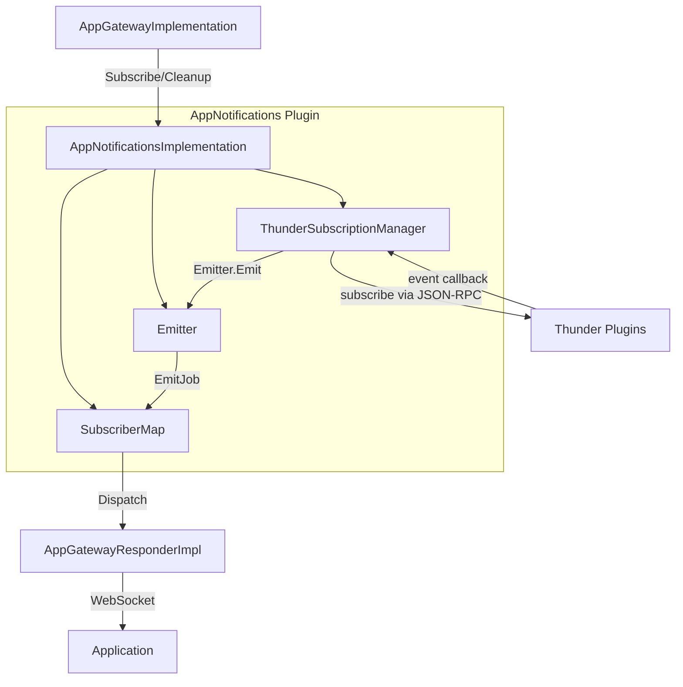
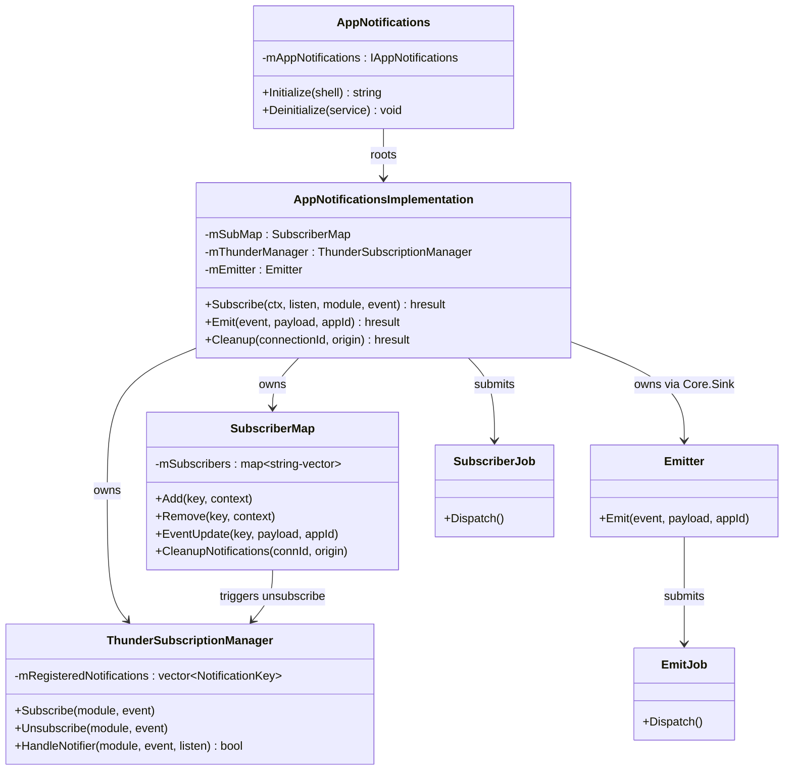
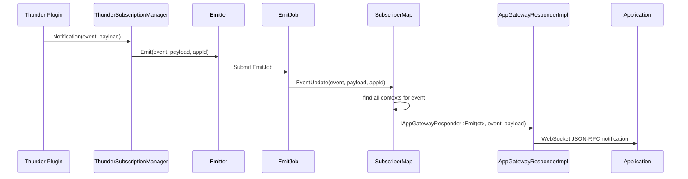
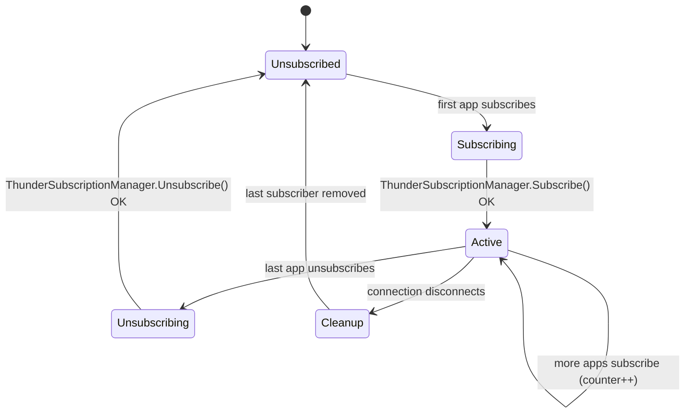

# AppNotifications Plugin

> **Source files:** `AppNotifications/`
> **Callsign:** `org.rdk.AppNotifications`
> **Shared library:** `libWPEFrameworkAppNotifications.so`
> **Version:** `1.0.0`

---

## 1. High-Level Purpose & Architecture

### Role in ENT / RDK Infrastructure

`AppNotifications` is the **event subscription and routing layer** of the AppGateway system. It is a separate Thunder plugin that bridges between Thunder plugin events (fired natively inside the RDK framework) and the WebSocket-connected applications served by `AppGateway`.

Its sole job is: **subscribe to Thunder events on behalf of apps, and deliver those events to the correct WebSocket connections when they fire.**

### Responsibilities

| Responsibility | Component |
|---|---|
| Receive subscription/unsubscription requests from AppGatewayImplementation | `AppNotificationsImplementation::Subscribe()` |
| Maintain a registry of which contexts are subscribed to which events | `SubscriberMap` |
| Subscribe to / unsubscribe from Thunder plugin events as first/last subscriber | `ThunderSubscriptionManager` |
| Route fired events to all subscribed app connections | `SubscriberMap::EventUpdate()` → `Dispatch()` |
| Clean up subscriptions when a WebSocket connection closes | `AppNotificationsImplementation::Cleanup()` |
| Accept explicit emit requests (for internal/testing use) | `AppNotificationsImplementation::Emit()` |

### What AppNotifications Does NOT Do

- Does **not** open or manage WebSocket connections — that is `AppGatewayResponderImplementation`.
- Does **not** interpret event payloads — payloads are passed through opaquely.
- Does **not** authenticate or authorize subscribers — that is done upstream in `AppGatewayImplementation`.

### Interacting Subsystems

```
AppGatewayImplementation
  │  Subscribe(context, listen, module, event)
  ▼
AppNotificationsImplementation
  │                           │
  ▼                           ▼
SubscriberMap           ThunderSubscriptionManager
(context registry)      (Thunder event subscriptions)
  │                           │
  │                    Thunder plugins
  │                    (fire events)
  │                           │
  └──── EventUpdate() ◄───────┘
              │
              ▼
  AppGatewayResponderImplementation
     Emit(context, event, payload)
              │
              ▼
       Application (WebSocket)
```

---

## 2. Architectural Overview

### Major Components

| Class | Role |
|---|---|
| `AppNotifications` | Thunder plugin shell (`IPlugin` + `JSONRPC`); roots `AppNotificationsImplementation` |
| `AppNotificationsImplementation` | Core logic: `IAppNotifications` + `IConfiguration` |
| `SubscriberMap` | Thread-safe registry: `event key → [AppNotificationContext]` |
| `ThunderSubscriptionManager` | Manages Thunder plugin event subscriptions; calls back on event |
| `Emitter` | `IAppNotificationHandler::IEmitter` impl; submits `EmitJob` to worker pool |
| `SubscriberJob` | Async job: subscribes/unsubscribes one Thunder event |
| `EmitJob` | Async job: calls `SubscriberMap::EventUpdate()` |

### High-Level Diagram



---

## 3. Code Organization

```
AppNotifications/
├── AppNotifications.h / .cpp              # Plugin shell (IPlugin + JSONRPC)
├── AppNotificationsImplementation.h / .cpp # Core event routing logic
├── Module.h / .cpp                        # WPEFramework module declaration
├── AppNotifications.conf.in               # Thunder config template
├── AppNotifications.config                # CMake config script
├── CMakeLists.txt
└── tests/                                 # (local test files)
```

### File Breakdown

| File | Purpose | Key Types |
|---|---|---|
| `AppNotifications.h/.cpp` | Plugin entry point; roots `AppNotificationsImplementation` out-of-process | `AppNotifications::Initialize`, `Deinitialize` |
| `AppNotificationsImplementation.h/.cpp` | All event routing logic | `Subscribe()`, `Emit()`, `Cleanup()`, `SubscriberMap`, `ThunderSubscriptionManager`, `Emitter`, `SubscriberJob`, `EmitJob` |
| `Module.h/.cpp` | WPEFramework module boilerplate | `MODULE_NAME=Plugin_AppNotifications` |

---

## 4. Class & Interface Documentation

### 4.1 `AppNotifications` — Plugin Shell

**File:** `AppNotifications/AppNotifications.h`

**Inherits:** `PluginHost::IPlugin`, `PluginHost::JSONRPC`

```cpp
// AppNotifications/AppNotifications.h (excerpt)
class AppNotifications : public PluginHost::IPlugin, public PluginHost::JSONRPC {
    BEGIN_INTERFACE_MAP(AppNotifications)
    INTERFACE_ENTRY(PluginHost::IPlugin)
    INTERFACE_ENTRY(PluginHost::IDispatcher)
    INTERFACE_AGGREGATE(Exchange::IAppNotifications, mAppNotifications)
    END_INTERFACE_MAP
private:
    PluginHost::IShell*             mService;
    Exchange::IAppNotifications*    mAppNotifications;  // AppNotificationsImplementation
    uint32_t mConnectionId;
};
```

Lifecycle mirrors the other plugins:
1. `Initialize()` — roots `AppNotificationsImplementation` out-of-process; calls `IConfiguration::Configure(service)`.
2. `Deinitialize()` — releases interface and service pointers; handles remote connection drop via `Deactivated()`.

---

### 4.2 `AppNotificationsImplementation` — Core Event Routing

**File:** `AppNotifications/AppNotificationsImplementation.h`, `AppNotifications/AppNotificationsImplementation.cpp`

**Implements:** `Exchange::IAppNotifications`, `Exchange::IConfiguration`

**Public Interface:**

| Method | Signature | Description |
|---|---|---|
| `Subscribe` | `(context, listen, module, event) → hresult` | Add or remove a context from the subscriber map for a given Thunder event |
| `Emit` | `(event, payload, appId) → hresult` | Directly emit an event to all subscribers (used for internal/test injection); submits an `EmitJob` |
| `Cleanup` | `(connectionId, origin) → hresult` | Remove all subscriptions belonging to a closed connection |
| `Configure` | `(IShell*) → uint32_t` | `IConfiguration` entry; stores `mShell` |

**Internal members:**

| Member | Type | Purpose |
|---|---|---|
| `mSubMap` | `SubscriberMap` | Event → contexts registry |
| `mThunderManager` | `ThunderSubscriptionManager` | Thunder plugin event subscriptions |
| `mEmitter` | `Core::Sink<Emitter>` | `IEmitter` implementation passed to AppGatewayCommon |
| `mShell` | `PluginHost::IShell*` | Service shell |

---

### 4.3 `SubscriberMap` — Subscriber Registry

**Location:** Inner class of `AppNotificationsImplementation`

**Storage:** `std::map<string, std::vector<AppNotificationContext>>` protected by `std::mutex mSubscriberMutex`.

**Key Methods:**

| Method | Description |
|---|---|
| `Add(key, context)` | Append a context to the subscriber list for `key` |
| `Remove(key, context)` | Remove a specific context from the list |
| `Get(key)` | Return a snapshot of all contexts subscribed to `key` |
| `Exists(key)` | Check if any subscribers exist for `key` |
| `EventUpdate(key, payload, appId)` | Called when a Thunder event fires; iterates all contexts and calls `Dispatch()` |
| `Dispatch(key, context, payload)` | Routes one event delivery — gateway or launch-delegate path |
| `DispatchToGateway(key, context, payload)` | Acquire `IAppGatewayResponder` lazily; call `Emit()` |
| `DispatchToLaunchDelegate(key, context, payload)` | Route to the internal gateway notifier for delegate destinations |
| `CleanupNotifications(connectionId, origin)` | Remove all contexts with matching `connectionId` + `origin` |

**Lazy interface acquisition:**
- `mAppGateway` (`Exchange::IAppGatewayResponder*`) — acquired lazily via `QueryInterface` on first gateway dispatch; protected by `mAppGatewayLock`.
- `mInternalGatewayNotifier` (`Exchange::IAppGatewayResponder*`) — similar pattern for the launch-delegate path.

---

### 4.4 `ThunderSubscriptionManager` — Thunder Event Subscription

**Location:** Inner class of `AppNotificationsImplementation`

**Storage:** `std::vector<NotificationKey> mRegisteredNotifications` protected by `std::mutex mThunderSubscriberMutex`.

```cpp
// AppNotifications/AppNotificationsImplementation.h (excerpt)
struct NotificationKey {
    string module;
    string event;
    bool operator==(const NotificationKey& other) const {
        return (this->module == other.module) && (this->event == other.event);
    }
};
```

**Key Methods:**

| Method | Description |
|---|---|
| `Subscribe(module, event)` | Subscribe to a Thunder plugin event; registers notification handler |
| `Unsubscribe(module, event)` | Unsubscribe from a Thunder plugin event |
| `HandleNotifier(module, event, listen)` | Unified subscribe/unsubscribe entry point |
| `RegisterNotification(module, event)` | Add to `mRegisteredNotifications` (thread-safe) |
| `UnregisterNotification(module, event)` | Remove from `mRegisteredNotifications` |
| `IsNotificationRegistered(module, event)` | Check registration state (thread-safe) |

---

### 4.5 Async Job Classes

#### `SubscriberJob`

Submitted to the Thunder worker pool when `Subscribe()` is called. Decouples the subscribe/unsubscribe Thunder call from the caller thread.

```cpp
// AppNotifications/AppNotificationsImplementation.h (excerpt)
virtual void Dispatch() {
    if (mSubscribe) {
        mParent.mThunderManager.Subscribe(mModule, mEvent);
    } else {
        mParent.mThunderManager.Unsubscribe(mModule, mEvent);
    }
}
```

#### `EmitJob`

Submitted to the worker pool when `Emit()` is called (or when the `Emitter` receives a call from `AppGatewayCommon`). Calls `SubscriberMap::EventUpdate()`.

```cpp
// AppNotifications/AppNotificationsImplementation.h (excerpt)
virtual void Dispatch() {
    mParent.mSubMap.EventUpdate(mEvent, mPayload, mAppId);
}
```

#### `Emitter`

Implements `Exchange::IAppNotificationHandler::IEmitter`. When `AppGatewayCommon` needs to fire an event toward apps, it calls `Emitter::Emit()`, which submits an `EmitJob`.

```cpp
// AppNotifications/AppNotificationsImplementation.h (excerpt)
virtual void Emit(const string &event, const string &payload, const string &appId) override {
    Core::IWorkerPool::Instance().Submit(EmitJob::Create(&mParent, event, payload, appId));
}
```

---

### 4.6 `AppNotificationContext`

Defined in `interfaces/IAppNotifications.h`. Carries routing metadata for one subscription:

| Field | Type | Description |
|---|---|---|
| `connectionId` | `uint32_t` | WebSocket connection identifier |
| `requestId` | `uint32_t` | Request identifier |
| `appId` | `string` | Authenticated app identifier |
| `version` | `string` | Firebolt API version (e.g., `"0"` legacy, `"8"` RDK8) |

The `origin` string distinguishes gateway-routed events from launch-delegate events.

---

## 5. Configuration & Build Integration

### CMake Build (`AppNotifications/CMakeLists.txt`)

```
Sources: AppNotificationsImplementation.cpp  AppNotifications.cpp  Module.cpp
Output:  libWPEFrameworkAppNotifications.so
```

**Key options:**

| Option | Default | Effect |
|---|---|---|
| `PLUGIN_APPNOTIFICATIONS` | — | Must be `ON` |
| `PLUGIN_APPNOTIFICATIONS_AUTOSTART` | `"false"` | Thunder autostart |

**Linked libraries:** `${NAMESPACE}Plugins`, `${NAMESPACE}Definitions`

**Install:** `lib/${STORAGE_DIRECTORY}/plugins`

---

## 6. Internal Workflows & Execution Flow

### 6.1 Subscribe Flow (App → Thunder)

```
AppGatewayImplementation::HandleEvent(ctx, alias, event, origin, listen=true)
  └── AppNotificationsImplementation::Subscribe(context, listen=true, module, event)
        ├── SubscriberMap::Add(key, context)          // register context
        └── if first subscriber for this key:
              └── Submit SubscriberJob(module, event, subscribe=true)
                    └── ThunderSubscriptionManager::Subscribe(module, event)
                          └── JSON-RPC call to Thunder plugin to register handler
```

### 6.2 Unsubscribe Flow

```
AppGatewayImplementation::HandleEvent(ctx, alias, event, origin, listen=false)
  └── AppNotificationsImplementation::Subscribe(context, listen=false, module, event)
        ├── SubscriberMap::Remove(key, context)        // unregister context
        └── if last subscriber removed:
              └── Submit SubscriberJob(module, event, subscribe=false)
                    └── ThunderSubscriptionManager::Unsubscribe(module, event)
```

### 6.3 Event Delivery Flow (Thunder → App)

```
Thunder plugin fires event
  └── ThunderSubscriptionManager notification handler callback
        └── Emitter::Emit(event, payload, appId)
              └── Submit EmitJob
                    └── SubscriberMap::EventUpdate(event, payload, appId)
                          └── for each matching AppNotificationContext:
                                ├── [gateway origin] DispatchToGateway()
                                │     └── IAppGatewayResponder::Emit(ctx, event, payload)
                                │           └── WebSocket message to app
                                └── [delegate origin] DispatchToLaunchDelegate()
                                      └── InternalGatewayNotifier::Emit(ctx, event, payload)
```

### 6.4 Connection Cleanup Flow

```
WebSocket connection closes
  └── AppGatewayResponderImplementation::OnConnectionStatusChanged(appId, connId, false)
        └── AppNotificationsImplementation::Cleanup(connectionId, origin)
              └── SubscriberMap::CleanupNotifications(connectionId, origin)
                    └── Remove all contexts with matching connectionId+origin
                          └── For each removed event: if last subscriber
                                └── Unsubscribe from Thunder plugin
```

### 6.5 Error Handling

| Error Code | Meaning |
|---|---|
| `Core::ERROR_NONE` | Success |
| `Core::ERROR_GENERAL` | Thunder plugin subscription failed |
| `Core::ERROR_UNAVAILABLE` | `IAppGatewayResponder` not yet available |

Errors in async jobs are logged via `LOGERR()`. Failed Thunder subscriptions may leave the subscriber map in a subscribed-but-undeliverable state; the cleanup path still removes all contexts.

---

## 7. Diagrams & Visual Aids

### 7.1 Class Diagram



### 7.2 Event Delivery Sequence



### 7.3 Subscription Lifecycle



---

## 8. Testing & Quality

### Existing Tests

No dedicated `AppNotifications` unit test directory was found under `Tests/L1Tests/`. Test coverage is currently limited to integration-level checks.

### Relevant Mocks

| Mock | Purpose |
|---|---|
| `Tests/mocks/AppNotificationHandlerMock.h` | `IAppNotificationHandler` |
| `Tests/mocks/MockEmitter.h` | `IAppNotificationHandler::IEmitter` |
| `Tests/mocks/AppGatewayMock.h` | `IAppGatewayResponder` (for dispatch testing) |
| `Tests/mocks/ServiceMock.h` | `PluginHost::IShell` |

### Missing Coverage & Suggestions

- No unit tests for `SubscriberMap` (Add/Remove/EventUpdate/Cleanup).
- No unit tests for `ThunderSubscriptionManager` subscribe/unsubscribe logic.
- No test for the "last subscriber removed → unsubscribe from Thunder" path.
- No test for `Cleanup()` removing all contexts for a given `connectionId`.
- **Suggestion:** Add unit tests for `SubscriberMap` using `AppGatewayMock` as the responder.
- **Suggestion:** Add a test that verifies `CleanupNotifications()` correctly unsubscribes from Thunder when the last subscriber disconnects.
- **Suggestion:** Add concurrency tests for simultaneous subscribe/unsubscribe operations on the same event key.

---

## 9. Beginner-to-Expert Learning Path

### Must-Know First

1. Understand how Thunder event notifications work — a plugin registers a callback with a remote plugin and receives async calls when the event fires.
2. Read `AppNotificationsImplementation.h` — focus on the three public methods (`Subscribe`, `Emit`, `Cleanup`) and the two inner classes (`SubscriberMap`, `ThunderSubscriptionManager`).
3. Understand `AppNotificationContext` — it is the routing key that ties an event delivery back to the correct WebSocket connection.

### Intermediate

4. Trace a subscribe call from `AppGatewayImplementation::HandleEvent()` all the way to `ThunderSubscriptionManager::Subscribe()`.
5. Trace an event delivery from `ThunderSubscriptionManager` callback → `Emitter::Emit()` → `EmitJob::Dispatch()` → `SubscriberMap::EventUpdate()` → `IAppGatewayResponder::Emit()`.
6. Understand why `SubscriberJob` and `EmitJob` are asynchronous — the Thunder callback arrives on a Thunder notification thread; dispatching to the worker pool avoids blocking it.

### Advanced

7. **Lazy interface acquisition in `SubscriberMap`** — `mAppGateway` is not acquired at construction but on first use. Understand why (`AppGatewayResponderImplementation` may not be rooted yet at subscription time).
8. **Cleanup correctness** — study `CleanupNotifications()` and verify it handles the case where the same event has subscribers from multiple connections, only some of which are being cleaned up.
9. **Adding a new event type** — no code change in `AppNotifications` is needed; add the event entry in `resolution.base.json`, subscribe via `AppGatewayImplementation`, and the routing is automatic.

---

*Back to [README.md](../README.md) | Related: [AppGateway.md](../AppGateway/AppGateway.md) | [AppGatewayCommon.md](../AppGatewayCommon/AppGatewayCommon.md)*
