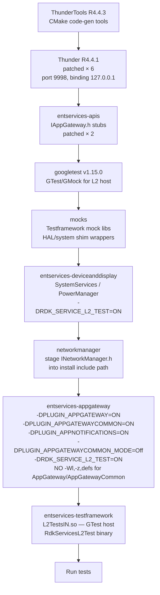
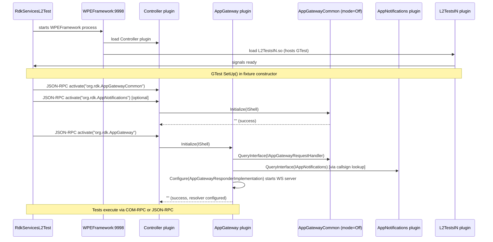
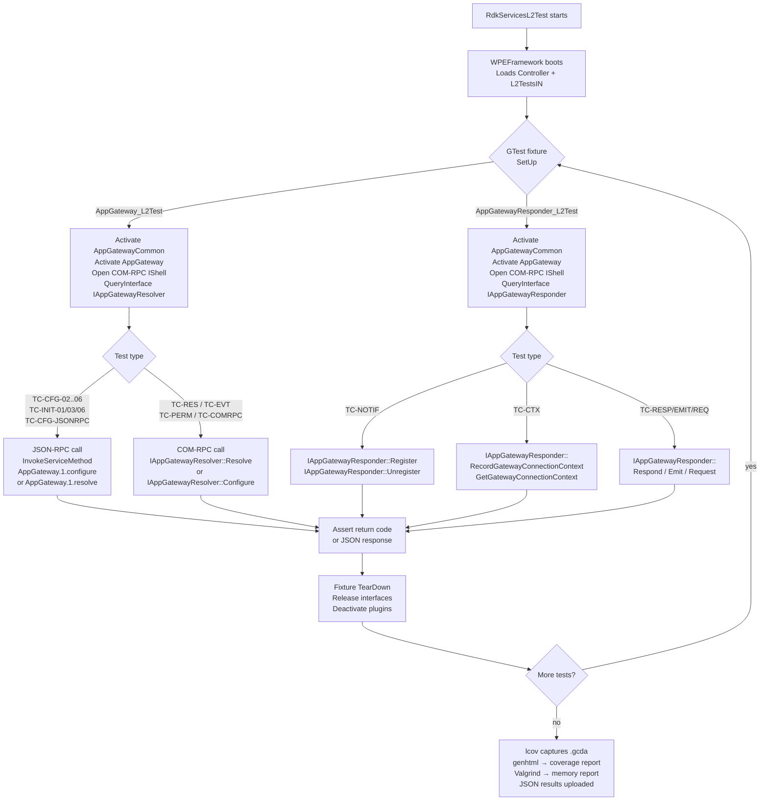
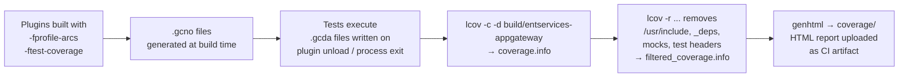

# AppGateway — L2 Test Workflow

## 1. What is an L2 Test?

L2 ("Level 2") tests run the **real plugin code** inside a live Thunder (WPEFramework) process.  
There is no firmware, no hardware, and no device.  External hardware calls are intercepted by  
a thin mock library; everything else — Thunder COM-RPC, JSON-RPC, plugin activation, interface  
dispatch — executes exactly as it would on a real box.

This is different from:

| Level | What runs | What is mocked |
|---|---|---|
| **L0 (component test)** | Individual plugin logic in isolation | Thunder service stubs, external interfaces |
| **L1 (unit test)** | Individual C++ class methods | Thunder, all interfaces |
| **L2 (integration test)** | Full Thunder + real plugins | Hardware HAL only |
| **L3 (system test)** | Real device | Nothing |

### Scope For This Document

Primary focus is **AppGateway plugin L2 behaviour** (`IAppGatewayResolver` path):
- Resolver configuration and method resolution (`Configure` / `Resolve`)
- Event subscribe/unsubscribe path via AppNotifications
- Permission and COM-RPC forwarding paths from AppGateway

`AppGatewayCommon` is documented as a **runtime dependency** needed by AppGateway for
`IAppGatewayRequestHandler` / authenticator flows, plus secondary coverage from the
`AppGatewayResponder_L2Test` fixture that is part of the same suite.

---

## 2. Architecture Overview

```
┌────────────────────────────────────────────────────────────────────────┐
│  Ubuntu 22.04 (GitHub Actions runner / local docker)                   │
│                                                                        │
│  ┌───────────────────────────────────────────────────────────────┐     │
│  │  WPEFramework (Thunder R4.4.1)  - port 9998                   │     │
│  │                                                               │     │
│  │   ┌───────────────────┐                                       │     │
│  │   │ Controller plugin │                                       │     │
│  │   └────────┬──────────┘                                       │     │
│  │            │ QueryInterface                                   │     │
│  │            v                                                  │     │
│  │   ┌──────────────────────────────────────────────────────┐    │     │
│  │   │ AppGateway plugin                                     │    │     │
│  │   │ - IAppGatewayResolver                                 │    │     │
│  │   │ - IAppGatewayResponder                                │    │     │
│  │   │ - IAppGatewayTelemetry                                │    │     │
│  │   └───────────────┬───────────────────────┬──────────────┘    │     │
│  │                   │                       │                   │     │
│  │                   │ uses                  │ uses              │     │
│  │                   v                       v                   │     │
│  │   ┌──────────────────────────┐   ┌────────────────────────┐   │     │
│  │   │ AppGatewayCommon plugin  │   │ AppNotifications plugin│   │     │
│  │   │ - IAppGatewayRequestHandler│  │ - IAppNotifications    │   │     │
│  │   │ - IAppGatewayAuthenticator │  └────────────────────────┘   │     │
│  │   └──────────────────────────┘                                 │     │
│  │                                                               │     │
│  │   ┌────────────────────────────────────────────────────────┐  │     │
│  │   │ L2TestsIN plugin (in-process .so)                     │  │     │
│  │   │ - Hosts GTest runner                                  │  │     │
│  │   │ - AppGateway_L2Test fixture                           │  │     │
│  │   │ - AppGatewayResponder_L2Test fixture                  │  │     │
│  │   │ - COM-RPC client to Controller on /tmp/communicator   │  │     │
│  │   └────────────────────────────────────────────────────────┘  │     │
│  └───────────────────────────────────────────────────────────────┘     │
│                                                                        │
│  RdkServicesL2Test binary --JSON-RPC--> WPEFramework:9998              │
└────────────────────────────────────────────────────────────────────────┘
```

### Key deployment decision — `PLUGIN_APPGATEWAYCOMMON_MODE=Off`

AppGatewayCommon is configured with `mode=Off` (in-process) for L2 tests.  
This means it **loads directly into the WPEFramework process** — no separate WPEProcess is spawned.

| Mode | Process | COM-RPC socket | Used in L2? |
|---|---|---|---|
| `Local` (default) | separate `WPEProcess` | `/tmp/communicator` | No |
| `Off` (in-process) | same as WPEFramework | `/tmp/communicator` | **Yes** |

### AppNotifications in L2 flow

For AppGateway L2 event coverage, AppNotifications is treated in the same runtime dependency model as
AppGatewayCommon: the fixture proactively activates `org.rdk.AppNotifications`, and AppGateway then uses
`QueryInterfaceByCallsign` to bind `IAppNotifications` on demand for subscribe/unsubscribe paths.

This keeps AppGateway event tests on the live Thunder plugin path rather than a mock interface path.

### AppGatewayCommon dependency architecture (plugin-centric)

```mermaid
flowchart TD
    C[Controller plugin] -->|activate| AGWC[AppGatewayCommon plugin]

    AGWC -->|QueryInterfaceByCallsign| RM[org.rdk.RuntimeManager]
    AGWC -->|QueryInterfaceByCallsign| LM[org.rdk.LifecycleManager]
    AGWC -->|QueryInterfaceByCallsign| WM[org.rdk.RDKWindowManager]

    AGWC -->|QueryInterfaceByCallsign| DI[org.rdk.DeviceInfo]
    AGWC -->|JSON-RPC link / subscribe| DS[org.rdk.DisplaySettings]
    AGWC -->|JSON-RPC link / subscribe| HDCP[org.rdk.HdcpProfile]
    AGWC -->|QueryInterfaceByCallsign| DINFO[org.rdk.DisplayInfo]
    AGWC -->|QueryInterfaceByCallsign| PM[org.rdk.PowerManager]
    AGWC -->|QueryInterfaceByCallsign| NM[org.rdk.NetworkManager]

    AGWC -->|QueryInterfaceByCallsign| US[org.rdk.UserSettings]
    AGWC -->|QueryInterfaceByCallsign| TT[org.rdk.TextTrack]
    AGWC -->|QueryInterfaceByCallsign| TTS[org.rdk.TextToSpeech]
    AGWC -->|QueryInterfaceByCallsign| SS[org.rdk.SharedStorage]

    classDef core fill:#eef7ff,stroke:#4a90e2,stroke-width:1px;
    classDef optional fill:#f8fff1,stroke:#6aa84f,stroke-width:1px;
    class AGWC core;
    class RM,LM,WM,DI,DS,HDCP,DINFO,PM,NM,US,TT,TTS,SS optional;
```



Notes:
- Most dependencies are acquired lazily at call-time and are treated as optional at runtime.
- Missing dependencies should degrade specific method/event paths, not crash plugin initialization.

With `mode=Off` the Thunder COM-RPC proxy still uses `/tmp/communicator` but the stub is  
serviced in-process, eliminating the process-lifecycle race that otherwise causes test  
instability when `WPEProcess` starts/stops independently.

---

## 3. Build Pipeline



### Critical build flags for AppGateway plugins

| Flag | Purpose |
|---|---|
| `-DRDK_SERVICE_L2_TEST=ON` | Enables `TestMocklib` HAL shim; skips `-Wl,-z,defs` |
| `-DPLUGIN_APPGATEWAYCOMMON_MODE=Off` | Forces AppGatewayCommon in-process |
| `-fprofile-arcs -ftest-coverage` | Emits `.gcno` / `.gcda` for lcov |
| `-DDISABLE_SECURITY_TOKEN` | Skips token auth on JSON-RPC calls from tests |
| `-DHIDE_NON_EXTERNAL_SYMBOLS=OFF` | Keeps symbols visible for COM-RPC introspection |

### Why `-Wl,-z,defs` is removed for L2 builds

`-Wl,-z,defs` statically embeds `libgcov.a` into each plugin `.so`.  
This creates an **isolated gcov runtime** inside AppGateway.so / AppGatewayCommon.so  
whose `gcov_cleanup` destructor cannot write `.gcda` files because `__gcov_*` symbols  
conflict with the shared `libgcov` instance in `L2TestsIN.so`.  
**Fix:** `if(NOT RDK_SERVICE_L2_TEST)` guard in both `AppGateway/CMakeLists.txt` and  
`AppGatewayCommon/CMakeLists.txt` removes the flag when building for L2 tests,  
allowing gcov symbol sharing and correct `.gcda` emission.

---

## 4. Runtime Initialisation Flow



---

## 5. Test Fixtures In This Suite

### 5.1 `AppGateway_L2Test` — tests the **Resolver** interface

```
AppGateway_L2Test
│
├── Activates: AppGatewayCommon (first) + AppGateway
├── COM-RPC client on /tmp/communicator
│   └── Opens IShell for "org.rdk.AppGateway"
│       └── QueryInterface → IAppGatewayResolver  ← used by TC-RES/EVT/PERM
└── JSON-RPC client on 127.0.0.1:9998
    └── InvokeServiceMethod("org.rdk.AppGateway.1", ...) ← used by TC-CFG/TC-INIT
```

Tests covered: TC-CFG-01..06, TC-CFG-JSONRPC-01/02, TC-RES-03..05,  
TC-COMRPC-04, TC-EVT-01..05, TC-PERM-01, TC-INIT-01/03/06 — **22 tests**

### 5.2 `AppGatewayResponder_L2Test` — secondary fixture for **Responder** interface (AppGateway)

```
AppGatewayResponder_L2Test
│
├── Activates: AppGatewayCommon (first) + AppGateway
├── COM-RPC client on /tmp/communicator  (AGWR_Engine / AGWR_Client)
│   └── Opens IShell for "org.rdk.AppGateway"
│       └── QueryInterface → IAppGatewayResponder  ← all responder tests
└── Notification handler: AppGatewayResponderNotificationHandler
    └── implements IAppGatewayResponder::INotification
        └── captures OnAppConnectionChanged events
```

Tests covered: TC-NOTIF-01..04, TC-CTX-01..03 (overwrite), TC-RESP-03,  
TC-EMIT-01, TC-REQ-01 — **8 tests**

**Total: 30 tests (29 PASS + 1 SKIP)**

---

## 6. Step-by-Step Test Execution Flow



---

## 7. AppGateway-Focused Dependency Strategy

### 7.1 What AppGatewayCommon Implements (No Mocking Required)

AppGatewayCommon itself **implements** three interfaces directly:

| Interface | Role | Consumed by |
|---|---|---|
| `IAppGatewayRequestHandler` | Handles COM-RPC method dispatch from AppGateway | AppGateway plugin |
| `IAppNotificationHandler` | Receives event subscription requests | AppGateway plugin |
| `IAppGatewayAuthenticator` | Authenticates WebSocket clients by sessionId | AppGatewayCommon internally |

Because AppGatewayCommon **is** these interfaces in the live Thunder stack, no mock is needed  
for them — the real implementation runs.

### 7.2 What IS Needed But Cannot Be Exercised Without a Real Environment

The following AppGatewayCommon paths require external services that are not present in CI:

| Dependency | What it does | L2 behaviour |
|---|---|---|
| Live WebSocket client (app) | Connects to AppGatewayCommon WS server | Not present — `Respond`, `Emit`, `Request` return error but **must not crash** |
| Valid `sessionId` token | Required for `IAppGatewayAuthenticator::Authenticate` | Cannot simulate — WS auth path (TC-WS-*) not exercised in current tests |
| `SettingsDelegate` backends | `IUserSettings`, `INetworkManager`, cloud stores | Not present in CI — `HandleAppGatewayRequest` for those paths returns early |

### 7.3 What AppGateway (Resolver) Needs From AppGatewayCommon

When AppGateway resolves a method with `"useComRpc": true`, it calls  
`QueryInterfaceByCallsign("org.rdk.AppGatewayCommon")` to get `IAppGatewayRequestHandler`.  
In L2 tests this works because AppGatewayCommon is **already activated** (in-process).

```
TC-COMRPC-04: test.comrpc → QueryInterfaceByCallsign → IAppGatewayRequestHandler
              AppGatewayCommon is up but HandleAppGatewayRequest for "test.comrpc"
              method is not mapped → returns error → resolution = "notAvailable"
              ✔ PASS (verifies the not-available branch)
```

### 7.4 Mock Summary for Current 30-Test Suite

| Mock / Substitute | Used | How |
|---|---|---|
| **No hardware mocks needed** | AppGateway / AppGatewayCommon have no HAL calls | — |
| **TestMocklib** (`-DRDK_SERVICE_L2_TEST`) | Other plugins (SystemServices, PersistentStore etc.) | Intercepted by CMake HAL shim |
| **Temp JSON config files** (`mkstemps`) | TC-INIT / TC-CFG resolution config files | Written inline in test fixture, deleted on teardown |
| **Real Thunder Controller** | Plugin activate/deactivate, JSON-RPC forward | Live Thunder instance, no mock |
| **Real AppNotifications plugin** | TC-EVT-01..05 event subscribe/unsubscribe | Fixture activates `org.rdk.AppNotifications`; AppGateway then uses `QueryInterfaceByCallsign` |
| **Real AppGatewayCommon plugin** | AppGateway dependency path (TC-COMRPC-04) + dependency activation for responder fixture (TC-NOTIF/CTX/RESP) | Real plugin, mode=Off |

### 7.5 AppGatewayCommon dependency mocking plan

L2-only plan (keep the default lane integration-real, then add targeted mocks only where CI cannot provide services):

| L2 step | Goal | Approach | Exit criteria |
|---|---|---|---|
| Step 1: Baseline real-plugin lane | Preserve integration fidelity | Keep `AppGatewayCommon`, Controller, and available dependency plugins real in Thunder; run with `PLUGIN_APPGATEWAYCOMMON_MODE=Off` | Current 30-test suite stays stable with no lifecycle race regressions |
| Step 2: Targeted infra shims | Simulate only missing infra in CI | Use `TestMocklib` (`-DRDK_SERVICE_L2_TEST`) for HAL/system wrapper gaps; do not replace AppGatewayCommon itself | Tests for unavailable env dependencies return expected controlled errors (not crashes) |
| Step 3: Optional dependency emulation lane | Add deterministic negative-path coverage | In a separate opt-in L2 job, enable `L2_TEST_OOP_RPC` and extend `MockPlugin`/`MockAccessor` only for required missing COM dependencies | Fault-injection scenarios are reproducible without changing default L2 behavior |

Recommended L2 rollout:
1. Keep default L2 lane unchanged as the release gate.
2. Add one dependency-emulation lane for missing CI services only.
3. Promote new mocked scenarios to required checks only after parity with real-lane behavior is confirmed.

### 7.6 Separate L2 lane with dedicated mock Thunder plugins

#### What this approach means

1. Build mock Thunder plugins whose callsigns match what AppGatewayCommon looks up.
2. In a separate L2 lane, activate those mock plugins first.
3. Then activate AppGatewayCommon so `QueryInterfaceByCallsign` resolves to those mocks.

#### Best in-repo examples to refer

1. Mock plugin skeleton + `SERVICE_REGISTRATION`:
    - `entservices-testframework/Tests/mocks/MockAuthService/MockAuthServicePlugin.cpp`
    - `entservices-testframework/Tests/mocks/MockSecManager/MockSecManagerPlugin.cpp`
2. Callsign in plugin config (`.conf.in`):
    - `entservices-testframework/Tests/mocks/MockAuthService/MockAuthServicePlugin.conf.in`
    - `entservices-testframework/Tests/mocks/MockSecManager/MockSecManagerPlugin.conf.in`
3. Activation/deactivation flow via Controller in L2 harness:
    - `entservices-testframework/Tests/L2Tests/L2TestsPlugin/L2TestsMock.cpp` (`ActivateService` / `DeactivateService`)
4. AppGatewayCommon dependency callsigns to match:
    - `entservices-appgateway/AppGatewayCommon/delegate/LifecycleDelegate.h`
    - `entservices-appgateway/AppGatewayCommon/delegate/NetworkDelegate.h`
    - `entservices-appgateway/AppGatewayCommon/delegate/SystemDelegate.h`

#### Practical step-by-step recipe (copy/adapt)

1. Create dedicated mock plugin folders in `entservices-testframework/Tests/mocks`, for example:
    - `MockRuntimeManager`
    - `MockLifecycleManager`
    - `MockNetworkManager`
    - `MockDisplaySettings`
2. In each plugin `.conf.in`, set `callsign` exactly to what AppGatewayCommon expects:
    - `org.rdk.RuntimeManager`
    - `org.rdk.LifecycleManager`
    - `org.rdk.NetworkManager`
    - `org.rdk.DisplaySettings`
3. Implement required interfaces in each mock plugin with deterministic success/failure behavior.
4. Add these plugin targets in testframework CMake behind a separate lane flag (example: `APPGWCOMMON_L2_DEP_MOCKS`).
5. In the separate L2 lane startup sequence:
    1. Activate dependency mock plugins first.
    2. Activate `org.rdk.AppGatewayCommon` next.
    3. Activate `org.rdk.AppGateway` and run tests.
6. Keep the current real-dependency L2 lane unchanged as baseline; run this as an additional deterministic fault-injection lane.

#### Important note

- There is no existing full mock plugin example in this repo yet for `RuntimeManager` / `LifecycleManager` / `NetworkManager` / `DisplaySettings`.
- The `MockAuthService` / `MockSecManager` plugins are the template for plugin structure and lifecycle wiring.

---

## 8. Known Thunder R4.4.1 Constraints

### 8.1 `IStringIterator*` as IN parameter via COM-RPC — Crashes

**Affected:** `IAppGatewayResolver::Configure(IStringIterator* paths)`

Passing a COM-RPC proxy `IStringIterator*` as an IN parameter triggers a crash inside  
Thunder's reverse-proxy cleanup (double-Release on the marshalled stub). This is a  
Thunder R4.4.1 framework bug — not an AppGateway bug.

**Workaround:**
- TC-CFG-01 (`Configure(nullptr)`) is `GTEST_SKIP()`'d — cannot be safely called via COM-RPC.
- TC-CFG-02..06 use **JSON-RPC** (`AppGateway.1.configure` with `params.paths[]`) instead of  
  the COM-RPC `Configure(IStringIterator*)` path.

```
COM-RPC path (broken in R4.4.1):
  Test → RPC::CommunicatorClient::Open<IAppGatewayResolver>
       → Configure(IStringIterator*) → CRASH during proxy cleanup

JSON-RPC workaround (used instead):
  Test → JSONRPC::LinkType → AppGateway.1.configure {"paths": [...]}
       → Thunder dispatches to AppGateway::configure() JSONRPC handler
       → Internally calls Configure(IStringIterator*) from the same process → OK
```

### 8.2 Non-`@opaque` `string&` OUT parameters via COM-RPC — Not Marshalled Back

**Affected:** `IAppGatewayResponder::GetGatewayConnectionContext(connId, key, contextValue /* @out */)`

`contextValue` is a plain `string&` output (not `@opaque`). Thunder R4.4.1's COM-RPC  
serialiser does not reliably copy back plain `string&` out-parameters across the  
proxy/stub boundary when `mode=Off`.

**Workaround:**  
TC-CTX-01, TC-CTX-02, TC-CTX-03 only assert `EXPECT_EQ(result, Core::ERROR_NONE)`.  
They do **not** assert the string value returned.

### 8.3 WPEFramework SIGSEGV on Shutdown

Thunder R4.4.1 crashes with SIGSEGV during Controller's self-deactivation after all  
plugins have been cleanly deactivated. This is a known Thunder framework issue and  
does **not** affect test pass/fail — all assertions complete before teardown.

---

## 9. Coverage Collection



### Why AppGateway and AppGatewayCommon were previously missing from coverage

`-Wl,-z,defs` was present in both `AppGateway/CMakeLists.txt` and  
`AppGatewayCommon/CMakeLists.txt`. This caused `libgcov.a` to be **statically embedded**  
inside each plugin `.so`, creating isolated gcov runtimes. When L2TestsIN.so was  
`dlclose()`'d, only the shared `libgcov` (from `AppNotifications.so`, which had no  
`-z,defs`) wrote its `.gcda` files. AppGateway and AppGatewayCommon had no mechanism  
to flush their isolated gcov data.

**Fix applied (not yet pushed):**
```cmake
# AppGateway/CMakeLists.txt  and  AppGatewayCommon/CMakeLists.txt
# To error any missing links (skip for L2 test builds: -Wl,-z,defs embeds
# libgcov.a statically, preventing __gcov_* symbol sharing and breaking
# coverage data collection)
if(NOT RDK_SERVICE_L2_TEST)
    target_link_options(${MODULE_NAME} PRIVATE -Wl,-z,defs)
endif()
```

---

## 10. CI Pipeline Phases

| Phase | Step | Output |
|---|---|---|
| **Build** | ThunderTools → Thunder → apis → mocks → device-display → appgateway → testframework | Installed under `$GITHUB_WORKSPACE/install/usr/` |
| **Setup** | Create `/etc/app-gateway/`, device nodes, temp dirs | Filesystem ready for plugin config |
| **Run (plain)** | `RdkServicesL2Test` — 30 tests, ~18 s | `rdkL2TestResultsWithoutValgrind.json` |
| **Run (valgrind)** | Same binary under `valgrind --leak-check=yes` | `valgrind_log`, `rdkL2TestResultsWithValgrind.json` |
| **Coverage** | `lcov -c -d build/entservices-appgateway` → filter → `genhtml` | `coverage/index.html` |
| **Upload** | `actions/upload-artifact@v4` — `artifacts-L2-infra` | Downloadable from GitHub Actions run |

### Current CI result (Run 6, 5 Jun 2026)

```
[==========] 30 tests from 2 test suites ran. (18128 ms total)
[  PASSED  ] 29 tests.
[  SKIPPED ] 1 test.  (AppGateway_L2Test.Configure_NullIterator_COMRPC)
[  FAILED  ] 0 tests.
```

---

## 11. File Structure

```
entservices-appgateway/
├── AppGateway/
│   ├── CMakeLists.txt              ← -Wl,-z,defs guarded by if(NOT RDK_SERVICE_L2_TEST)
│   ├── AppGatewayImplementation.cpp
│   └── ...
├── AppGatewayCommon/
│   ├── CMakeLists.txt              ← same -Wl,-z,defs guard
│   ├── AppGatewayCommon.cpp        ← implements IAppGatewayRequestHandler,
│   │                                  IAppNotificationHandler, IAppGatewayAuthenticator
│   └── ...
├── .github/workflows/
│   └── L2-tests.yml                ← PLUGIN_APPGATEWAYCOMMON_MODE=Off; gcc with-coverage only
└── Tests/L2Tests/
    ├── docs/
    │   ├── AppGateway_L2_TestPlan.md     ← per-test-case plan
    │   └── AppGateway_L2_TestWorkflow.md ← this file
    └── tests/
        └── AppGateway_L2Test.cpp   ← AppGateway_L2Test + AppGatewayResponder_L2Test
```
