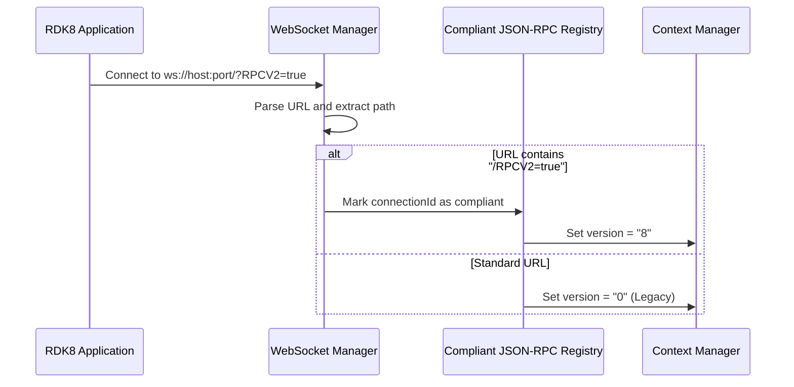
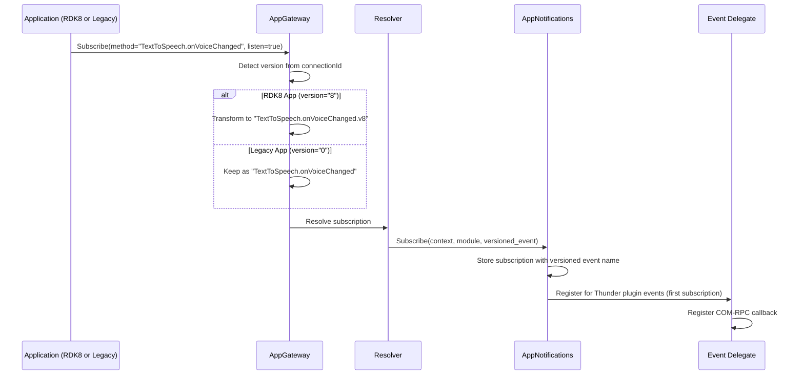
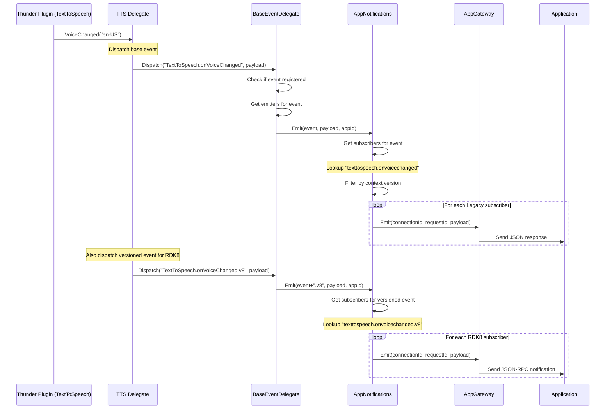
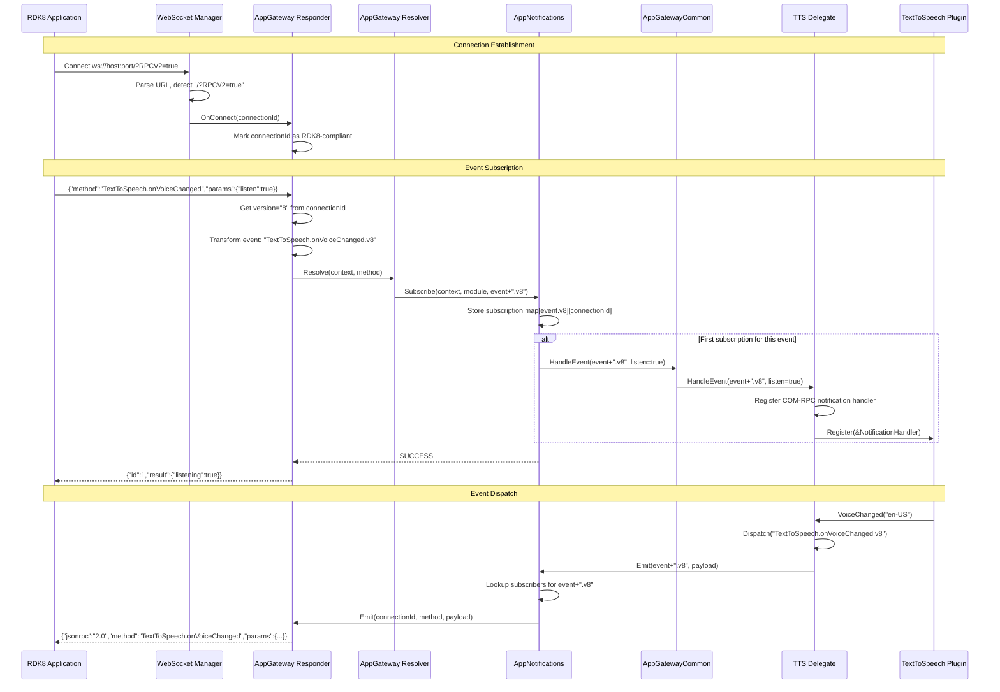
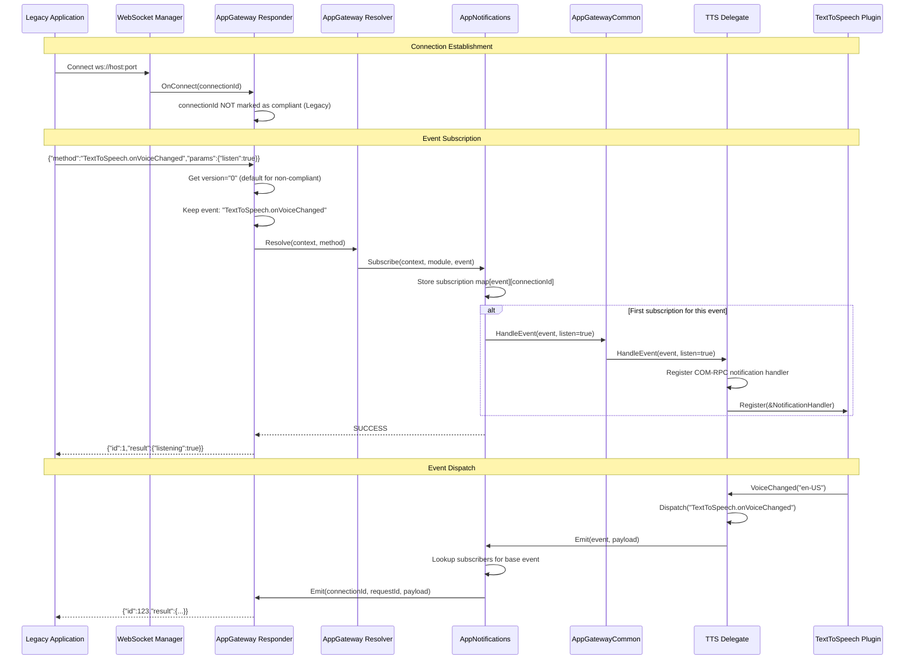

# RDK8 Firebolt API Support - Design Documentation

## Table of Contents
- [Overview](#overview)
- [RDK8 vs Legacy Notification System](#rdk8-vs-legacy-notification-system)
- [Compliant JSON-RPC Detection](#compliant-json-rpc-detection)
- [Context Version Management](#context-version-management)
- [Event Registration and Dispatch](#event-registration-and-dispatch)
- [Sequence Diagrams](#sequence-diagrams)
- [Key Implementation Files](#key-implementation-files)

---

## Overview

The AppGateway supports both **Legacy Firebolt APIs** (version 0) and **RDK8 Firebolt APIs** (version 8). The primary difference lies in how events are registered, dispatched, and how the application's JSON-RPC compliance is detected based on the WebSocket connection URL.

This document focuses on the notification and event dispatch mechanisms that differ between RDK8 and Legacy applications.

---

## RDK8 vs Legacy Notification System

### Key Differences

| Aspect | Legacy (Version 0) | RDK8 (Version 8) |
|--------|-------------------|------------------|
| **Version Identifier** | `"0"` | `"8"` |
| **Event Name Format** | Base event name (e.g., `TextToSpeech.onVoiceChanged`) | Base event name + `.v8` suffix (e.g., `TextToSpeech.onVoiceChanged.v8`) |
| **Detection Method** | Default for non-compliant connections | Detected via WebSocket URL path containing `/RPCV2=true` |
| **JSON-RPC Compliance** | Not required | Fully JSON-RPC compliant |
| **Event Subscription Storage** | Events stored using base name | Events stored using versioned name (with `.v8` suffix) |
| **Event Dispatch** | Dispatches events with base name | Dispatches events with versioned name (with `.v8` suffix) |

### Version Constants

```cpp
#define LEGACY_FIREBOLT_VERSION "0"
#define RDK8_FIREBOLT_VERSION "8"
#define RDK8_SUFFIX ".v8"
#define RDK8_SUFFIX_LENGTH 3
```

---

## Compliant JSON-RPC Detection

### URL-Based Detection

The system determines if a WebSocket connection is RDK8-compliant by examining the connection URL:

- **Legacy Apps**: Connect via standard WebSocket URL (e.g., `ws://127.0.0.1:3473`)
- **RDK8 Apps**: Connect via JSON-RPC compliant URL (e.g., `ws://127.0.0.1:3473/?RPCV2=true`)

### Detection Flow



### Implementation Details

- **URL Parsing**: The WebSocket server examines the connection path during the handshake
- **Registry Storage**: A `CompliantJsonRpcRegistry` maintains a list of connection IDs that are RDK8-compliant
- **Context Update**: When processing requests, the system checks the registry and sets the context version accordingly

**Key Code Location**: `AppGatewayResponderImplementation.cpp`

```cpp
string version = LEGACY_FIREBOLT_VERSION;
if (mCompliantJsonRpcRegistry.IsCompliantJsonRpc(connectionId)) {
    version = RDK8_FIREBOLT_VERSION;
}
```

---

## Context Version Management

### GatewayContext Structure

Each request in the AppGateway includes a `GatewayContext` that carries version information:

```cpp
struct GatewayContext {
    uint32_t requestId;
    uint32_t connectionId;
    string appId;
    string version;  // "0" for Legacy, "8" for RDK8
};
```

### Context Conversion

When communicating between AppGateway and AppNotifications plugins, contexts are converted to carry version information:

```cpp
// Convert from Gateway to Notifications
Exchange::IAppNotifications::AppNotificationContext notificationContext;
notificationContext.requestId = gatewayContext.requestId;
notificationContext.connectionId = gatewayContext.connectionId;
notificationContext.appId = gatewayContext.appId;
notificationContext.origin = origin;
notificationContext.version = gatewayContext.version;  // Version propagated
```

---

## Event Registration and Dispatch

### Event Name Transformation

The system uses helper functions to transform event names based on the version:

**Key Helper Functions** (`ContextUtils.h`):

```cpp
// Transform event name based on version
static string GetEventNameFromContextBasedonVersion(const string& version, const string& baseEventName) {
    if (RDK8_FIREBOLT_VERSION == version) {
        return GetRDK8VersionedEventName(baseEventName);
    }
    return baseEventName;
}

// Add .v8 suffix for RDK8
static string GetRDK8VersionedEventName(const string& baseEventName) {
    return baseEventName + RDK8_SUFFIX;  // Adds ".v8"
}

// Remove .v8 suffix to get base name
static string GetBaseEventNameFromVersionedEvent(const string& versionedEventName) {
    if (versionedEventName.size() > RDK8_SUFFIX_LENGTH && 
        RDK8_SUFFIX == versionedEventName.substr(versionedEventName.size() - RDK8_SUFFIX_LENGTH)) {
        return versionedEventName.substr(0, versionedEventName.size() - RDK8_SUFFIX_LENGTH);
    }
    return versionedEventName;
}
```

### Registration Flow

#### 1. Subscription from Application

When an application subscribes to an event:



#### 2. Event Storage

The `AppNotificationsImplementation` stores subscriptions in a map:

- **Key**: Event name (lowercase, with `.v8` for RDK8 apps)
- **Value**: List of `AppNotificationContext` objects containing subscriber information

**Example Storage**:

| Event Name (Key) | Subscribers |
|------------------|-------------|
| `texttospeech.onvoicechanged` | [Legacy App1, Legacy App2] |
| `texttospeech.onvoicechanged.v8` | [RDK8 App1, RDK8 App2] |

This separation ensures Legacy and RDK8 apps maintain independent subscription lists.

### Dispatch Flow

#### 1. Event Trigger from Thunder Plugin

When a Thunder plugin (e.g., TextToSpeech) fires an event:



#### 2. Dual Dispatch for Mixed Compatibility

Some events need to support both Legacy and RDK8 applications. In such cases, delegates must dispatch both event variants:

**Example from TTSDelegate.h**:

```cpp
void VoiceChanged(const string voice) {
    // Dispatch for Legacy subscribers
    mParent.Dispatch("TextToSpeech.onVoiceChanged", voice);
    
    // Dispatch for RDK8 subscribers (if needed)
    // Note: Based on API requirements, some events may only need one variant
}
```

**Important Note**: Not all events require dual dispatch. Whether an event should be dispatched for both versions depends on the API specification:

- **RDK8-only events**: Only dispatch the `.v8` variant
- **Legacy-only events**: Only dispatch the base variant
- **Dual-support events**: Dispatch both variants

### Response Format Differences

#### Legacy Application Response

For non-compliant JSON-RPC connections, the response is sent using the request-response pattern:

```json
{
    "id": 123,
    "result": {
        "listening": true,
        "event": "TextToSpeech.onVoiceChanged"
    }
}
```

#### RDK8 Application Response

For compliant JSON-RPC connections, events are sent as JSON-RPC notifications:

```json
{
    "jsonrpc": "2.0",
    "method": "TextToSpeech.onVoiceChanged",
    "params": {
        "voice": "en-US"
    }
}
```

---

## Sequence Diagrams

### Complete RDK8 Subscription Flow



### Complete Legacy Subscription Flow



---

## Key Implementation Files

### Core Files

| File | Purpose |
|------|---------|
| `helpers/ContextUtils.h` | Version detection and event name transformation utilities |
| `AppGateway/AppGatewayResponderImplementation.cpp` | WebSocket connection management and JSON-RPC compliance detection |
| `AppGateway/AppGatewayImplementation.cpp` | Event subscription handling and version-based event name transformation |
| `AppNotifications/AppNotificationsImplementation.cpp` | Event subscription storage and dispatch coordination |
| `AppGatewayCommon/delegate/*.h` | Event delegates that dispatch events to AppNotifications |
| `helpers/BaseEventDelegate.h` | Base class for event delegation with registration and dispatch logic |

### Event Delegates

Each delegate handles events from specific Thunder plugins:

- **TTSDelegate**: TextToSpeech events (RDK8-only)
- **UserSettingsDelegate**: Accessibility, ClosedCaptions, VoiceGuidance events (Mixed)
- **NetworkDelegate**: Network connectivity events
- **SystemDelegate**: Device and system events
- **LifecycleDelegate**: Application lifecycle events
- **AppDelegate**: Advertising and shared storage events

---

## Summary

The RDK8 notification system provides a robust mechanism for supporting both legacy and modern Firebolt applications:

- **URL-based detection** identifies RDK8-compliant applications
- **Version-specific context** propagates through the entire request/response pipeline
- **Event name transformation** ensures proper routing to subscribers
- **Independent subscription lists** prevent cross-version event pollution
- **Flexible dispatch** allows delegates to support single or dual-version events

This architecture maintains backward compatibility while enabling the migration path to fully compliant JSON-RPC 2.0 applications.
