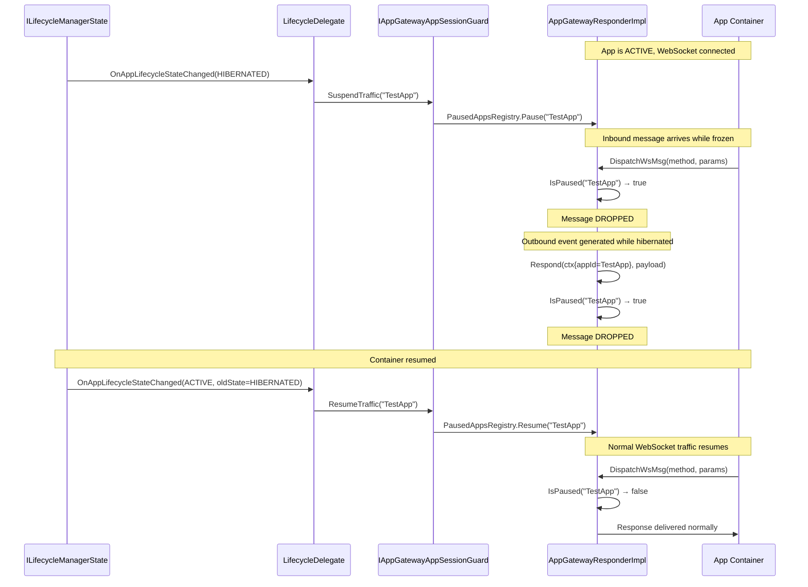

# WebSocket Traffic Control During App Hibernation — Detailed Design

## 1. Overview

This document describes the design for pausing and resuming traffic when an application enters the `HIBERNATED` lifecycle state. It applies **exclusively to the Lifecycle 2 (AppManagers) architecture** and is implemented **only in `AppGatewayCommon`** — legacy/non-AppManagers paths are unaffected.

The approach is **drop-based**: all WebSocket messages (inbound and outbound) for a hibernated application are silently discarded. No queuing or replay occurs. Normal traffic resumes as soon as the application transitions out of the `HIBERNATED` state.

---

## 2. Background and Terminology

| Term | Meaning in this codebase |
|---|---|
| **App container** | The sandboxed process running the app, managed by `IRuntimeManager` |
| **WebSocket connection** | A persistent TCP connection between the app container and `AppGatewayResponderImplementation` on `127.0.0.1:3473` |
| **`connectionId`** | Unique integer identifying one WebSocket connection inside `AppGatewayResponderImplementation` |
| **Hibernation** | OS-level freeze of the container process (`CGROUP_FREEZE`). The TCP state survives in the kernel; the user-space reader/writer inside the container is frozen. |
| **`AppGatewayResponder`** | The `IAppGatewayResponder` interface, implemented by `AppGatewayResponderImplementation`, used by other plugins to push responses and events to an app |
| **`IAppGatewayAppSessionGuard`** | New COM interface added to `IAppGateway.h`; exposes `SuspendTraffic` / `ResumeTraffic` per appId |

---

## 3. Problem Statement

When a container is hibernated:

- The **WebSocket TCP connection remains open** because the kernel holds the socket independently of user space.
- **Inbound messages** from the frozen app arrive and would be dispatched as if the app were active, wasting work and potentially returning responses into a frozen TCP window.
- **Outbound messages** (responses / events pushed via `AppGatewayResponder`) would be written to a send-buffer the frozen container cannot drain — messages would be silently lost.

The solution is to **drop both directions** while hibernated. The app restarts its interactions after resuming, so message ordering across the hibernation boundary is not meaningful.

---

## 4. Architectural Context

```
┌─────────────────────────────────────────────────────────────┐
│                     AppGatewayCommon                        │
│                                                             │
│  ┌──────────────────────────────────────────────────────┐   │
│  │  AppGatewayResponderImplementation                   │   │
│  │  (implements IAppGatewayResponder +                  │   │
│  │             IAppGatewayAppSessionGuard)              │   │
│  │                                                      │   │
│  │  DispatchWsMsg()   ← inbound drop gate               │   │
│  │  Respond()         ← outbound drop gate              │   │
│  │  Emit()            ← outbound drop gate              │   │
│  │  Request()         ← outbound drop gate              │   │
│  │                                                      │   │
│  │  PausedAppsRegistry  (thread-safe unordered_set)     │   │
│  │    SuspendTraffic(appId)                             │   │
│  │    ResumeTraffic(appId)                              │   │
│  └──────────────────────────────────────────────────────┘   │
│                         ▲                                   │
│                         │                                   │
│             IAppGatewayAppSessionGuard(COM-RPC)             │
│  ┌──────────────────────┴───────────────────────────────┐   │
│  │  LifecycleDelegate                                   │   │
│  │  OnAppLifecycleStateChanged()                        │   │
│  │    HIBERNATED  → SessionGuard.SuspendTraffic         │   │
│  │    ← HIBERNATED → SessionGuard.ResumeTraffic         │   │
│  └──────────────────────────────────────────────────────┘   │
└─────────────────────────────────────────────────────────────┘
         ▲                              ▲
         │ WebSocket TCP                │ COM-RPC
         │                              │
┌────────┴──────────┐     ┌─────────────┴────────────┐
│  App Container    │     │  LifecycleManager /      │
│  (frozen during   │     │  AppGatewayCommon /      │
│   hibernation)    │     │  Other plugins           │
└───────────────────┘     └──────────────────────────┘
```

---

## 5. Design Components

### 5.1 `IAppGatewayAppSessionGuard` (new interface)

Added to `entservices-apis/apis/AppGateway/IAppGateway.h` with ID `ID_APP_GATEWAY_APP_SESSION_GUARD`.

```cpp
// entservices-apis/apis/AppGateway/IAppGateway.h
struct EXTERNAL IAppGatewayAppSessionGuard : virtual public Core::IUnknown
{
    enum { ID = ID_APP_GATEWAY_APP_SESSION_GUARD };

    // Pauses all WebSocket I/O for the named application.
    // Incoming messages are silently dropped; outgoing messages are discarded.
    // No errors are surfaced to the application.
    virtual Core::hresult SuspendTraffic(const string& appId) = 0;

    // Resumes normal WebSocket I/O for the named application.
    virtual Core::hresult ResumeTraffic(const string& appId) = 0;
};
```

`ID_APP_GATEWAY_APP_SESSION_GUARD = ID_APP_GATEWAY + 6` is registered in `entservices-apis/apis/Ids.h`.

---

### 5.2 `PausedAppsRegistry` inner class (in `AppGatewayResponderImplementation`)

A private inner class inside `AppGatewayResponderImplementation` that maintains a thread-safe set of paused appIds:

```cpp
class PausedAppsRegistry {
public:
    void Pause(const string& appId);    // insert appId
    void Resume(const string& appId);   // erase appId
    bool IsPaused(const string& appId) const;  // O(1) lookup
private:
    mutable std::mutex mMutex;
    std::unordered_set<string> mPausedApps;
};
```

---

### 5.3 `AppGatewayResponderImplementation` — Drop Gates

`AppGatewayResponderImplementation` now also inherits `IAppGatewayAppSessionGuard`. Drop checks are inserted at the four traffic entry points:

#### Inbound drop (`DispatchWsMsg`)

```cpp
void AppGatewayResponderImplementation::DispatchWsMsg(...)
{
    // ...
    if (mPausedAppsRegistry.IsPaused(appId)) {
        LOGDBG("dropping inbound message for hibernated appId=%s", appId.c_str());
        return;   // message silently discarded
    }
    // existing resolver dispatch ...
}
```

#### Outbound drops (`Respond`, `Emit`, `Request`)

```cpp
Core::hresult AppGatewayResponderImplementation::Respond(const Context& context, const string& payload)
{
    if (mPausedAppsRegistry.IsPaused(context.appId)) {
        LOGDBG("dropping outgoing response for hibernated appId=%s", context.appId.c_str());
        return Core::ERROR_NONE;  // silently discarded
    }
    Core::IWorkerPool::Instance().Submit(RespondJob::Create(...));
    return Core::ERROR_NONE;
}
// Emit() and Request() follow the same pattern
```

#### `SuspendTraffic` / `ResumeTraffic`

```cpp
Core::hresult AppGatewayResponderImplementation::SuspendTraffic(const string& appId)
{
    mPausedAppsRegistry.Pause(appId);
    return Core::ERROR_NONE;
}

Core::hresult AppGatewayResponderImplementation::ResumeTraffic(const string& appId)
{
    mPausedAppsRegistry.Resume(appId);
    return Core::ERROR_NONE;
}
```

---

### 5.4 `LifecycleDelegate` — Hibernation Trigger

`LifecycleDelegate` receives `OnAppLifecycleStateChanged` from `ILifecycleManagerState`. It now holds an `IAppGatewayAppSessionGuard*` member (`mSessionGuard`) and calls pause/resume on HIBERNATED transitions:

```cpp
// In HandleLifecycleUpdate() — Lifecycle 2 path only
if (ConfigUtils::useAppManagers() && !appId.empty()) {
    std::lock_guard<std::mutex> lock(mSessionGuardMutex);
    if (mSessionGuard != nullptr) {
        if (newLifecycleState == Exchange::ILifecycleManager::HIBERNATED) {
            mSessionGuard->SuspendTraffic(appId);
        } else if (oldLifecycleState == Exchange::ILifecycleManager::HIBERNATED) {
            mSessionGuard->ResumeTraffic(appId);
        }
    }
}
```

`SetSessionGuard(IAppGatewayAppSessionGuard*)` is the thread-safe setter (with proper `AddRef`/`Release`) called by `AppGatewayCommon`.

---

### 5.5 `AppGatewayCommon` — Wiring

During `Initialize()`, `AppGatewayCommon` queries `IAppGatewayAppSessionGuard` from `AppGatewayResponderImplementation` (via the `APP_GATEWAY_CALLSIGN`) and injects it into `LifecycleDelegate`. This runs on the Lifecycle 2 path only (`ConfigUtils::useAppManagers()`).

During `Deinitialize()`, `SetSessionGuard(nullptr)` is called before delegate cleanup to prevent in-flight callbacks from using a stale pointer.

```cpp
// Initialize
Exchange::IAppGatewayAppSessionGuard* sessionGuard =
    mShell->QueryInterfaceByCallsign<Exchange::IAppGatewayAppSessionGuard>(APP_GATEWAY_CALLSIGN);
if (sessionGuard != nullptr) {
    lifecycleDelegate->SetSessionGuard(sessionGuard);
    sessionGuard->Release();
}

// Deinitialize
lifecycleDelegate->SetSessionGuard(nullptr);
```
---

### 5.6 Design Decisions
#### Why is there no `IsSuspended()` query method in IAppGatewayAppSessionGuard?

`IAppGatewayAppSessionGuard` is deliberately a **command-only interface**. No query method (e.g. `IsSuspended(appId, bool& out)`) is provided, for two reasons:

1. **The caller already knows the state.** `AppGatewayCommon` is the sole driver of suspend/resume — it calls `SuspendTraffic` in response to a `HIBERNATED` notification it received, so it already knows whether a given app is suspended. A query would duplicate information the caller already holds.

2. **TOCTOU race condition.** Any code that checks `IsSuspended()` and then acts on the result is inherently racy in a multi-threaded environment (Time-Of-Check to Time-Of-Use). The state could change between the check and the action. The current design avoids this entirely: `SuspendTraffic`/`ResumeTraffic` are fire-and-forget commands, and the drop logic inside `AppGatewayResponderImplementation` evaluates `PausedAppsRegistry::IsPaused()` atomically under a mutex at each message boundary.

If suspended-state visibility is ever needed for diagnostics, the appropriate mechanism is a JSON-RPC diagnostic method exposed on the `AppGateway` plugin itself, not a query on this internal COM interface.

---

## 6. Data Flow Diagrams

### 6.1 App enters HIBERNATED — traffic paused

```
ILifecycleManagerState::INotification::OnAppLifecycleStateChanged
   (appId="TestApp", newState=HIBERNATED)
        │
        ▼
LifecycleDelegate::HandleLifecycleUpdate()
        │
        ▼
IAppGatewayAppSessionGuard::SuspendTraffic("TestApp")
   → PausedAppsRegistry.Pause("TestApp")


─── Inbound path (app → AppGatewayResponder) ─────────────────
App message → AppGatewayResponderImplementation::DispatchWsMsg()
        │
        ▼
PausedAppsRegistry::IsPaused("TestApp") → true
        │
        ▼
Message DROPPED 


─── Outbound path (AppGatewayResponder → app) ────────────────
AppGatewayCommon calls Respond(ctx{appId="TestApp"}, payload)
        │
        ▼
AppGatewayResponderImplementation::Respond()
        │
        ▼
PausedAppsRegistry::IsPaused("TestApp") → true
        │
        ▼
Message DROPPED 
```

### 6.2 App resumes from HIBERNATED — traffic restored

```
ILifecycleManagerState::INotification::OnAppLifecycleStateChanged
   (appId="TestApp", oldState=HIBERNATED, newState=ACTIVE)
        │
        ▼
LifecycleDelegate::HandleLifecycleUpdate()
        │
        ▼
IAppGatewayAppSessionGuard::ResumeTraffic("TestApp")
   → PausedAppsRegistry.Resume("TestApp")
        │
        ▼
All subsequent WebSocket I/O for "TestApp" proceeds normally
```

---

## 7. Sequence Diagram



---

## 8. File Changes Summary

| File | Change |
|---|---|
| `entservices-apis/apis/Ids.h` | Add `ID_APP_GATEWAY_APP_SESSION_GUARD = ID_APP_GATEWAY + 6` |
| `entservices-apis/apis/AppGateway/IAppGateway.h` | Add `IAppGatewayAppSessionGuard` interface with `SuspendTraffic` / `ResumeTraffic` |
| `entservices-appgateway/AppGateway/AppGatewayResponderImplementation.h` | Inherit `IAppGatewayAppSessionGuard`; add `PausedAppsRegistry` inner class + `mPausedAppsRegistry` member; declare `SuspendTraffic` / `ResumeTraffic` |
| `entservices-appgateway/AppGateway/AppGatewayResponderImplementation.cpp` | Implement `SuspendTraffic` / `ResumeTraffic`; add drop guards in `DispatchWsMsg`, `Respond`, `Emit`, `Request` |
| `entservices-appgateway/AppGatewayCommon/delegate/LifecycleDelegate.h` | Add `mSessionGuard` member + `mSessionGuardMutex`; add `SetSessionGuard()`; add pause/resume calls in `HandleLifecycleUpdate()` |
| `entservices-appgateway/AppGatewayCommon/AppGatewayCommon.cpp` | Query `IAppGatewayAppSessionGuard` and inject into `LifecycleDelegate` in `Initialize()`; clear in `Deinitialize()` |

---

## 9. Scope and Constraints

| Constraint | Detail |
|---|---|
| **Lifecycle 2 only** | All guard logic is gated behind `ConfigUtils::useAppManagers()`. Legacy/non-AppManagers paths have no changes. |
| **AppGatewayCommon only** | Any responder implementation outside the AppManagers path is separate and is not affected. |
| **Drop, not queue** | Messages are discarded while the app is hibernated. The app is expected to re-request any state it needs after resuming. |
| **No errors surfaced** | `Respond`, `Emit`, and `Request` return `Core::ERROR_NONE` when dropping; `DispatchWsMsg` returns void. The application does not observe hibernation-related errors. |
| **Thread safety** | `PausedAppsRegistry` uses a `std::mutex`; `SetSessionGuard` uses a separate `mSessionGuardMutex`. |


