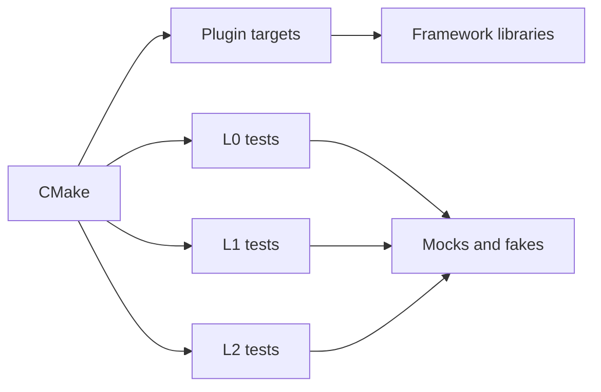
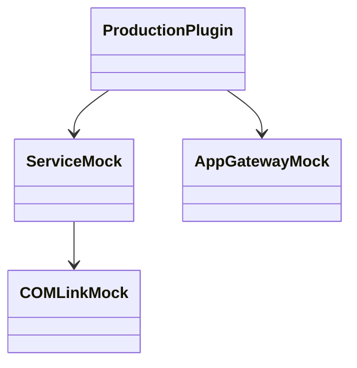
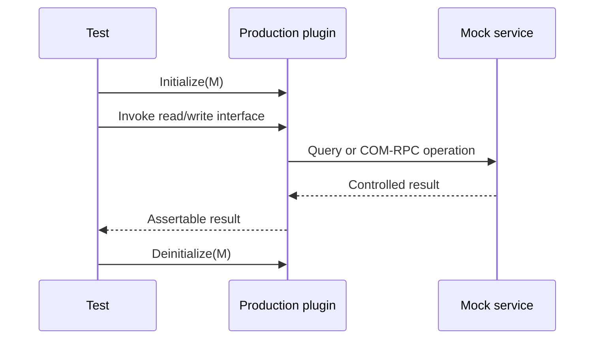
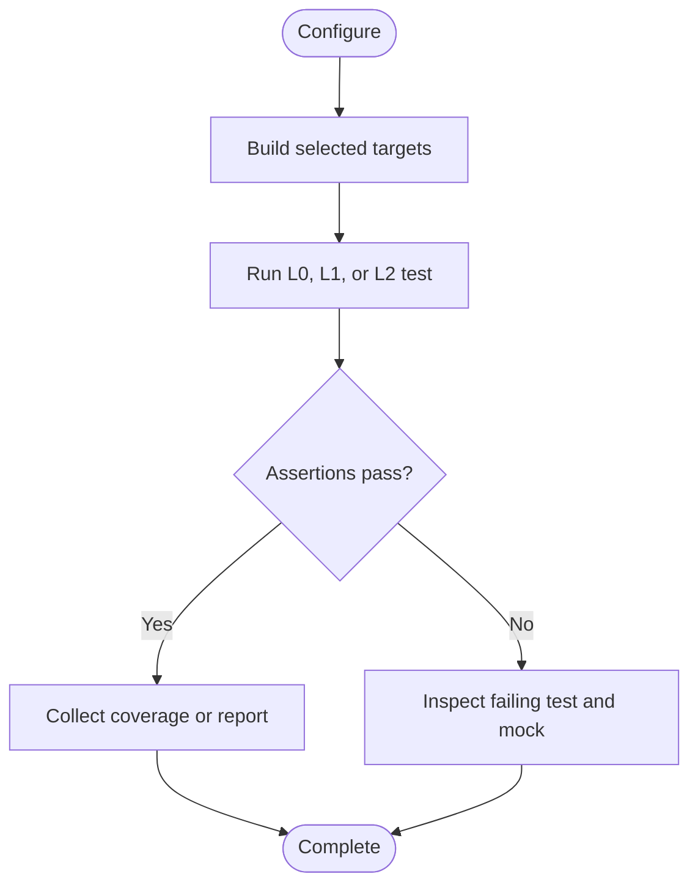

# Testing and Build Component

## 1. High-Level Purpose & Architecture

`Tests/`, the root CMake files, and CI/build scripts form the verification and integration component of the ENT/RDK plugin suite. They build selected plugins, provide mocks for Thunder/platform interfaces, and exercise L0, L1, and L2 behavior.

Responsibilities:
- Select plugin subdirectories through root CMake options.
- Build unit-style L0 tests, service-level L1 tests, and L2/integration tests.
- Provide mocks such as `ServiceMock`, `COMLinkMock`, `AppGatewayMock`, `AppActionsMock`, telemetry, network, lifecycle, and notification fakes.
- Support coverage and platform-specific build configuration.

It does not replace runtime deployment validation or prove behavior of external Thunder services that are mocked.

## 2. Architectural Overview

```text
Root CMake
  |-- plugin options --> AppGateway / Common / Notifications / Actions
  |-- RDK_SERVICES_L1_TEST --> Tests/L1Tests
  |-- RDK_SERVICE_L2_TEST --> Tests/L2Tests
  +-- direct test sources --> Tests/L0Tests
                         |
                         v
                    mocks and fakes
```

## 3. Code Organization (Folder & File-Level)

- `CMakeLists.txt`: discovers Thunder, defines global options/definitions, and conditionally adds four plugin directories and test trees.
- `Tests/L0Tests`: focused branch/unit tests for all four subsystems, common bootstrap helpers, and mocks.
- `Tests/L1Tests`: service-level tests for AppGateway, AppNotifications, AppActions, AppGatewayCommon, and utilities.
- `Tests/L2Tests`: integration-style AppGateway tests.
- `Tests/mocks`: Thunder/platform fakes, service mocks, telemetry mocks, and interface mocks.
- `Tests/clang.cmake`, `gcc-with-coverage.cmake`: compiler/coverage configurations.
- `cov_build.sh`: Coverity build entry point.
- `build_dependencies.sh`: dependency build helper.
- `App*/CMakeLists.txt`: individual plugin targets, flags, installation, and generated configuration.
- `App*/tests/CurlCmds.md`: manual smoke-test commands for selected plugins.

Selected test files include `AppGateway_Init_DeinitTests.cpp`, `Resolver_Configure_And_ResolveTests.cpp`, `AppGatewayTelemetry_Tests.cpp`, `AppNotifications_SubscriberMapTests.cpp`, `AppActions_ActionStartTests.cpp`, and the AppGatewayCommon routing/lifecycle/display suites.

## 4. Class & Interface Documentation

### Test bootstrap and mocks

`Tests/L0Tests/common/L0Bootstrap.*` creates test setup; `L0ServiceMock.hpp` and `ServiceMock.h` stand in for `IShell`. `COMLinkMock.h` models remote links. Component-specific mocks model App Gateway, actions, notification handlers, telemetry, network, lifecycle, user settings, and text-to-speech interfaces.

### Test entry points

L0 test aggregators such as `AppGatewayTest.cpp`, `AppActionsTest.cpp`, and `AppNotificationsTest.cpp` register test functions. L1 files exercise plugin/service behavior. L2 uses `Tests/L2Tests/tests/AppGateway_L2Test.cpp` for a broader integration surface.

Actual test setup calls the production lifecycle, for example the AppGateway suite invokes `plugin->Initialize(service)` and later `plugin->Deinitialize(service)`; this is the key contract under test.

## 5. Configuration & Build Integration

Root options include `PLUGIN_APPGATEWAY`, `PLUGIN_APPNOTIFICATIONS`, `PLUGIN_APPGATEWAYCOMMON`, and `PLUGIN_APPACTIONS`; test options include `RDK_SERVICES_L1_TEST` and `RDK_SERVICE_L2_TEST`. `BUILD_ENABLE_TELEMETRY_LOGGING` adds telemetry definitions. `DISABLE_SECURITY_TOKEN` alters compile behavior, while Thunder API compatibility comes from the header-provided `THUNDER_VERSION` macro.

Plugin CMake files use `${NAMESPACE}` for plugin/definition packages at the target level, install modules under `lib/${STORAGE_DIRECTORY}/plugins`, and generate plugin configuration with `write_config`. AppGateway adds optional automation and telemetry-msgsender flags.

## 6. Internal Workflows & Execution Flow

- **Configure:** root CMake finds framework dependencies and conditionally adds plugin/test subdirectories.
- **Build:** each selected plugin compiles its implementation; tests link mocks or test libraries as configured.
- **L0 flow:** construct mocks, initialize a production class, drive one branch, assert result, then deinitialize.
- **L1 flow:** execute service-level test cases against plugin interfaces and method paths.
- **L2 flow:** build with integration-specific settings and run broader AppGateway behavior.
- **Quality flow:** coverage uses `gcc-with-coverage.cmake`; Coverity uses `cov_build.sh`.
- **Failure flow:** missing framework packages, libraries, generated interfaces, or test mocks stop configuration/linking; runtime assertion failures identify behavior gaps.

## 7. Diagrams & Visual Aids

### Architecture



### Class



### Read/write sequence



### Lifecycle activity



## 8. Testing & Quality Analysis

The repository has broad subsystem coverage: L0 tests cover lifecycle, routing, callbacks, telemetry, contexts, and branch behavior; L1 tests cover platform API groups; L2 covers AppGateway integration. Existing test names document many negative/error paths, including unavailable services and malformed requests.

Gaps include complete end-to-end WebSocket deployment, all resolution JSON variants, production platform behavior without mocks, stress/race tests, and full CI/Coverity invocation in this Windows workspace. A build cannot be declared verified without the external Thunder/RDK dependencies and a configured Linux-like target environment.

## 9. Beginner-to-Expert Teaching Mode

**Must know first:** CMake options decide what exists; L0 isolates logic with mocks; L1 exercises service contracts; L2 is broader integration. Read one test beside its production class.

**Advanced path:** follow mock ownership and AddRef/Release expectations, inspect coverage build flags, understand L2 linker exceptions, and compare mocked COM-RPC behavior with deployment traces.

**Known limits:** CI workflow files named in onboarding guidance are not part of the discovered root tree, and external framework packages are required for a real build.
