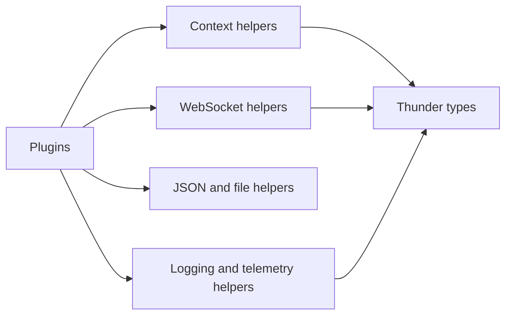
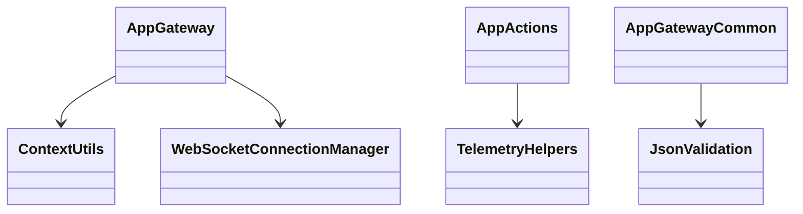
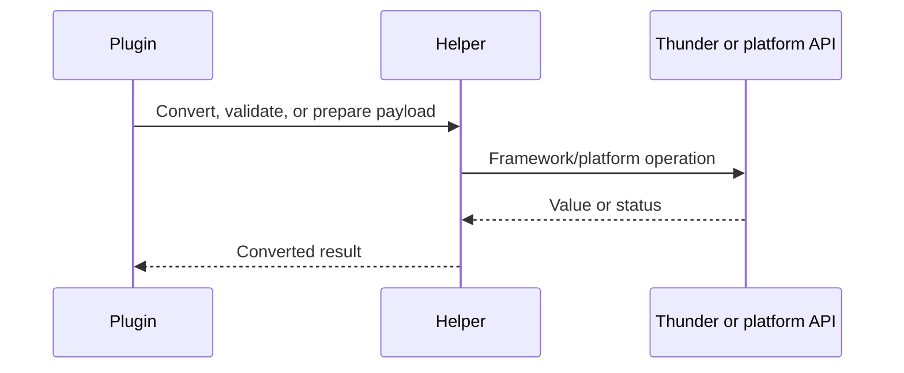
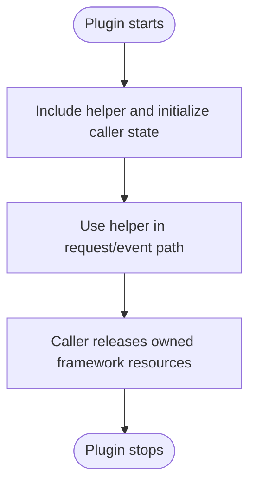

# Shared Helpers Subsystem

## 1. High-Level Purpose & Architecture

The `helpers/` folder is a cross-plugin support layer for the ENT/RDK App Gateway suite. It centralizes context conversion, WebSocket management, logging, telemetry access, Thunder controller calls, JSON validation, synchronization, and small platform utilities.

Responsibilities:
- Provide reusable headers to the four plugins.
- Keep cross-cutting behavior consistent without owning a Thunder plugin lifecycle.
- Encapsulate common framework calls, file/config access, and synchronization primitives.

It does not register a service, own application sessions globally, or replace generated Thunder interfaces.

## 2. Architectural Overview

Plugins include only the helper headers they need. `ContextUtils`, `WsManager`, and telemetry helpers are the most direct integration points; utility headers support logging, JSON, files, UUIDs, process calls, and controller access.

```text
AppGateway -----------+
AppGatewayCommon -----+--> helpers/ --> Thunder Core / platform APIs
AppNotifications -----+
AppActions -----------+
```

## 3. Code Organization (Folder & File-Level)

- `AppGatewayTelemetryMarkers.h`: telemetry marker constants.
- `BaseEventDelegate.h`: common event-delegate abstraction.
- `ContextUtils.h`: gateway/notification context conversion and origin/version helpers.
- `ObjectUtils.h`: object utility helpers.
- `PluginInterfaceBuilder.h`: interface-building support.
- `StringUtils.h`, `UtilsString.h`, `UtilsCStr.h`: string conversion/manipulation helpers.
- `UtilsAppGatewayTelemetry.h`, `UtilsTelemetry.h`: telemetry client/reporting macros and helpers.
- `UtilsCallsign.h`: known Thunder callsigns.
- `UtilsConnections.h`: connection-related helpers.
- `UtilsController.h`: controller/plugin access helpers.
- `UtilsFirebolt.h`: Firebolt-specific utility support.
- `UtilsFile.h`, `UtilsfileExists.h`, `UtilsgetFileContent.h`, `UtilsgetRFCConfig.h`, `UtilsSearchRDKProfile.h`: file, profile, RFC, and configuration access.
- `UtilsInterface.h`, `UtilsLibraryLoader.h`: interface/library loading support.
- `UtilsJsonRpc.h`, `UtilsJsonrpcDirectLink.h`, `UtilsJsonValidation.h`: JSON-RPC and payload validation helpers.
- `UtilsLogging.h`, `UtilsLOG_MILESTONE.h`: logging and milestone macros.
- `UtilsProcess.h`: process operations.
- `UtilsSynchro.hpp`, `UtilsSynchroIarm.hpp`, `UtilssyncPersistFile.h`, `UtilsThreadRAII.h`: synchronization, persistence, and thread lifetime utilities.
- `UtilsUUID.h`, `UtilsisValidInt.h`, `UtilsUnused.h`: small validation/utility helpers.
- `WebSocketLink.h`, `WsManager.h`: WebSocket link and connection-manager support.
- `cSettings.h`, `tptimer.h`: settings and timer support.

Exact public functions vary by header; this walkthrough intentionally avoids inventing signatures that were not needed by the subsystem sources.

## 4. Class & Interface Documentation

### `ContextUtils`

Used by gateway and notifications to convert between `GatewayContext` and notification context, detect gateway origin, and normalize versioned event names. It is a utility namespace/header rather than a lifecycle-managed object.

### `WebSocketConnectionManager` / `WsManager.h`

Used by `AppGatewayResponderImplementation` to send requests, responses, and notifications to connection IDs. The complete class definition is in the helper header and is consumed behind responder methods.

### Telemetry helpers

`UtilsAppGatewayTelemetry.h` and `AppGatewayTelemetryMarkers.h` provide macros/client access used by `AppActionsImplementation` and `AppGatewayCommon` to initialize, deinitialize, and record bootstrap/API telemetry.

### JSON/file/logging helpers

`UtilsJsonValidation`, `UtilsFile`, `UtilsLogging`, and related headers provide focused stateless or macro-based operations. They have no plugin lifecycle and should be treated as dependencies of the caller.

## 5. Configuration & Build Integration

The root `CMakeLists.txt` adds `helpers/` to the module include paths indirectly through each plugin target. Root definitions include `RDKAPPMANAGERS_PATH`, optional telemetry logging, and `DISABLE_SECURITY_TOKEN`. Helpers use the `THUNDER_VERSION` macro provided by the Thunder headers for API compatibility; there is no helper library target in the checked-in root build.

## 6. Internal Workflows & Execution Flow

- **Request path:** `ContextUtils` preserves context while `WsManager` carries payloads to/from sockets.
- **Event path:** notification context is converted to gateway context before responder emission.
- **Telemetry path:** plugin macros obtain the App Gateway telemetry client and report markers.
- **Validation path:** JSON validation helpers reject malformed payloads before platform calls.
- **Error path:** logging helpers select Thunder logging levels; caller-owned code returns framework error codes.
- **Lifetime path:** synchronization/thread helpers protect shared state and worker lifetime.

## 7. Diagrams & Visual Aids

### Architecture



### Class



### Read/write sequence



### Lifecycle activity



## 8. Testing & Quality Analysis

Helper behavior is exercised indirectly by AppGateway/AppNotifications/AppGatewayCommon tests; direct utility coverage includes `Tests/L1Tests/tests/test_UtilsFile.cpp` and L0 context-conversion tests. Recommended additions are direct tests for event-version normalization, malformed context fields, telemetry macro behavior when AppGateway is unavailable, WebSocket connection cleanup, and thread-safety boundaries.

No standalone helper test target or helper library is visible in the root source inventory. Exact coverage for every header therefore cannot be claimed.

## 9. Beginner-to-Expert Teaching Mode

**Must know first:** helpers are shared headers, not independent services. Start with `ContextUtils`, `WsManager`, `UtilsLogging`, and `UtilsJsonValidation` because they appear in the main data paths.

**Advanced path:** study ownership across COM-RPC helpers, lock scope around external calls, telemetry lazy reconnection, and worker/thread synchronization. Then inspect each utility only when tracing a concrete subsystem flow.

**Known limits:** many helper implementations are header-only and some behavior depends on external Thunder/platform headers not included here.
