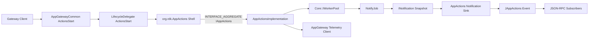
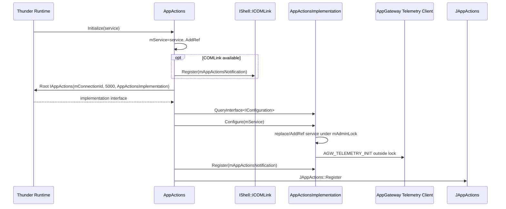
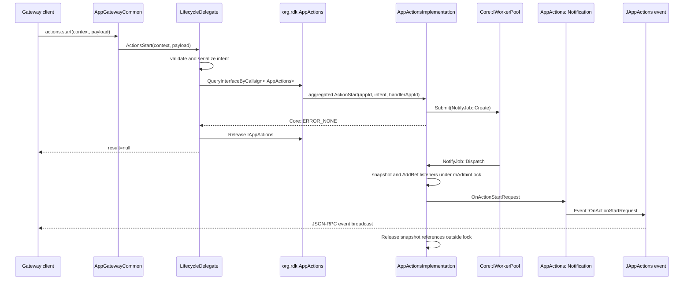
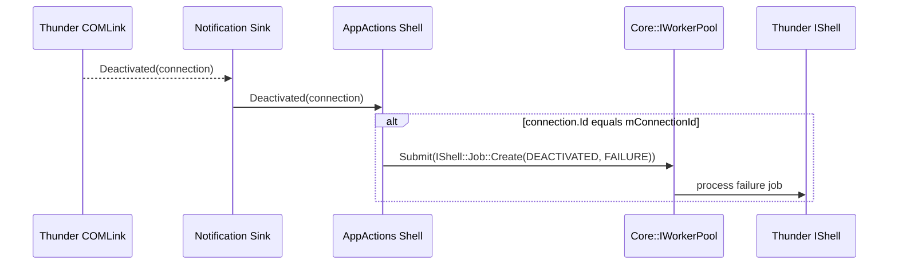
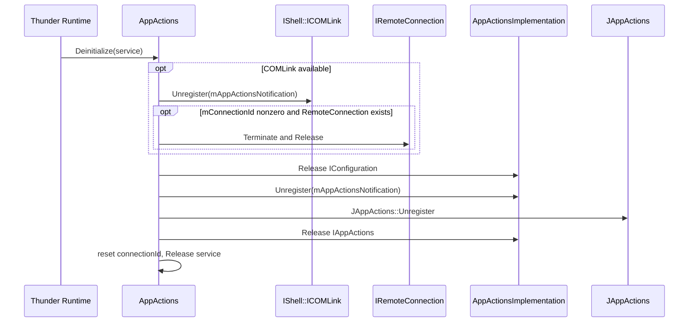

# AppActions Specification

## Purpose

Define the runtime contract implemented by `AppActions/`: the Thunder shell and mode-dependent implementation host, `actions.start` integration, asynchronous listener fan-out, generated JSON-RPC event delivery, reference ownership, telemetry, and failure handling.

## Requirements

### Requirement: Shell initialization order

`AppActions::Initialize` SHALL retain `IShell`, conditionally register `mAppActionsNotification` with `ICOMLink`, call `Root<IAppActions>(mConnectionId, 5000, "AppActionsImplementation")`, query `IConfiguration`, configure the implementation, register the sink with `IAppActions`, and then register `Exchange::JAppActions`.

#### Scenario: COMLink is unavailable

- **WHEN** `IShell::COMLink()` returns null
- **THEN** initialization SHALL log that crash recovery is unavailable and continue rooting/configuring the implementation

#### Scenario: Configuration fails

- **WHEN** root, `IConfiguration` lookup, or `Configure` fails
- **THEN** initialization SHALL return error text and SHALL NOT register the implementation notification or generated JSON-RPC surface; source code SHALL not be assumed to roll back earlier service, COMLink, or root state

### Requirement: Mode-dependent implementation hosting

The shell SHALL root `AppActionsImplementation` according to configured plugin mode. Remote-connection registration, deactivation, and termination behavior SHALL be conditional because source configuration permits in-process/test execution as well as remote hosting.

#### Scenario: Matching remote implementation deactivates

- **WHEN** `AppActions::Notification::Deactivated` is invoked for `mConnectionId`
- **THEN** `AppActions::Deactivated` SHALL submit `PluginHost::IShell::Job(mService, DEACTIVATED, FAILURE)` to `Core::IWorkerPool`

### Requirement: Shell deinitialization order

`AppActions::Deinitialize` SHALL no-op when not initialized; otherwise it SHALL unregister the COMLink sink, optionally terminate/release the remote connection, release `IConfiguration`, unregister the implementation sink, unregister `JAppActions`, release `IAppActions`, reset `mConnectionId`, and release `mService`.

#### Scenario: COMLink or remote connection is absent

- **WHEN** shutdown runs without COMLink or without a nonzero remote connection
- **THEN** out-of-process cleanup SHALL be skipped while implementation and shell interfaces are still released

### Requirement: Caller-side action validation

`actions.start` SHALL enter through `AppGatewayCommon::ActionsStart` and `LifecycleDelegate::ActionsStart`. The lifecycle delegate SHALL reject empty, `null`, malformed, or missing/empty-object `intent`, serialize the `intent` subdocument, read optional `handlerAppId`, use `GatewayContext.appId` as initiator, and query `org.rdk.AppActions` for `IAppActions`.

#### Scenario: Valid action payload arrives

- **WHEN** payload contains a nonempty `intent`
- **THEN** LifecycleDelegate SHALL call `ActionStart(context.appId, serializedIntent, handlerAppId)` and return JSON null on success

### Requirement: Asynchronous implementation dispatch

`AppActionsImplementation::ActionStart` SHALL copy initiator, intent, and handler app ID into `NotifyJob`, submit it to `Core::IWorkerPool`, and immediately return `Core::ERROR_NONE` without validating arguments or waiting for listeners.

#### Scenario: NotifyJob executes

- **WHEN** WorkerPool calls `NotifyJob::Dispatch`
- **THEN** it SHALL invoke `DispatchActionStartRequest` with the copied values

### Requirement: Listener registration ownership and status

`Register` and `Unregister` SHALL reject null with `Core::ERROR_BAD_REQUEST`. Accepted registration SHALL prevent duplicate pointers and call `AddRef`; duplicate registration and unknown unregistration SHALL return `Core::ERROR_GENERAL`; successful unregistration and deinitialization SHALL `Release` retained listeners.

#### Scenario: Listener is duplicated

- **WHEN** an already registered pointer is passed to `Register`
- **THEN** no duplicate SHALL be stored and API error `Register`/`AGW_ERROR_ALREADY_REGISTERED` SHALL be reported after releasing `mAdminLock`

### Requirement: Callback-safe fan-out

`DispatchActionStartRequest` SHALL copy listener pointers and `AddRef` each non-null listener while holding `mAdminLock`, release the lock, invoke `OnActionStartRequest` on each snapshot entry, and then release each temporary reference.

#### Scenario: Registration mutates during callback

- **WHEN** a callback registers or unregisters a listener
- **THEN** callback execution SHALL not hold `mAdminLock`, and the current snapshot SHALL remain alive through temporary references

### Requirement: JSON-RPC event bridge

`AppActions::Notification::OnActionStartRequest` SHALL call `Exchange::JAppActions::Event::OnActionStartRequest(_parent, initiator, intent, handlerAppId)` and broadcast unchanged values to JSON-RPC subscribers.

#### Scenario: Implementation notification reaches the shell

- **WHEN** the sink receives an action-start callback
- **THEN** the generated event SHALL be broadcast; it SHALL not be modeled as a client response

### Requirement: Telemetry lifecycle and lock separation

`Configure` SHALL replace/AddRef `mService` under `mAdminLock`, release that lock, and then call `AGW_TELEMETRY_INIT`. Telemetry lookup/reporting SHALL not occur while `mAdminLock` is held. Implementation deinitialize and destructor SHALL safely call telemetry deinit.

#### Scenario: AppGateway telemetry is initially unavailable

- **WHEN** initial telemetry interface lookup fails
- **THEN** the telemetry client SHALL retain service context and lazy-retry from `IsAvailable`

## High-Level Design

AppActions consists of a Thunder shell and a separately built implementation whose actual process placement is controlled by plugin mode. AppGatewayCommon validates and translates Firebolt `actions.start`, the shell aggregates `IAppActions`, the implementation queues notification work, and the shell sink converts COM-RPC callbacks to generated JSON-RPC events.

## Low-Level Design

### Component and interface model

- `AppActions` implements `IPlugin` and JSON-RPC dispatcher and aggregates `IAppActions` from the rooted implementation.
- `AppActions::Notification` implements `IAppActions::INotification` and `IRemoteConnection::INotification`.
- `AppActionsImplementation` implements `IPlugin`, `IConfiguration`, and `IAppActions` and owns a `std::list<INotification*>`.
- Shell and implementation are separate libraries; process isolation is configuration-dependent, not an unconditional architectural guarantee.

### Lifecycle details

| Phase | Exact behavior |
|---|---|
| shell initialize | service AddRef; optional COMLink register; root with 5000 ms timeout; query/configure; implementation sink register; generated JSON-RPC register |
| implementation configure | replace service under mutex; telemetry init outside mutex |
| shell deinitialize | optional COMLink unregister/remote terminate; configuration release; implementation sink unregister; JSON-RPC unregister; implementation/service release |
| implementation deinitialize | telemetry deinit; under mutex release all listener references and service when initialized |
| implementation destructor | telemetry deinit fallback; listener/service cleanup depends on prior deinitialize/release lifecycle |

### WorkerPool and dispatch boundaries

- The AppGatewayCommon/Lifecycle caller path is synchronous through input validation and `IAppActions::ActionStart`.
- `ActionStart` submits `NotifyJob`; it never executes listener callbacks inline.
- `NotifyJob` copies all arguments and retains its parent with `AddRef` until job destruction calls `Release`.
- `DispatchActionStartRequest` and listener callbacks execute on the global WorkerPool dispatch thread.
- The shell sink invokes generated event broadcast on the callback thread.
- Matching remote deactivation submits a separate shell failure job to the global WorkerPool.

### Concurrency and ownership boundaries

| Operation | `mAdminLock` behavior |
|---|---|
| register | search and append under lock; accepted listener AddRef under lock; duplicate telemetry after unlock |
| unregister | search, Release, and erase under lock |
| fan-out | copy and AddRef snapshot under lock; callbacks and snapshot Release after unlock |
| configure | replace/release service and AddRef new service under lock; telemetry init after unlock |
| deinitialize | telemetry deinit before lock; release listener list and service under lock |

No callback or telemetry COM-RPC occurs while `mAdminLock` is held. The listener snapshot permits callbacks to mutate future registration safely while preserving current targets.

## Sequence Diagrams

### Shell initialization

### Validated action dispatch and broadcast

### Remote implementation failure

### Shell deinitialization

