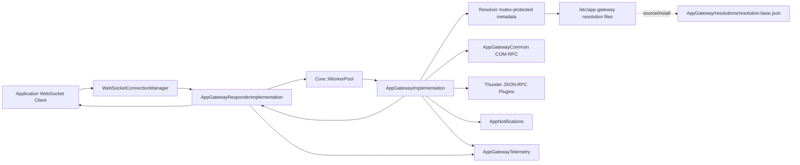
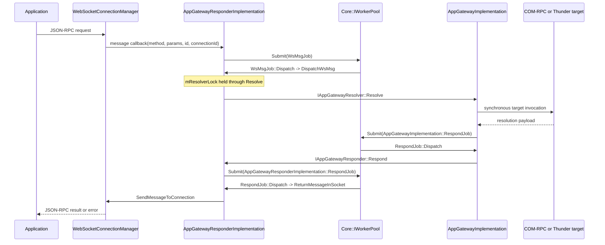
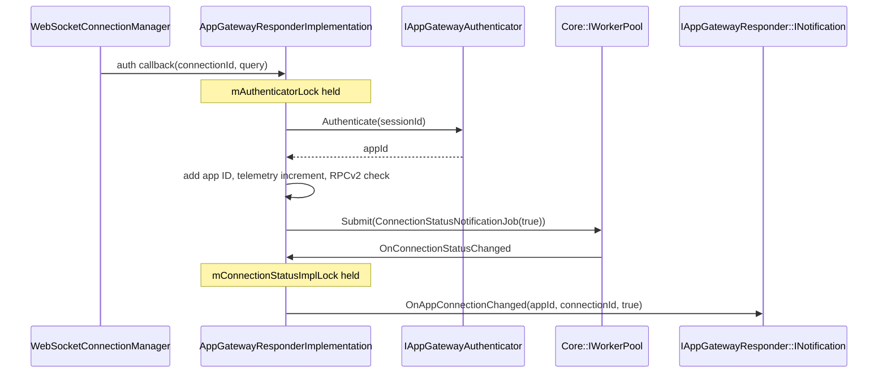
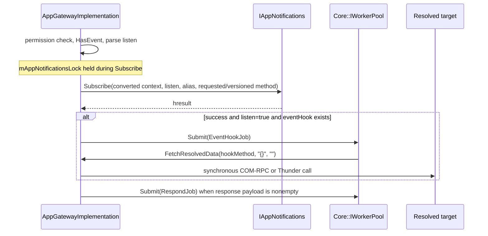
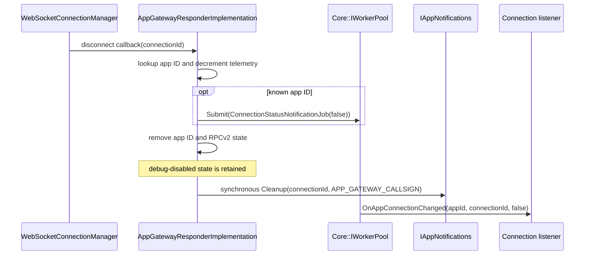
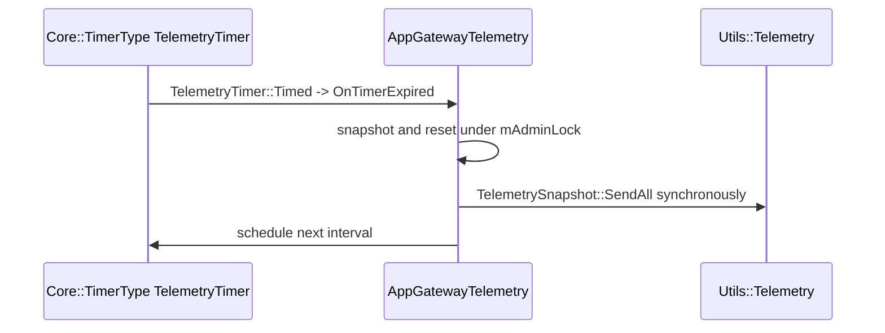

# AppGateway Specification

## Purpose

Define the runtime contract implemented by `AppGateway/`: Thunder plugin composition, authenticated local WebSocket ingress, configuration-driven Firebolt method resolution, COM-RPC and direct JSON-RPC routing, application response/event transport, and centralized telemetry.

## Requirements

### Requirement: Shell composition and lifecycle

`AppGateway` SHALL aggregate `Exchange::IAppGatewayResolver`, `Exchange::IAppGatewayResponder`, and `Exchange::IAppGatewayTelemetry`. Initialization SHALL initialize the in-process telemetry singleton, root resolver and responder implementations with a 2000 ms timeout, configure available roots, register `JAppGatewayResolver`, record bootstrap duration, and succeed only when both roots are non-null.

#### Scenario: Both implementation roots are available

- **WHEN** `AppGateway::Initialize` roots resolver and responder successfully
- **THEN** it SHALL configure both, register resolver JSON-RPC, record bootstrap duration, and return an empty error string

#### Scenario: A root is unavailable

- **WHEN** resolver or responder rooting fails
- **THEN** initialization SHALL return `Could not retrieve the AppGateway interface.`

### Requirement: Shell deinitialization order

Deinitialization SHALL capture the remote connection when either root exists, deinitialize and release telemetry, release the responder, unregister and release the resolver, terminate and release the captured remote connection, reset `mConnectionId`, and release `mService` in that order.

#### Scenario: Remote connection exists during shutdown

- **WHEN** `RemoteConnection(mConnectionId)` returns a connection
- **THEN** AppGateway SHALL terminate and release it after releasing the resolver and responder interfaces

### Requirement: Authenticated WebSocket ingress

`AppGatewayResponderImplementation` SHALL configure `WebSocketConnectionManager` with default connector `127.0.0.1:3473`, overridden by valid JSON plugin configuration. Its authentication callback SHALL require a `session` query value and synchronously call `IAppGatewayAuthenticator::Authenticate` while holding `mAuthenticatorLock`.

#### Scenario: Authentication succeeds

- **WHEN** authentication returns `Core::ERROR_NONE` and an app ID
- **THEN** the responder SHALL map connection ID to app ID, increment connection telemetry, record exact `RPCv2=true` opt-in, and submit `ConnectionStatusNotificationJob(connected=true)`

#### Scenario: Authentication fails

- **WHEN** the session is absent, authenticator is unavailable, or authentication fails
- **THEN** the callback SHALL return false and SHALL NOT add connection registry state

### Requirement: Resolution configuration

`AppGateway/resolutions/resolution.base.json` SHALL be the canonical source-tree method catalog. Runtime SHALL load country-selected deployed paths from `/etc/app-gateway/resolutions.json` and SHALL fall back to `/etc/app-gateway/resolution.base.json`. Resolver keys SHALL be lowercased, files SHALL merge in order, and later duplicate definitions SHALL replace earlier definitions. Reconfiguration SHALL not clear unrelated prior entries.

#### Scenario: Regional configuration is unavailable or invalid

- **WHEN** `/etc/app-gateway/resolutions.json` cannot be opened or parsed
- **THEN** resolver initialization SHALL attempt the deployed base catalog

#### Scenario: No configured path loads

- **WHEN** every requested resolution file fails to load
- **THEN** configuration SHALL return `Core::ERROR_GENERAL`

### Requirement: Resolution metadata semantics

Each resolution SHALL support `alias`, `event`, `eventHook`, `permissionGroup`, `additionalContext`, `includeContext`, `useComRpc`, and `versionedEvent`. If `additionalContext` is an object and an associated boolean is absent, `includeContext`, `useComRpc`, and `versionedEvent` SHALL default to true according to `Resolver::LoadConfig`.

#### Scenario: Method is absent

- **WHEN** case-insensitive alias lookup returns empty
- **THEN** the resolver SHALL create a not-supported payload without invoking a downstream target

### Requirement: Permission-first dispatch

For methods with `permissionGroup`, `FetchResolvedData` SHALL synchronously call `IAppGatewayAuthenticator::CheckPermissionGroup` before event, COM-RPC, or JSON-RPC routing.

#### Scenario: Permission service denies or fails

- **WHEN** the authenticator is unavailable, the check fails, or `allowed` is false
- **THEN** the resolver SHALL return not-permitted, record external-service telemetry where applicable, and SHALL NOT dispatch downstream

### Requirement: Event routing

A nonempty resolution `event` field SHALL classify a request as an event. `PreProcessEvent` SHALL parse a boolean `listen`, derive a version-specific requested method when `versionedEvent` is true, and call `IAppNotifications::Subscribe` with the resolved alias and requested method or version-derived method. It SHALL not pass the configured `Resolution::event` value as the subscription event argument.

#### Scenario: Event request is valid

- **WHEN** parameters contain boolean `listen`
- **THEN** the resolver SHALL call `Subscribe`, return JSON containing `listening` and the original method, and submit `EventHookJob` independently when listen succeeds and `eventHook` exists

#### Scenario: Event parameters are invalid

- **WHEN** parameters are absent, malformed, or omit boolean `listen`
- **THEN** the resolver SHALL return `Core::ERROR_BAD_REQUEST` with a bad-request payload

### Requirement: COM-RPC and direct JSON-RPC routing

Methods with `useComRpc=true` SHALL call `IAppGatewayRequestHandler::HandleAppGatewayRequest`. Other non-event methods SHALL split the alias at its final dot and synchronously invoke the target through `Utils::GetThunderControllerClient`.

#### Scenario: COM-RPC context inclusion is enabled

- **WHEN** `additionalContext` is configured
- **THEN** parameters SHALL be wrapped as `params` plus `_additionalContext`, and `_additionalContext.origin` SHALL contain the request origin

#### Scenario: Direct JSON-RPC context inclusion is enabled

- **WHEN** `includeContext=true` on a direct route
- **THEN** parameters SHALL receive `context.appId`, `context.connectionId`, and `context.requestId`

### Requirement: Asynchronous response and transport jobs

WebSocket ingress SHALL submit `WsMsgJob`. A nonempty resolution SHALL submit `AppGatewayImplementation::RespondJob`; gateway-origin dispatch SHALL then invoke responder `Respond`, which SHALL submit `AppGatewayResponderImplementation::RespondJob` before socket write. Responder `Request` SHALL submit `RequestJob`; RPCv2 `Emit` SHALL submit `EmitJob`, while legacy `Emit` SHALL submit responder `RespondJob`.

#### Scenario: Gateway request resolves

- **WHEN** resolution creates a payload
- **THEN** gateway response delivery SHALL traverse implementation and responder WorkerPool jobs before `SendMessageToConnection`

### Requirement: Disconnect cleanup

Disconnect SHALL decrement telemetry, optionally submit `ConnectionStatusNotificationJob(connected=false)`, remove app-ID and RPCv2 state, and synchronously call `IAppNotifications::Cleanup(connectionId, APP_GATEWAY_CALLSIGN)`. It SHALL retain any debug-disabled registry entry for that connection.

#### Scenario: Known application disconnects

- **WHEN** the app-ID registry contains the connection
- **THEN** listener notification SHALL be queued, connection registries SHALL be updated, and AppNotifications cleanup SHALL be invoked without ordering guarantees relative to the queued listener callback

### Requirement: Telemetry execution

`AppGatewayTelemetry` SHALL be an in-process singleton with atomic health counters, request state keyed by connection/request ID, protected aggregate maps, and a scheduled `TelemetryTimer`. Active periodic and shutdown flush SHALL snapshot/reset under `mAdminLock` and call T2 synchronously after releasing the lock. Gateway request latency SHALL not be inferred unless supplied through external metric records.

#### Scenario: Reporting interval expires

- **WHEN** `TelemetryTimer::Timed` invokes expiration handling
- **THEN** telemetry SHALL synchronously flush the captured snapshot and schedule the next interval

## High-Level Design

AppGateway is a Thunder shell plus two rooted implementations. The responder owns transport and connection identity; the resolver owns metadata-driven routing; AppNotifications owns subscription state; AppGatewayCommon and external Thunder plugins execute resolved operations. Telemetry remains in the AppGateway process and is exposed as an aggregated COM-RPC interface.

## Low-Level Design

### Component and interface model

- `AppGateway` owns `mService`, one shared `mConnectionId`, resolver/responder proxies, and an AddRef on the telemetry singleton.
- `AppGatewayImplementation` owns `ResolverPtr` and cached `IAppNotifications`, gateway responder, and InternalGateway responder proxies.
- `AppGatewayResponderImplementation` owns `WebSocketConnectionManager`, cached authenticator/resolver proxies, listener list, and app-ID, RPCv2, and debug-control registries.
- `Resolver` parses metadata and synchronously invokes direct Thunder JSON-RPC targets.
- `AppGatewayTelemetry` owns timer state, request tracking, atomic health counters, and aggregate event/metric maps.

### WorkerPool inventory

| Submit or schedule site | Dispatch object | Active action |
|---|---|---|
| WebSocket message callback | `WsMsgJob` | `DispatchWsMsg` |
| `InternalResolve` | implementation `RespondJob` | route response to gateway or InternalGateway |
| successful listen with hook | `EventHookJob` | `FetchResolvedData(hookMethod, "{}", "")` |
| auth/disconnect callback | `ConnectionStatusNotificationJob` | `OnConnectionStatusChanged` |
| responder `Respond` | responder `RespondJob` | `ReturnMessageInSocket` |
| responder `Emit` for RPCv2 | `EmitJob` | `DispatchNotificationToConnection` |
| responder `Emit` for legacy | responder `RespondJob` | legacy response delivery |
| responder `Request` | `RequestJob` | `SendRequestToConnection` |
| shell `Deactivated`, if invoked | `PluginHost::IShell::Job` | report `DEACTIVATED/FAILURE` |
| telemetry timer | `TelemetryTimer` via `Core::TimerType` | periodic synchronous flush; not WorkerPool submission |

Every responder/implementation job retains its parent with `AddRef`/`Release`. `AppGateway::Deactivated` contains a submission path, but this component does not register itself as a remote-connection notification listener; it is not guaranteed to be invoked by this source alone.

### Thread dispatch boundaries

- WebSocket message callback copies request data and submits `WsMsgJob`; its worker thread performs app lookup, request telemetry, resolver acquisition, permission checks, and downstream routing.
- Public resolver JSON-RPC calls may execute on their caller thread; only WebSocket ingress guarantees entry through `WsMsgJob`.
- Authentication remains synchronous in the WebSocket auth callback while `mAuthenticatorLock` is held.
- Disconnect performs state removal and AppNotifications cleanup synchronously; connection listener delivery is independently queued.
- Direct Thunder JSON-RPC and COM-RPC target calls are synchronous on the resolver caller thread.
- Transport output is deferred by responder jobs; gateway-origin responses use two separate WorkerPool submissions.

### Concurrency boundaries

| Lock/state | Protected scope and call behavior |
|---|---|
| `mAuthenticatorLock` | authenticator acquisition and synchronous `Authenticate` |
| `mResolverLock` | entire `DispatchWsMsg`, including synchronous `Resolve` |
| `mAppNotificationsLock` | notification proxy acquisition and synchronous `Subscribe` |
| `mAppGatewayResponderLock` | gateway responder acquisition and synchronous `Respond` |
| `mInternalGatewayResponderLock` | InternalGateway acquisition and synchronous `Respond` |
| `mConnectionStatusImplLock` | listener list mutation and callbacks; callbacks run while held |
| `Resolver::mMutex` | each independent catalog read or merge operation, not the full resolution transaction |
| registry mutexes | independent app-ID, RPCv2, and debug-disabled maps |
| telemetry `mAdminLock` | configuration, timer state, request maps, and aggregate snapshots |

Reconfiguration is additive because `ClearResolutions()` is not called. The disconnect path does not remove debug-disabled state. Resolver and responder cache locks include external interface calls, so downstream callbacks must not assume those locks are free.

## Sequence Diagrams

### WebSocket request and double-hop response

### Authentication and connection notification

### Event subscription and hook

### Disconnect cleanup

### Telemetry timer flush

