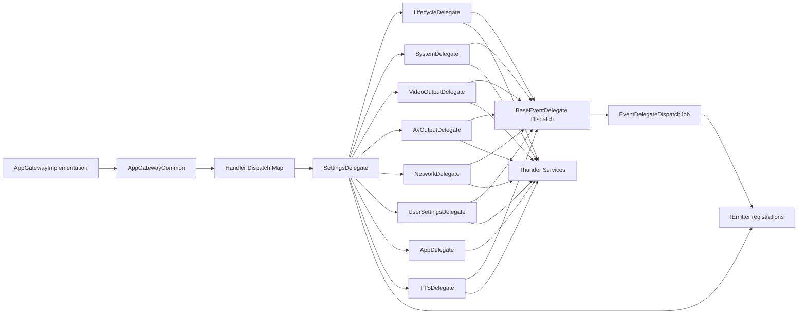
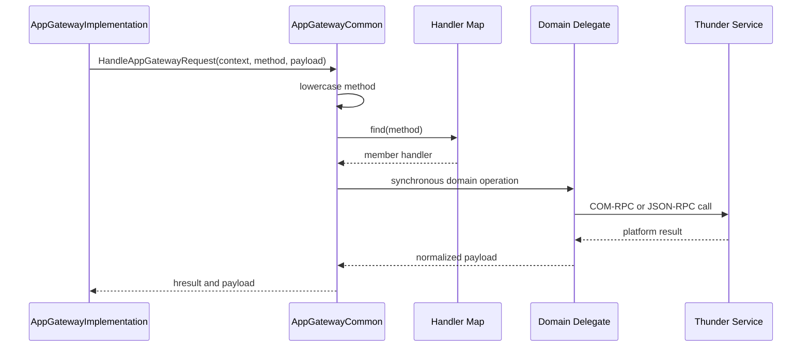
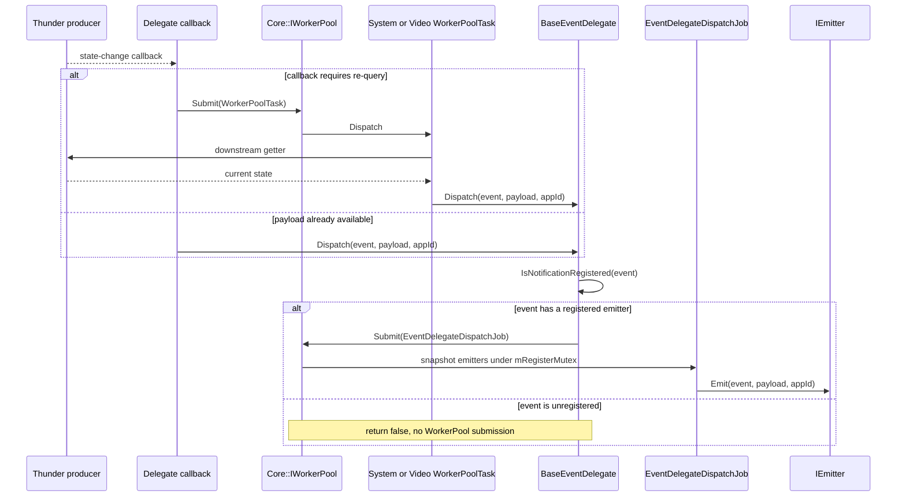
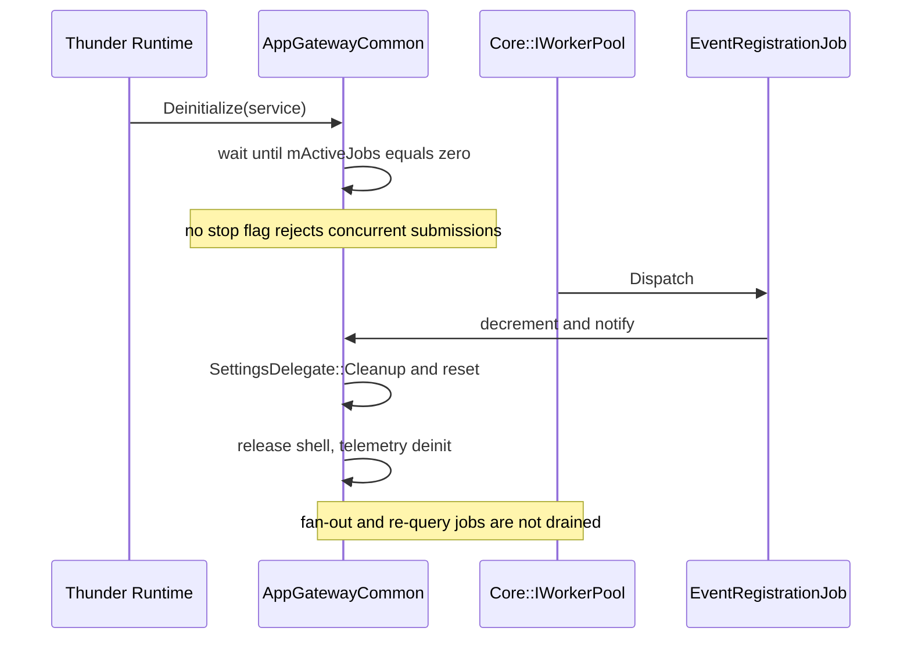
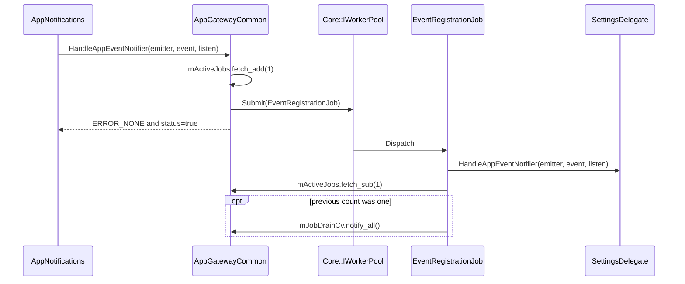

# AppGatewayCommon Specification

## Purpose

Define the runtime contract implemented by `AppGatewayCommon/`: COM-RPC request dispatch, application authentication, event registration, platform-service delegation, notification translation, WorkerPool execution, shared-state protection, and shutdown behavior.

## Requirements

### Requirement: Interfaces and initialization

`AppGatewayCommon` SHALL implement `PluginHost::IPlugin`, `Exchange::IAppGatewayRequestHandler`, `Exchange::IAppNotificationHandler`, and `Exchange::IAppGatewayAuthenticator`. `Initialize` SHALL retain `IShell`, initialize telemetry/bootstrap tracking, construct `SettingsDelegate`, and call `SettingsDelegate::setShell` to construct and connect domain delegates.

#### Scenario: Common initializes

- **WHEN** Thunder calls `Initialize` with a valid shell
- **THEN** the component SHALL retain the shell and make delegate-backed request, auth, and notification interfaces available

### Requirement: Synchronous request dispatch

`HandleAppGatewayRequest` SHALL lowercase the incoming method and synchronously invoke the corresponding static handler-map function. If `mDelegate` is null it SHALL return `Core::ERROR_UNAVAILABLE` with `{"error":"Service unavailable"}`. Advertising ID and device UID SHALL delegate through their explicit handler-map entries; if no mapped or source-defined special-case handler exists, it SHALL call `ErrorUtils::NotSupported` and return `Core::ERROR_UNKNOWN_KEY`.

#### Scenario: Method has a mapped handler

- **WHEN** the lowercased method exists in `handlers`
- **THEN** its member handler SHALL execute on the incoming COM-RPC service thread and return its `Core::hresult` and payload

#### Scenario: Method is unsupported

- **WHEN** the lowercased method matches neither a handler-map entry nor a source-defined special case
- **THEN** the component SHALL return `Core::ERROR_UNKNOWN_KEY` with the payload produced by `ErrorUtils::NotSupported`

### Requirement: Supported request families

The handler map SHALL implement the source-defined families below while `AppGateway/resolutions/resolution.base.json` remains the source-tree routing catalog.

#### Scenario: Supported family is invoked

- **WHEN** a mapped device, localization, accessibility, output, lifecycle, action, storage, TTS, or metrics method arrives
- **THEN** AppGatewayCommon SHALL invoke the corresponding delegate or source-defined stub behavior

### Requirement: Authentication and permission behavior

`Authenticate` and `GetSessionId` SHALL forward to LifecycleDelegate app/session registries and return `Core::ERROR_GENERAL` for unknown values. `CheckPermissionGroup` SHALL ignore app ID and permission group and currently return `Core::ERROR_NONE` with `allowed=true`.

#### Scenario: Session is known

- **WHEN** LifecycleDelegate maps the supplied session to an app ID
- **THEN** `Authenticate` SHALL return that app ID

### Requirement: Asynchronous event registration

`HandleAppEventNotifier` SHALL call `SafeSubmitEventRegistrationJob`, which increments atomic `mActiveJobs` and submits `EventRegistrationJob` to `Core::IWorkerPool`. The public status SHALL indicate scheduling only; downstream registration failure or an unmatched event SHALL not revise the already returned status.

#### Scenario: Event registration job completes

- **WHEN** `SettingsDelegate::HandleAppEventNotifier` returns
- **THEN** the job SHALL decrement `mActiveJobs` and notify `mJobDrainCv` when the previous count was one

### Requirement: Event callback dispatch

`BaseEventDelegate::Dispatch` SHALL submit `EventDelegateDispatchJob` only when the event currently has a registered emitter; otherwise it SHALL return false without submitting work. The job SHALL snapshot registered emitters under `mRegisterMutex` and invoke `IEmitter::Emit(event,payload,appId)` on a WorkerPool thread. Producer callbacks SHALL not invoke registered emitters directly.

#### Scenario: Delegate emits a registered event

- **WHEN** a producer callback calls `Dispatch` for an event with a registered emitter
- **THEN** emitter fan-out SHALL occur asynchronously through `EventDelegateDispatchJob`

#### Scenario: Delegate emits an unregistered event

- **WHEN** a producer callback calls `Dispatch` for an event without a registered emitter
- **THEN** `Dispatch` SHALL return false without submitting `EventDelegateDispatchJob`

### Requirement: Deferred re-query callbacks

System and VideoOutput callbacks that need current state SHALL first submit component-specific `WorkerPoolTask`, perform downstream getters on that worker thread, then call `Dispatch`, creating a second WorkerPool hop through `EventDelegateDispatchJob`.

#### Scenario: Display resolution callback arrives

- **WHEN** `OnDisplaySettingsResolutionChanged` fires
- **THEN** SystemDelegate SHALL queue re-query work before dispatching screen- and video-resolution events

### Requirement: Shutdown drain scope

`Deinitialize` SHALL wait for `mActiveJobs==0`, call `SettingsDelegate::Cleanup`, reset the delegate, release the shell, and deinitialize telemetry. The drain SHALL cover only `EventRegistrationJob`; it SHALL NOT imply admission control for concurrent new registrations or draining of `EventDelegateDispatchJob`, System `WorkerPoolTask`, or VideoOutput `WorkerPoolTask`.

#### Scenario: Existing registration job completes during shutdown

- **WHEN** deinitialization is waiting and the final tracked registration job completes
- **THEN** the condition variable SHALL wake shutdown so delegate cleanup can continue

### Requirement: Catalog and runtime event differences

The specification SHALL preserve actual runtime behavior when catalog names and delegate handlers differ. Current code recognizes/emits `Localization.onCountryChanged`, not catalogued `Localization.onCountryCodeChanged`; catalogued legacy VoiceGuidance event labels are not accepted by `UserSettingsDelegate::HandleEvent`.

#### Scenario: Catalogued event has no delegate handler

- **WHEN** event registration reaches SettingsDelegate with an unsupported label
- **THEN** no matching delegate registration SHALL occur even though scheduling previously reported success

## High-Level Design

AppGatewayCommon is a synchronous COM-RPC business-service front end over `SettingsDelegate` and eight domain delegates. Request handling remains on the caller thread. Event registration, all emitter fan-out, selected re-query operations, and shell failure signaling use the global WorkerPool.

## Low-Level Design

### Component and interface model

- `SettingsDelegate` owns UserSettings, System, Network, Lifecycle, App, TTS, AvOutput, and VideoOutput delegates.
- `BaseEventDelegate` owns event-to-emitter registration sets with AddRef/Release semantics and asynchronous dispatch.
- LifecycleDelegate conditionally registers `ILifecycleManagerState` and `IRDKWindowManager` when App Managers are enabled.
- SystemDelegate registers `ISystemServices` and lazily subscribes DisplaySettings/HdcpProfile JSON-RPC sources.
- VideoOutputDelegate lazily subscribes DisplaySettings, HdcpProfile, and HdmiCecSource; its DisplayInfo refresh-rate path is disabled by `#if 0`.
- Network, UserSettings, TTS, and AV delegates lazily acquire/register their corresponding platform interfaces.

### Handler inventory

| Family | Implemented labels and behavior |
|---|---|
| Device/system/display | make, name, SKU, network, firmware/version, chipset, class, uptime, active time, screen/video resolution, HDCP, HDR, audio, EDID, size, max resolution, colorimetry, video resolutions |
| Branding/mutation | set name, OS name/version get/set, country, timezone, locale, preferred languages; handlers validate and delegate as implemented |
| Accessibility | voice guidance, audio descriptions, captions, high contrast, parental control, preferred captions, settings aggregates |
| Video/AV output | resolution, HDCP, CEC state, port, refresh rate, color depth/format/colorimetry, dynamic/quantization range, Dolby Atmos availability |
| Lifecycle/presentation/actions | lifecycle v1/v2 close/state, ready, finished, presentation focus, `actions.start`, `actions.intent`, internal intent dispatch/get/set |
| Storage/statistics | advertising ID, device UID via AppDelegate/shared storage; memory usage |
| Speech | `TextToSpeech.speak`; SpeechSynthesis voices, speak, cancel, pause, resume |
| Stub/no-op | `Localization.addAdditionalInfo` returns null; `discovery.watched` and every `metrics.*` prefix return success |

### WorkerPool inventory

| Job | Producer | Worker action |
|---|---|---|
| `PluginHost::IShell::Job` | `Deactivated` | report shell `DEACTIVATED/FAILURE`; `mConnectionId` is not assigned in this source |
| `EventRegistrationJob` | `SafeSubmitEventRegistrationJob` | call `SettingsDelegate::HandleAppEventNotifier`, decrement tracked count |
| `EventDelegateDispatchJob` | `BaseEventDelegate::Dispatch` when the event has a registered emitter | snapshot emitters, then call `IEmitter::Emit` |
| `SystemDelegate::WorkerPoolTask` | display resolution, HDCP connection, audio format callbacks | re-query and emit corresponding System events |
| `VideoOutputDelegate::WorkerPoolTask` | resolution, display connection, active-source, connected-display callbacks | re-query and emit corresponding VideoOutput events |

### Event sources and emitted families

| Delegate | Producer callbacks and event families |
|---|---|
| Lifecycle | `OnAppLifecycleStateChanged`, `OnFocus`, `OnBlur`; Lifecycle v1/v2, Presentation, Actions, Discovery |
| Network | `onActiveInterfaceChange`, `onInternetStatusChange`; Network and Device connectivity |
| UserSettings | localization, accessibility, captions, audio description, high contrast, preferred languages, versioned RDK8 events |
| TTS | voice/state/speech lifecycle and playback/network error callbacks; TextToSpeech and SpeechSynthesis |
| AvOutput | `OnDolbyAtmosExperienceChanged` |
| System | SystemServices plus deferred display resolution, HDCP/HDR, and audio-format events |
| VideoOutput | deferred resolution, HDCP, CEC active source, and port events |

### Thread dispatch boundaries

- Mapped request handlers and their downstream calls execute synchronously on the COM-RPC caller thread.
- Event registration is asynchronous through `EventRegistrationJob`; returned success confirms submission, not downstream registration.
- Producer notification handlers may update local state on the callback thread, but every emitter callback is deferred through `EventDelegateDispatchJob`.
- System/VideoOutput re-query paths add a WorkerPool hop before the universal emitter-dispatch hop.

### Concurrency boundaries

| State | Synchronization |
|---|---|
| Common registration drain | atomic `mActiveJobs`, `mJobDrainMutex`, `mJobDrainCv` |
| event-to-emitter sets | `BaseEventDelegate::mRegisterMutex` |
| lifecycle state | separate app/session, lifecycle, intent, and focus mutexes; atomic intent index; interface CriticalSections |
| AppDelegate shared storage | `mSharedStorageMutex` |
| Network | interface CriticalSection plus registration and handler mutexes |
| UserSettings | UserSettings/TextTrack CriticalSections plus registration and per-handler flags |
| TTS | interface and registration mutexes |
| AvOutput | audio-output subscription CriticalSection |
| System | separate system registration, display, display-audio, and HDCP CriticalSections |
| VideoOutput | one subscription CriticalSection |

`SettingsDelegate::HandleAppEventNotifier` refuses all event processing if any of seven event delegates is null. The Common shutdown wait does not reject concurrent submissions and does not drain event fan-out/re-query jobs; those jobs use delegate references whose lifetime is not covered by `mActiveJobs`.

## Sequence Diagrams

### Deferred delegate notification

### Shutdown drain

### Event registration

