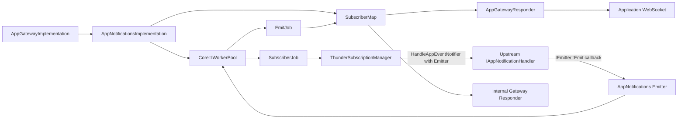
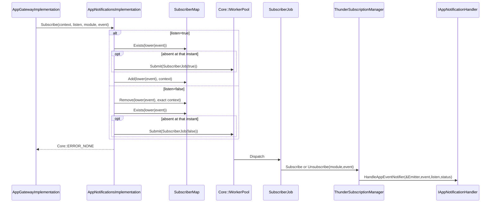
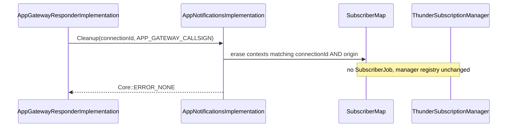
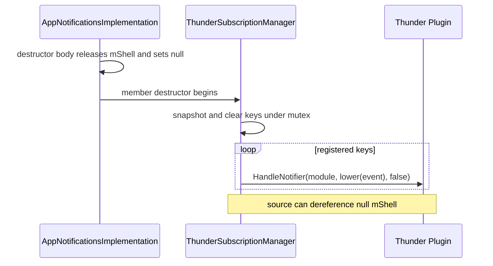
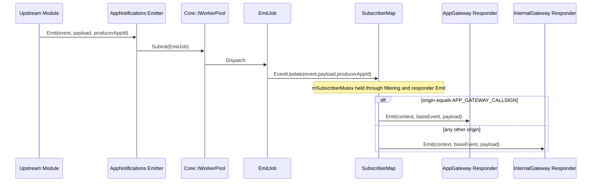

# AppNotifications Specification

## Purpose

Define the runtime contract implemented by `AppNotifications/`: shell/root lifecycle, subscriber-map semantics, asynchronous upstream registration, producer callback adaptation, app/origin-filtered fan-out, exact lock scopes, disconnect cleanup, and teardown limitations.

## Requirements

### Requirement: Shell initialization and aggregation

`AppNotifications::Initialize` SHALL retain `IShell`, initialize telemetry, record bootstrap time, root `Exchange::IAppNotifications` with timeout 2000 and implementation name `AppNotificationsImplementation`, optionally query/configure `IConfiguration`, and expose the rooted interface through `INTERFACE_AGGREGATE`. Root success SHALL determine shell initialization success; missing `IConfiguration` or an ignored Configure result SHALL not independently fail it.

#### Scenario: Root succeeds without configuration interface

- **WHEN** `Root<IAppNotifications>` succeeds but `IConfiguration` is unavailable
- **THEN** the shell SHALL still return successful initialization with the aggregated interface

### Requirement: Implementation configuration

`AppNotificationsImplementation::Configure` SHALL assert non-null shell, assign it to `mShell`, call `AddRef`, and return `Core::ERROR_NONE`. It SHALL not parse configuration, release a prior shell, or guard repeated configuration.

#### Scenario: Configure is called

- **WHEN** the shell provides a valid `IShell`
- **THEN** the implementation SHALL retain it for responder and upstream-handler queries

### Requirement: Shell deinitialization

The shell SHALL deinitialize telemetry first. When `mAppNotifications` is non-null, it SHALL obtain `RemoteConnection(mConnectionId)`, release `mAppNotifications`, and terminate/release the remote connection when present. It SHALL then reset connection state and release `mService`. `Deactivated` contains a matching-ID WorkerPool failure path, but this component source SHALL not be assumed to register that callback.

#### Scenario: Remote implementation exists

- **WHEN** deinitialization finds a remote connection
- **THEN** it SHALL terminate and release the connection after releasing the implementation interface

### Requirement: SubscriberMap key and equality semantics

SubscriberMap SHALL be `map<string, vector<AppNotificationContext>>` keyed only by lowercased event name. `Add` SHALL append without duplicate prevention. `Remove` SHALL erase all contexts equal by request ID, connection ID, app ID, origin, and version and erase the key when its vector becomes empty. Equal event names from different modules SHALL share a subscriber bucket.

#### Scenario: Duplicate context is added

- **WHEN** identical context is added repeatedly for the same event
- **THEN** each occurrence SHALL be stored and a later exact `Remove` SHALL erase all equal occurrences

### Requirement: Non-atomic first and last transitions

For listen, `Subscribe` SHALL call `Exists`, optionally queue `SubscriberJob(true)`, then separately call `Add`. For unlisten, it SHALL call `Remove`, then `Exists`, and optionally queue `SubscriberJob(false)`. Public `Subscribe` SHALL return `Core::ERROR_NONE` without waiting for or reporting upstream outcomes.

#### Scenario: Concurrent first subscribers race

- **WHEN** multiple callers observe an absent event before either adds
- **THEN** duplicate upstream subscribe jobs MAY be queued because check and mutation are separate critical sections

#### Scenario: Absent unsubscription is requested

- **WHEN** removal leaves or begins with no event key
- **THEN** an upstream unsubscribe job MAY be queued even when no matching context existed

### Requirement: Upstream registration protocol

`ThunderSubscriptionManager` SHALL track a vector of `{module,event}` keys, preserving exact module and lowercasing stored event. `HandleNotifier` SHALL query `IAppNotificationHandler` by module, call `HandleAppEventNotifier(&mEmitter,event,listen,status)`, release the interface, and return the output `status` rather than the COM-RPC result. Registry mutation SHALL occur only when status is true.

#### Scenario: Upstream handler accepts registration

- **WHEN** `HandleAppEventNotifier` sets status true
- **THEN** subscribe SHALL append the registration key or unsubscribe SHALL erase it

### Requirement: Upstream registration concurrency

Registry checks and mutations SHALL hold `mThunderSubscriberMutex`, while external `HandleNotifier` calls SHALL execute without it. The complete check-call-mutate sequence SHALL not be atomic.

#### Scenario: Concurrent jobs target one key

- **WHEN** multiple SubscriberJobs race for the same module/event
- **THEN** duplicate external registration or unregistration calls MAY occur

### Requirement: Asynchronous emit adaptation

Public `Emit` and `Emitter::Emit` SHALL submit `EmitJob` to `Core::IWorkerPool`; `Emitter` SHALL be the callback object passed directly to upstream `IAppNotificationHandler`. Upstream modules SHALL call Emitter directly rather than callback through ThunderSubscriptionManager.

#### Scenario: Producer emits

- **WHEN** an upstream module calls `Emitter::Emit(event,payload,producerAppId)`
- **THEN** `EmitJob` SHALL asynchronously invoke `SubscriberMap::EventUpdate`

### Requirement: Event lookup, filtering, and routing

`EventUpdate` SHALL lookup the full lowercased event key. For delivery it SHALL remove an exact lowercase `.v8` suffix from the method name without changing lookup. Empty producer app ID SHALL fan out to all contexts; nonempty app ID SHALL match only equal `context.appId`. Exact `origin == APP_GATEWAY_CALLSIGN` SHALL route to AppGateway responder; every other origin SHALL route to InternalGateway responder.

#### Scenario: Versioned event is emitted

- **WHEN** emitted event ends in exact lowercase `.v8`
- **THEN** lookup SHALL still use the full versioned key while delivered method SHALL omit the suffix

#### Scenario: Gateway responder emits

- **WHEN** a matching context has AppGateway origin
- **THEN** SubscriberMap SHALL synchronously call responder `Emit`, which may later produce RPCv2 notification or legacy response behavior

### Requirement: Fan-out lock scope

`EventUpdate` SHALL hold `mSubscriberMutex` through lookup, app filtering, iteration, lazy responder acquisition, and synchronous responder `Emit`. Gateway and InternalGateway proxy query/call paths SHALL additionally hold their respective CriticalSections.

#### Scenario: Subscription mutation overlaps fan-out

- **WHEN** Add, Remove, or Cleanup targets the map during event delivery
- **THEN** it SHALL wait for fan-out to release `mSubscriberMutex`

### Requirement: Disconnect cleanup limitation

`Cleanup(connectionId,origin)` SHALL erase contexts matching both fields while holding `mSubscriberMutex` across all buckets. It SHALL not queue SubscriberJob and lacks module information; upstream registration MAY remain after the final context is removed.

#### Scenario: Disconnect removes final context

- **WHEN** cleanup empties an event bucket
- **THEN** the bucket SHALL be erased but ThunderSubscriptionManager registry SHALL remain unchanged

### Requirement: Teardown limitations

ThunderSubscriptionManager destruction SHALL snapshot and clear registered keys under its mutex and call `HandleNotifier(module,lowercaseEvent,false)` after unlocking. Current implementation destructor SHALL release and null `mShell` before member destruction, so this intended unsubscribe path MAY dereference null shell. `SubscriberJob` and `EmitJob` store parent references without visible AddRef/Release retention, so queued work MAY race teardown.

#### Scenario: Registrations remain during destruction

- **WHEN** implementation destructor nulls `mShell` before manager member destruction
- **THEN** manager unsubscribe attempts SHALL retain the source-level null-shell hazard rather than being documented as guaranteed safe cleanup

## High-Level Design

AppNotifications separates subscriber intent from upstream registration. The COM-RPC entry mutates SubscriberMap and queues work; SubscriberJob asks a module implementing `IAppNotificationHandler` to register the implementation-owned Emitter; producer modules invoke Emitter directly; EmitJob fans out through cached gateway responders.

## Low-Level Design

### Component and interface model

- Shell owns service/root/connection state and aggregates `IAppNotifications`.
- Implementation owns shell reference, SubscriberMap, ThunderSubscriptionManager, and `Core::Sink<Emitter>`.
- SubscriberMap owns event-only buckets and cached gateway/InternalGateway responder pointers.
- ThunderSubscriptionManager owns registered module/event keys; producer callbacks target Emitter, not the manager.

### WorkerPool and thread boundaries

| Entry | Thread behavior |
|---|---|
| `Subscribe` | map checks/mutations on incoming COM-RPC thread; optional `SubscriberJob` submission |
| `SubscriberJob::Dispatch` | calls manager Subscribe/Unsubscribe on global WorkerPool thread |
| upstream producer callback | calls `Emitter::Emit` on producer callback thread |
| `Emitter::Emit` and public `Emit` | submit `EmitJob` immediately |
| `EmitJob::Dispatch` | calls `EventUpdate` and responder `Emit` on global WorkerPool thread |
| AppGateway responder `Emit` | may add another WorkerPool hop for actual transport |
| shell `Deactivated`, if invoked | submits shell failure job; registration is not present in this component |

`SubscriberJob` and `EmitJob` contain `AppNotificationsImplementation&` and do not visibly retain the parent. This differs from AppGateway/AppActions job classes.

### Key normalization and routing

- SubscriberMap lowercases event keys for `Add`, `Remove`, `Get`, and `Exists`.
- Thunder registration stores lowercased event but exact module; initial subscribe external call uses original casing, while stored-key unsubscribe uses lowercase.
- Distinct modules sharing the same event name share one SubscriberMap bucket, so first/last queued module can differ.
- `.v8` stripping affects only delivered method, not subscriber lookup.
- Nonempty producer app ID narrows delivery; empty app ID broadcasts to all contexts in the matched event bucket.
- Only exact AppGateway origin selects gateway responder; all other origins select InternalGateway.

### Concurrency boundaries

| Lock | Exact protected scope |
|---|---|
| `mSubscriberMutex` | each map primitive; entire EventUpdate fan-out; entire Cleanup traversal |
| `mAppGatewayLock` | gateway responder query/cache and synchronous `Emit` call |
| `mInternalGatewayNotifierLock` | internal responder query/cache and synchronous `Emit` call |
| `mThunderSubscriberMutex` | registry checks/mutations and destructor snapshot/clear; never external `HandleNotifier` |
| AppGateway `mAppNotificationsLock` | cached AppNotifications query and synchronous `Subscribe` call in the caller |

First/last decisions and manager check-call-mutate transitions span multiple lock acquisitions. They are intentionally documented as observations, not atomic guarantees.

## Sequence Diagrams

### Connection cleanup

### Implementation destruction

